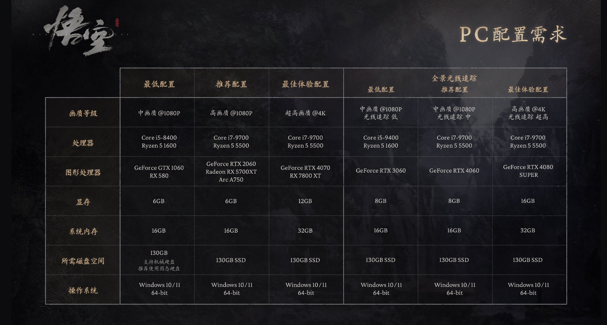

黑神话悟空配置要求图，黑神话悟空最低配置要求

今天好几个同事请假，一问，竟然还在和大头娃娃斗智斗勇

今天女朋友问我玩这个游戏要什么配置啊？我说我不喜欢玩游戏，然后就没有然后了。

不想玩是假的，于是今天来看了下到底需要什么配置？

ps5玩的爽还是PC更值得选择

其实官方已经给出了具体的配置要求，也发布了配置测试工具，

配置给出了不开光追的配置要求，和开了的配置要求，各个还有不同画质的配置要求。

有朋友就问了，这区别是啥呀？

简单讲前面是能玩，后面是玩的爽，玩游戏不就是为了爽嘛？如果不能玩的爽干脆不玩。

看到显卡的配置需求，其实大部分玩家心是凉的，毕竟能够得着这个配置的，还是有数的。

相对而言PS5或许是更不错的选择，据说某东的PS5最近都脱销了。毕竟看看游戏机的价格，再去看看显卡的价格就沉默了。

看到身边同事在玩，朋友圈朋友在玩，确实是有些心动。

不说了，再去看看PS5，问问人事这个月工资还发不发！