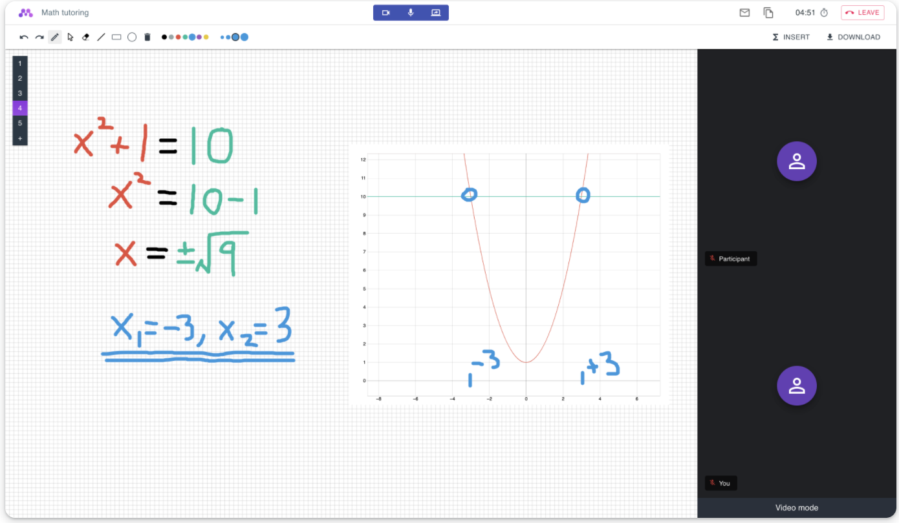

2.3k star，功能齐全，开源的视频会议系统

大家好，每天给大家带来不错的开源项目推荐。

今天推荐的是一款开源的视频会议系统，其实它更适合用于在线教辅，功能设计完善，想要学习了解的也可以作为试手项目。

>项目地址：https://github.com/fmeringdal/nettu-meet 



## nettu-meet项目简介

nettu-meet是一款提供了在线实时音视频共享，白板共享，屏幕共享，聊天，文件共享，在线绘图等功能的视频会议系统。

是免费开源可直接使用的。

这款工具的作者目的在于提供一个简单高效、功能齐全的在线教学平台。

## 如何快速安装

1. **克隆仓库**：
   首先，从 GitHub 上克隆 Nettu Meet 的代码仓库：
   ```bash
   git clone https://github.com/fmeringdal/nettu-meet.git
   cd nettu-meet
   ```

2. **设置环境变量**：
   复制 `.env.template` 文件并进行必要的配置：
   ```bash
   cp integrations/.env.template integrations/.env
   ```

3. **启动后端服务**：
   使用 Docker Compose 启动 Redis 和 MongoDB，然后安装并启动后端服务：
   ```bash
   cd server
   npm run infra
   npm install
   npm start
   ```

4. **启动前端应用**：
   在另一个终端窗口中，安装并启动前端应用：
   ```bash
   cd frontend
   npm install
   npm start
   ```

5. **创建会议**：
   使用以下命令创建一个新的会议：
   ```bash
   curl -X POST "http://localhost:5000/api/v1/meeting" -H "authorization: nettu_meet_default_secret" -H "Content-Type: application/json" -d '{"title": "First Nettu Meet meeting"}'
   ```

## 功能特点

1. **实时音视频共享**：
   支持高质量的音视频通信，确保教师和学生之间的交流顺畅。

2. **共享白板**：
   教师和学生可以在共享白板上进行实时绘画和标注，方便讲解和互动。

3. **屏幕共享**：
   教师可以共享自己的屏幕，展示课件或进行操作演示，增强教学效果。

4. **聊天功能**：
   会议参与者可以通过聊天功能发送消息，进行文字交流，补充音视频沟通。

5. **文件共享**：
   支持上传和共享文件，教师可以方便地分享教学资料，学生也可以提交作业。

6. **图形绘制**：
   内置图形绘制工具，支持在白板上插入数学图形，方便讲解复杂的数学概念。

7. **自定义功能**：
   用户可以创建账户并上传自己的标志，定制会议界面，提升品牌形象。

## star数

 

 目前该项目获得了2.3k star。