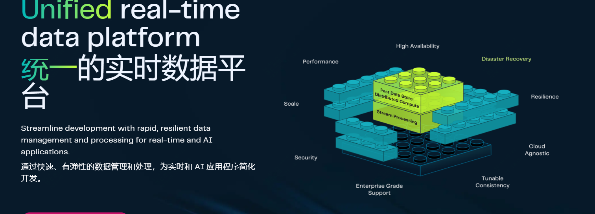

6k star，强大！开源的实时数据统一平台

大家好，每天给大家带来不错的开源项目推荐。

今天推荐的是一款开源的实时数据处理平台，适合大部分的应用场景，尤其是流处理与快速数据存储相关，可以理解为是一个数据处理平台！

>项目地址：https://github.com/hazelcast/hazelcast

## 项目简介

Hazelcast 是一个分布式计算和存储平台，用于针对事件流和传统数据源进行一致的低延迟查询、聚合和有状态计算。



你可以用这款工具干嘛呢？

可以使用连接到集群的Hazelcast客户端请求数据、监听事件、提交数据处理任务。

Hazelcast 的客户端使用 Java、.Net、C++、Node.js、Go 和 Python 语言实现。它还与 Memcache 和 REST 协议进行通信

## 如何部署或安装

下载量及docker镜像拉去数量还是蛮高的。

 

 

支持docker部署，如下：

```
docker run \
    -it \
    --network hazelcast-network \
    --rm \
    -e HZ_NETWORK_PUBLICADDRESS=<host_ip>:5701 \
    -e HZ_CLUSTERNAME=hello-world \
    -p 5701:5701 hazelcast/hazelcast:5.5.0
```

更多具体参数或者使用可以参考官方文档

## 功能特点

- 性能强！能够有较高的吞吐量并且延迟低
- 高可用!保证7*24可用，提供了高可用及灾备恢复能力
- 规模集群化！支持快速扩缩容
- 快速上线，享受易用性，减少编码、管理和监控的集成
- 成本低，可以减少比不要的组件，来实现更低的成本
- 安全性高，角色控制等方式保证安全


## 目前 github star数

 

 目前star数是6k