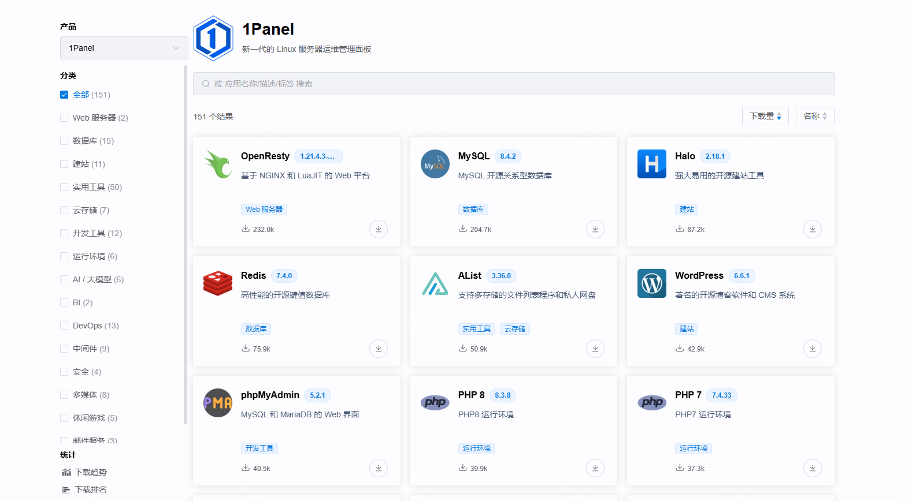
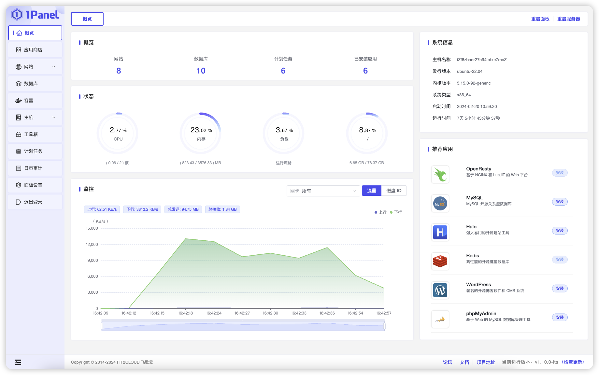
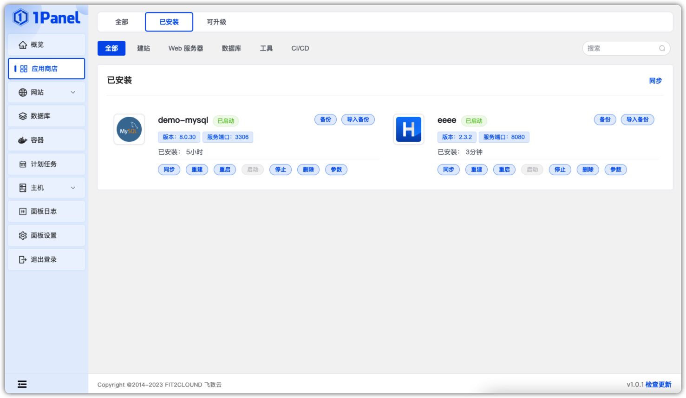
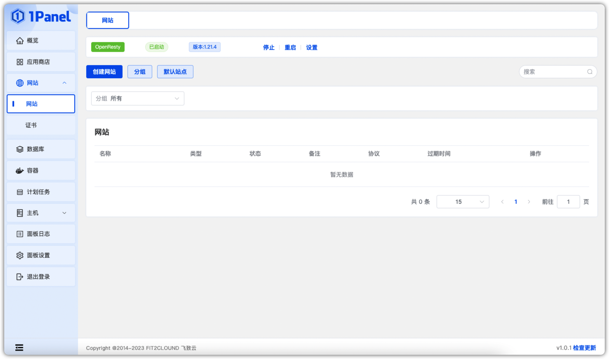
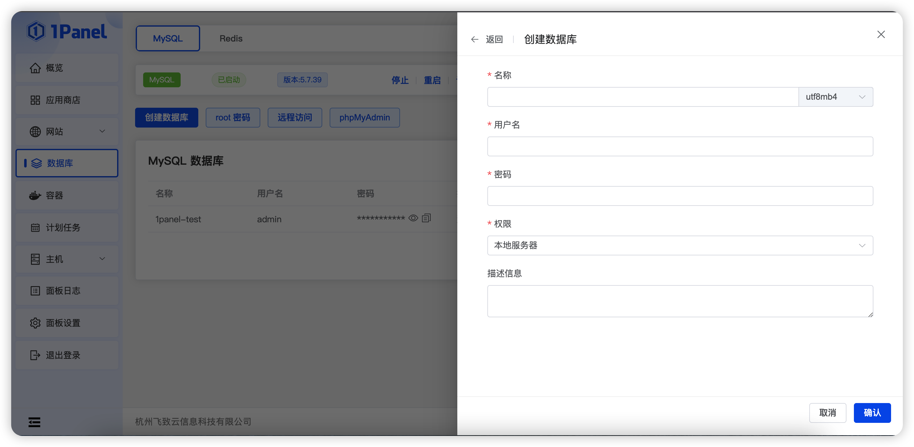

21.2k star！火爆，推荐一款新型的linux服务器管理工具

最初知道这款工具，还是在配合一个交付厂商的项目时了解到的，然后去看了之后写了这篇推荐文章。

很适合新手部署一些开源软件或者网站，而且官方的应用商店也汇集很多现有的开源组件，包括之前写的文章推荐的一些软件，这个平台都有涉及。

刚去看了下，目前已经有151个软件，包括不限于web服务器、建站、笔记类、ai相关、多媒体等等。

这个服务器管理工具开源免费提供，当然也有收费版本。



>项目地址：https://github.com/1Panel-dev/1Panel

## 1Panel项目简介

1Panel是一个操作界面更加现代化、开源免费的服务器运维管理面板。

如果是nas玩家，也可以用来管理你的nas。



## 如何安装

可以看到docker镜像的拉取量达到了421k

 

我们今天也简单介绍下 如何r快速部署，在官方文档中提供了具体的不同环境下的安装方式

如果是网络通畅的情况下，centos系统，直接执行如下即可

```
curl -sSL https://resource.fit2cloud.com/1panel/package/quick_start.sh -o quick_start.sh && sh quick_start.sh
```


## 功能特点

- 前面也有提到应用商店，可以直接安装，然后通过平台可对应用同步、升级、重启、启动、停止、删除、备份、恢复等操作。


- 可用于一键建站
  


- 创建数据库，并且有提供界面化的数据库操作组件

 


## star数

 
