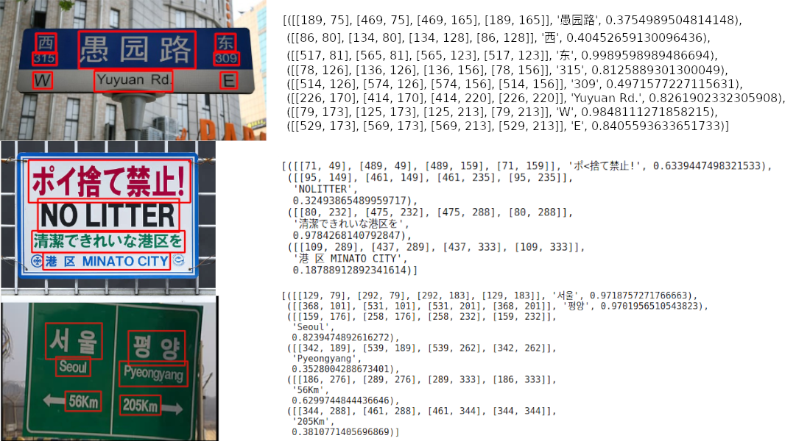

23.4k star,简单确强大！开源OCR引擎，支持80+语言

大家好，每天给大家带来不错的开源项目推荐。

今天推荐的是一款开源的OCR识别引擎，它最多支持80多种语言，实际上ocr工具在我们日常经常会用到，可能也有蛮多熟悉的工具，如微信截图就可以识别

但今天推荐的这款开源工具，可以让你对该项目有更多的了解，也能应用到更多的场景，比如批量识别。

>项目地址：https://github.com/JaidedAI/EasyOCR 
简单看几个效果


## EasyOCR项目简介

EasyOCR是一个python开发的ocr识别项目，可以本地化部署，支持语言丰富，如（拉丁文、中文、阿拉伯文、梵文、西里尔文）

部分手写体也可以识别

## 如何安装

目前已经被下载过140万次，如果你正好有票据识别、图片信息识别等需求，可以安装尝试下。

 

需要有python环境，window下还需要安装安装 torch 和 torchvision，然后通过pip安装如下模块即可

```
pip install easyocr
```

如果是纯cpu环境需要在使用时添加 如下配置

```
CUDA = None
```
然后可以通过命令去识别

```
$ easyocr -l ch_sim en -f chinese.jpg --detail=1 --gpu=True
```


如果有动手能力和模型相关技术能力的团队，还可以在此基础上去做针对性的微调

## 功能特点

- 可以本地化部署的一套ocr系统，该系统同时可以提供统云服务
- 数据识别准确率高，官方数据高达99%
- 如果有定制化需求可自行微调模型
- 支持手写体、表格、公式、表单等
- 对于签名、二维码、条形码等也支持识别
- 等等

## star数

 