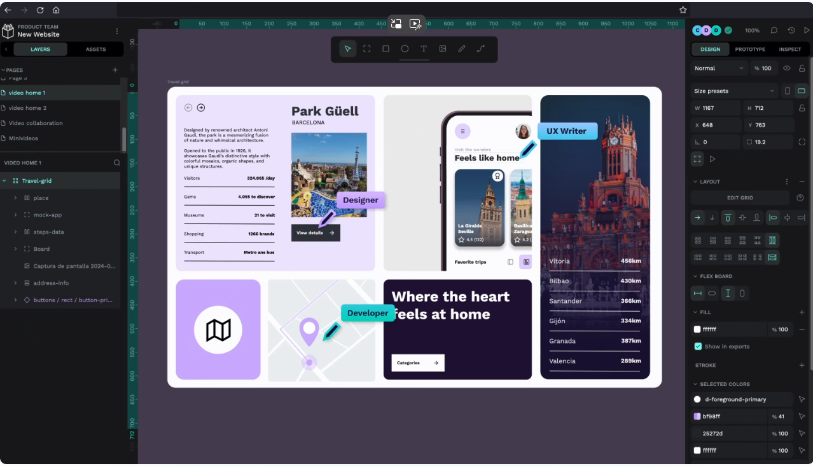

31.8k star！目前唯一款，figma的开源替代品，用于设计和代码协作的开源设计工具

大家好，每天给大家带来不错的开源项目推荐。

今天推荐的是一款开源的设计与开发结合的设计与原型平台

>项目地址：https://github.com/penpot/penpot 



## penpot项目简介

penpot是一款可以用于设计和代码协作的开源设计工具。

设计师在设计的同时开发人员可以代码编辑，简单讲就是一个页面设计出来之后，开发人员可以直接使用生成的代码。

这样的使得协作更加高效，penpot可以通过浏览器使用也可以在本地部署启动。


## penpot如何安装

官方给出的最简单的安装是通过docker，可以看到目前docker镜像的拉取已经达到了150万。

 

如果要通过docker尝试部署的话，可以通过如下步骤安装：

```
wget https://raw.githubusercontent.com/penpot/penpot/main/docker/images/docker-compose.yaml
curl -o docker-compose.yaml https://raw.githubusercontent.com/penpot/penpot/main/docker/images/docker-compose.yaml
docker compose -p penpot -f docker-compose.yaml up -d
```

然后可以通过访问本地的9001端口来访问。

## penpot功能特点

首先它是一个开源免费的强大工具

- 支持界面设计，有灵活的布局、设计系统以及定制化字体
- 交互式的流程，支持交互和过渡
- 支持代码，及代码格式检查，Penpot 将设计原生表示为 CSS、SVG 和 HTML
- 支持api或webhook，无论是使用浏览器还是私有实例，都可以将 Penpot 与现有的开发工具链集成。

## 目前penpot的github star数

 

 目前该项目的star已经达到了32k。