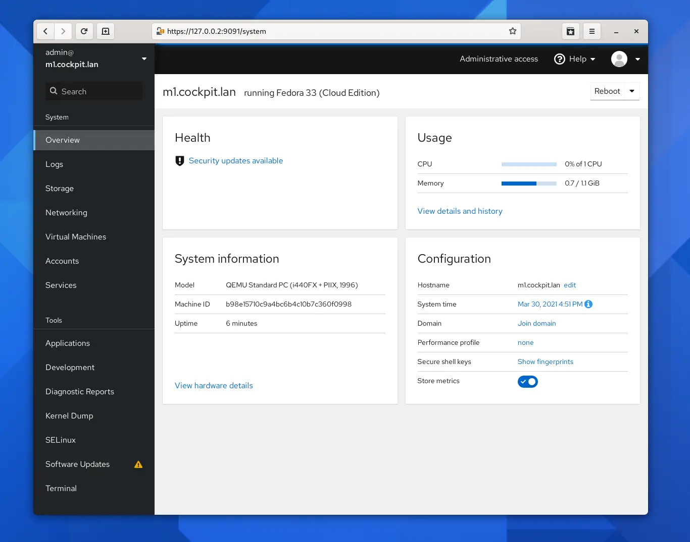
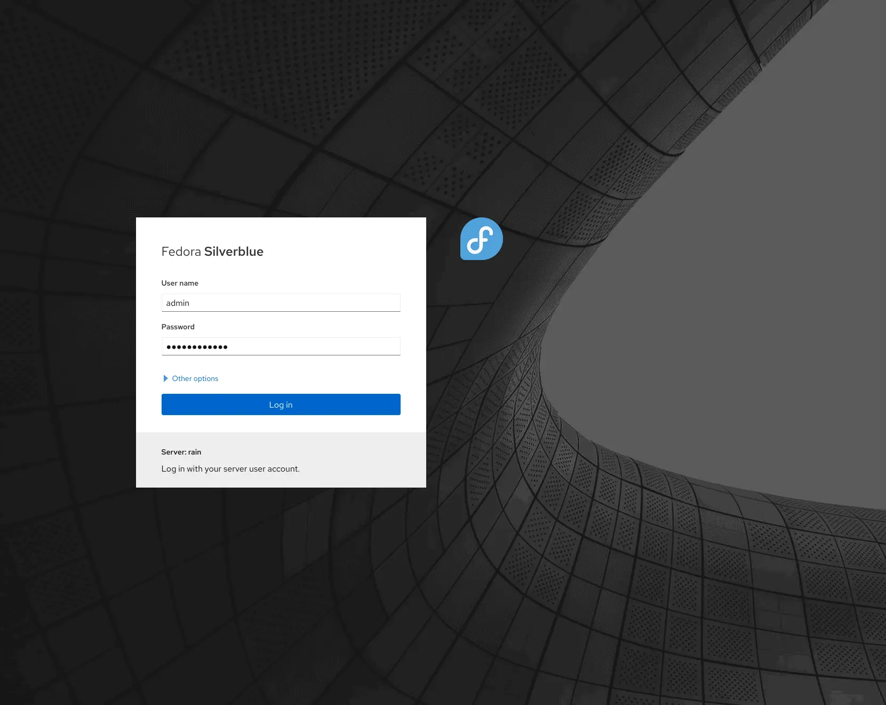
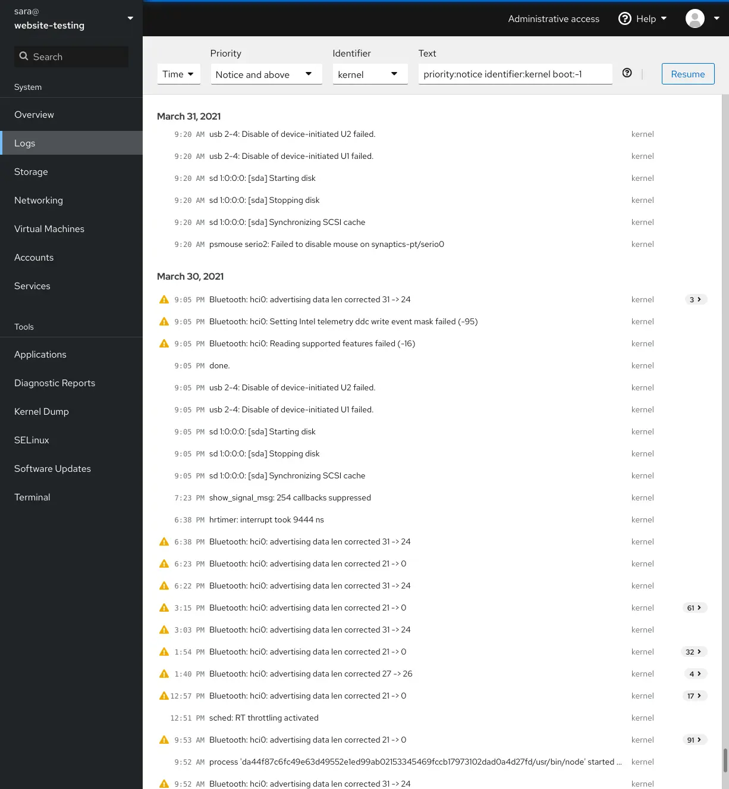
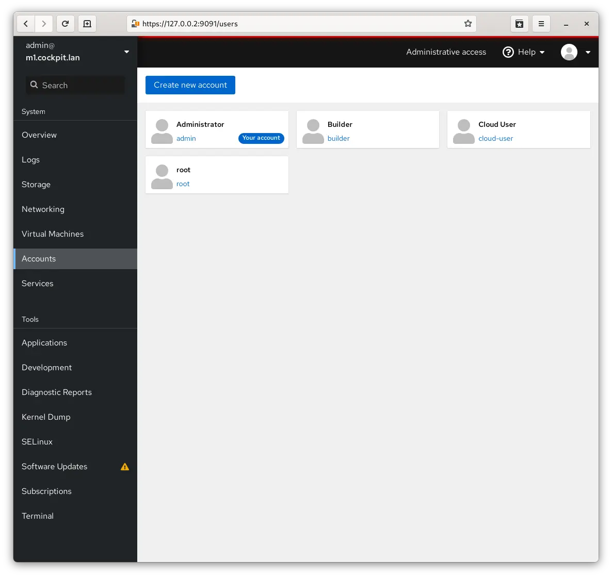
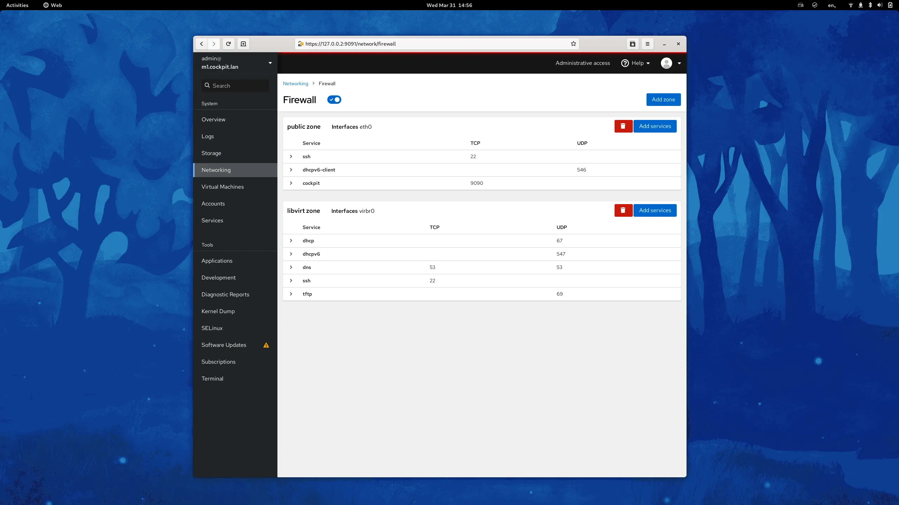
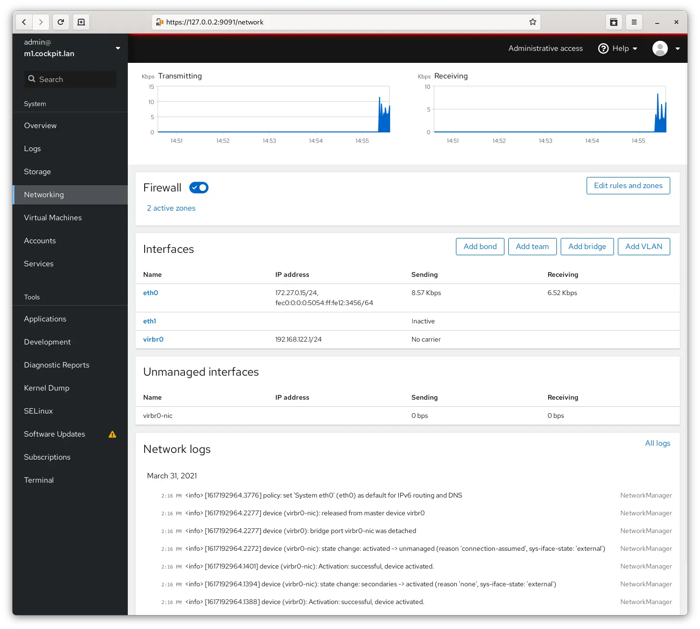
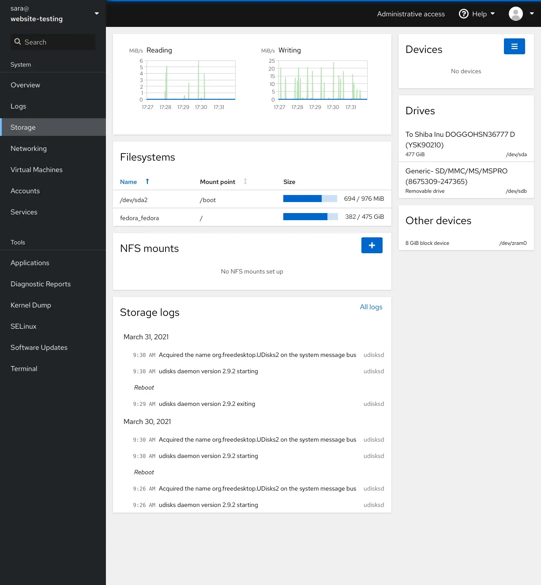
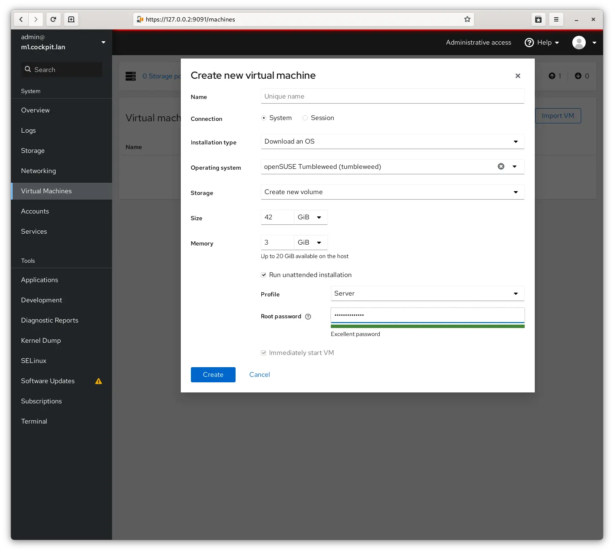

10.8k star,好用！基于web界面管理Linux系统

大家好，每天给大家带来不错的开源项目推荐。

今天推荐的是一款开源的基于Web的服务器图形界面。

>项目地址：https://github.com/cockpit-project/cockpit 

界面如下：



## 项目简介

Cockpit是一个易于使用，集成了主机上大部分资源情况，可以一目了然的通过web界面看到服务器情况。

它适合于使用linux的新手，可以通过web界面快速了解linux，并且还提供了大量的扩展，可以了解系统各个模块的概览。

可以在 Web 浏览器中查看服务器，并使用鼠标执行系统任务。启动容器、管理存储、配置网络和检查日志都很容易。

## 如何安装

 

安装方式很简单，大部分包管理器都有都有对应的步骤

centos

```
yum install cockpit
```
Ubuntu
```
. /etc/os-release
sudo apt install -t ${VERSION_CODENAME}-backports cockpit
```

其它发行版可以到官方文档去查看

## 功能特点

- 账户登录



- 日志查看



- 账户配置
  


- 检查和更改网络设置,防火墙配置




- 存储情况



- 创建和管理虚拟机



Cockpit本身不会消耗资源，甚至在你不使用它时在后台运行，它按需运行。

## star数

 