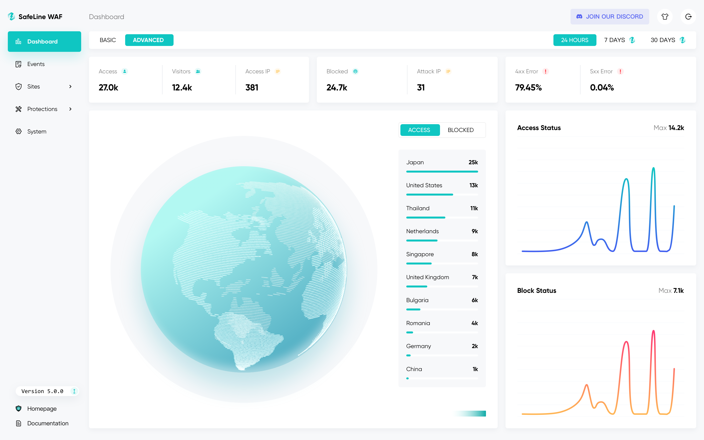
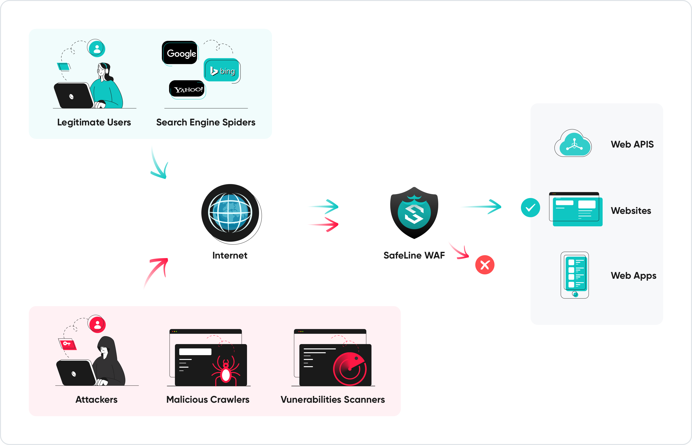

11.7k star,简单好用开源的WEB安全网关

大家好，每天给大家带来不错的开源项目推荐,文末有**开源精选合集**

今天推荐的是一款开源免费的web应用防火墙！

>项目地址：https://github.com/chaitin/safeline 



## safeline项目简介

SafeLine，中文叫"雷池"，是一款开源的waf，简单好用，安装简单，目前有开源社区版，可直接使用。

雷池可以通过过滤来自于互联网的请求，保护生产环境的web服务，可以避免sql注入、代码注入、命令注入、后门、爬虫等等攻击。

工作原理如下：



目前该工具累计装机量已经超过20万，防护的网站也多达100万个，每天清洗的请数更多超过300亿次。

## safeline如何安装

 

可以使用安装脚本快速安装，一条命令即可完成

```
bash -c "$(curl -fsSLk https://waf-ce.chaitin.cn/release/latest/setup.sh)"
```

官方也提供了离线环境安装方式，你也可以手动安装

安装完成后，可以通过如下地址访问

```
https://<safeline-ip>:9443/
```

如果你是第一次登陆的话，需要有个初始化过程，需要执行如下命令
```
docker exec safeline-mgt resetadmin
```
上述命令可以获取账户及密码

## safeline功能特点

- 可以防护web攻击（可以防御所有的 Web 攻击，例如 SQL 注入、XSS、代码注入、操作系统命令注入、CRLF 注入、XXE、SSRF、路径遍历 等等）、防止爬虫攻击，可以防止扫描、可以对前端代码动态加密
- 可以配置基于ip的访问频率限制（防止CC攻击、暴力破解、异常流量等），可以配置http访问控制。


## github目前star数

  

 目前该项目获得了12k star

 >回复关键字**开源合集**获取精选开源工具