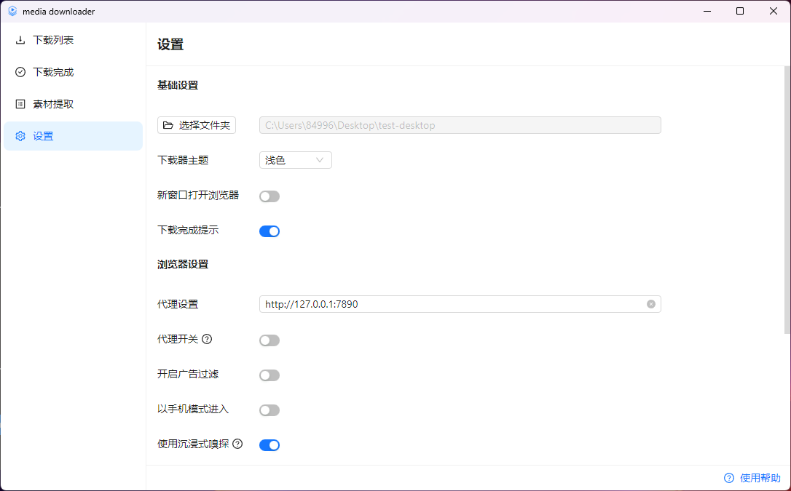

下载速度30M/s,神器推荐！

大家好，每天给大家带来不错的开源项目推荐,文末有**开源精选合集**

今天推荐的是一款开源视频下载神器-MediaGo，刚去看了下这款工具已经被下载过27万次了！

>项目地址：https://github.com/caorushizi/mediago

## MediaGo项目简介

MediaGo是一款跨平台支持的流视频下载工具，主要针对于m3u8视频下载，下载速度最高可以达30M，当然这个取决于你的网络情况。

下载速度是该工具的一个优势，但更大的优势在于其它功能，它支持浏览器嗅探功能，可以根据你复制的链接，检测到对应的视频。

支持单个视频下载，也可以批量下载视频。

## MediaGo如何安装

 

上述为该工具目前的下载安装量，工具提供了桌面版本，支持mac、linux、windows

只需要下载对应的软件包即可，下载地址在文末。

## MediaGo功能特点

- 1.嗅探功能，虽然提供了桌面版，但实际内置了浏览器，无需抓包，可以直接嗅探到你复制链接中的视频，然后可以选择下载
- 2.支持移动播放，你下载完毕视频后可以在PC或者移动设备上播放
- 3.支持批量下载，这个功能在一些动漫或者分集较多的视频中需求比较多
- 4.支持不同的视频平台，具体不再列出，可以去尝试
- 5.广告过滤功能、暗黑模式等。

## star数

  

 目前该工具在github获得了2.4k star，相较于下载量其实较低。

不过这类工具这种情况还是常见的！

## 简单聊几句

周六去了一趟大学室友家里，是我们室友里面第一个结婚的

这次去是他们刚搬了新家，定居在上海，位置其实蛮好的，在漕河泾附近，离徐家汇只有5站，刚出中环

这次去最大的惊讶还是他马上要成为父亲了，下个月小孩儿就要出生了

和他聊了聊房子，当时直接付了一半，现在每个月还1w多，压力其实不大了

两边家庭都是独生子女，家里人实力也还行，才能这么快定居在上海，同去的另外一位室友，确是前几年就会嘉兴了

目前也是买了房子，就等结婚了。

晚上回到家之后，其实是有些焦虑的，留在上海很难，回去后又不好找工作，人也到30了

说实话，什么决定都不好下了！

**工具下载地址**：downloader.caorushizi.cn/guides.html

 >回复关键字**开源合集**获取精选开源工具