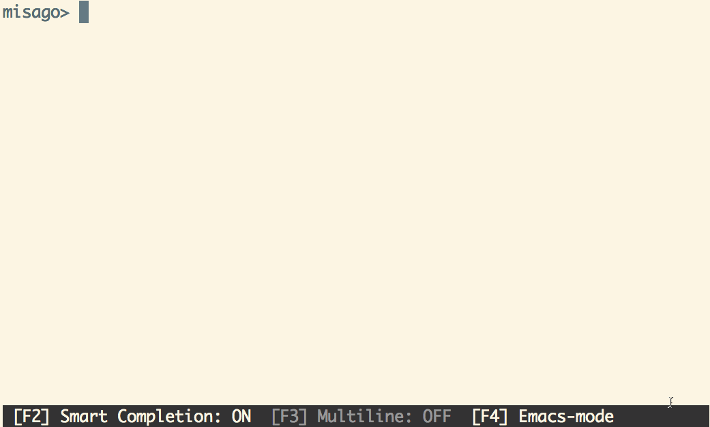
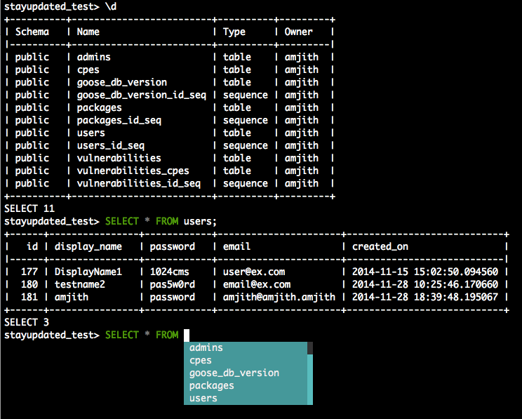

11.9K Star,好用的工具推荐，适合开发、DBA、运维、测试

大家好，每天给大家带来不错的开源项目推荐,文末有**开源精选合集**

今天推荐的是一款开源适合pg数据库用户的终端工具。

它最大的作用在于可以自动填充你的sql，并且具有语法高亮功能。

可以看下效果：



>项目地址：https://github.com/dbcli/pgcli

## pgcli项目简介

不知道看到这篇文章的朋友，你们公司目前用到最多的数据库是那种？

是mysql还是postgresql？或者是其它的，我司之前90%都是mysql，现在新的系统基本都在用postgresql了。

如果使用的是postgresql的话， 那么这个小工具，在部分场景下，还是蛮好用的。

它是采用python开发的工具。



## 如何安装

因为是python开发的，所以需要具备python环境，然后通过pip安装

```
pip install -U pgcli
```

如果是ubuntu用户

```
sudo apt-get install pgcli 
```
mac用户可以通过brew安装
```
brew install pgcli 
```

## 功能特点

Pgcli 是一个用于 PostgreSQL 的命令行界面工具，具有以下特点：

1. **自动补全**：
   Pgcli 提供智能的 SQL 语句自动补全功能，能够根据上下文提供相关的建议，极大地提高了输入效率

2. **语法高亮**：
   该工具支持 SQL 语法高亮显示，使得代码更易读，帮助用户快速识别不同的 SQL 语法元素

3. **多种主题**：
   Pgcli 提供多种配色主题，用户可以根据个人喜好进行配置，提升使用体验

4. **历史记录与搜索**：
   Pgcli 会记录用户输入的查询语句，用户可以通过上下箭头浏览历史记录，或者使用 <C-r> 进行增量历史搜索

5. **命令行编辑器集成**：
   用户可以在 Pgcli 中使用 \e 命令启动默认编辑器，方便编辑复杂的 SQL 语句

6. **SSH 隧道**：
   Pgcli 支持创建 SSH 隧道，适用于无法直接访问数据库的场景，增强了工具的灵活性

7. **IPython 集成**：
   Pgcli 可以在 IPython 控制台中运行，借助 pgcli.magic 扩展，提供更强大的交互式功能。

8. **日志记录**：
   默认日志文件位于 ~/.config/pgcli/log，提供用户友好的审计日志记录功能，便于追踪和调试。

## star数

   

 目前该工具获得了12kstar。

 >回复关键字**开源合集**获取精选开源工具