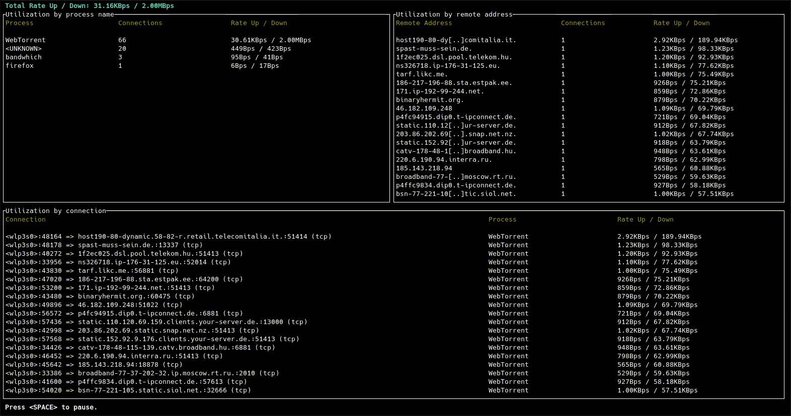
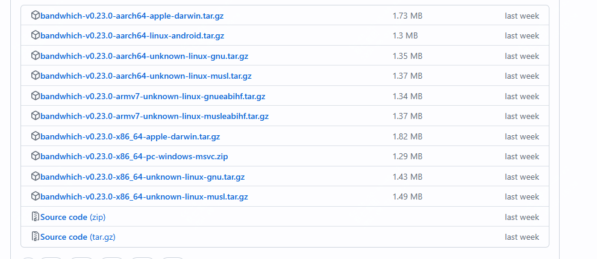
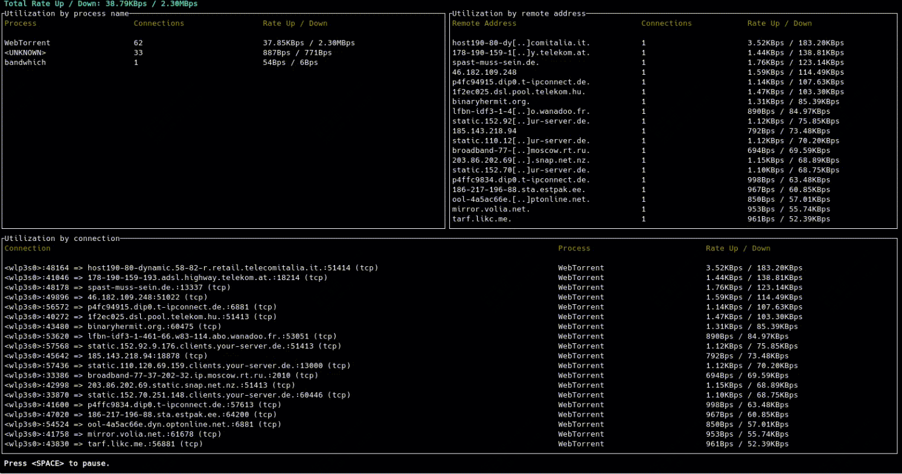

这个工具真强！一条命令显示哪个进程带宽使用率高，github9.7k star

大家好，每天给大家带来不错的开源项目推荐,文末有**开源精选合集**

今天推荐的是一款开源的终端带宽使用率工具，是真的强

>项目地址：https://github.com/imsnif/bandwhich 

来看下效果就明白了！

## 项目简介

bandwhich实际上利用的是不同操作系统已有的一些数据，然后在终端展示出来，如linux用的是/proc下的数据，而mac用的是lsof，win用的是winapi。

## 如何安装

 

下载量也挺高的，支持android系统、win、mac、linux，这些都提供了二进制包

可以直接去项目下下载。

linux不同发行版的话，也提供了对应的安装方式

## 功能特点

1. **实时网络利用率显示**：
   - Bandwhich 可以实时显示当前网络利用率，按进程、连接和远程 IP/主机名进行分类。这使得用户可以清楚地看到每个进程和连接的带宽使用情况。

2. **跨平台支持**：
   - 该工具支持多种操作系统，包括 Linux、macOS 和 Windows。它使用不同的系统调用和库来获取网络数据，例如在 Linux 上使用 `/proc` 文件系统，在 macOS 上使用 `lsof`，在 Windows 上使用 WinApi。

3. **响应式终端界面**：
   - Bandwhich 的界面会根据终端窗口的大小自动调整显示内容。如果窗口空间不足，它会减少显示的信息量，以确保用户界面始终清晰可读。

4. **IP 解析**：
   - 该工具会尝试通过反向 DNS 解析 IP 地址，以显示更具可读性的主机名。这一功能在后台运行，并尽力提供准确的解析结果。

5. **安装和使用简便**：
   - Bandwhich 提供了多种安装方式，包括预编译的二进制文件和从源代码构建。用户可以根据自己的操作系统选择合适的安装方法。

6. **开源和社区驱动**：
   - 该项目是开源的，欢迎社区贡献代码和改进功能。尽管目前处于被动维护状态，但仍然接受关键问题的修复和社区的 pull request。

## star数

   

 目前该项目获得了9.7k star,值得关注及使用。 

 

 >回复关键字**开源合集**获取精选开源工具
