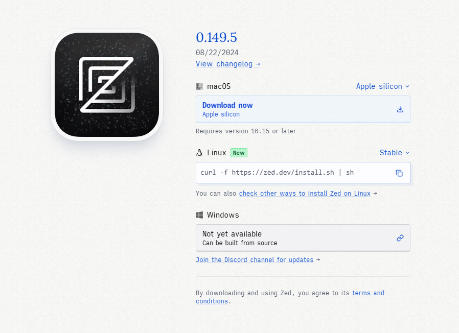
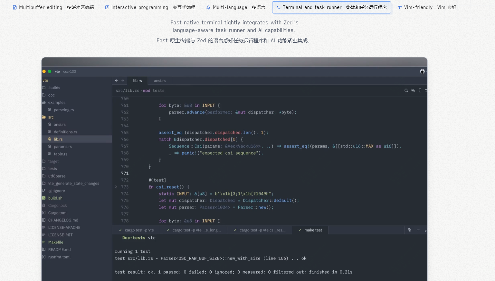

吊打vsCode,github 45K star,超强性能，新一代多人协作IDE推荐！

大家好，每天给大家带来不错的开源项目推荐,文末有**开源精选合集**

今天推荐的是一款开源代码编辑器，号称“下一代代码编辑器”，“代码编辑器界的瑞士军刀”

目前用的比较多的应该就是vscode或者IDEA了，但zed可以给你更新的体验。

>项目地址：https://github.com/zed-industries/zed 

在官网上，介绍的第一个特点就是该编辑器足够的快，如上。

## zed项目简介

zed是一款由rust语言的写的代码编辑器，让你以思维的速度编写代码，支持多人协作、支持AI功能等。

## zed如何安装

 

可以看到该编辑器已经有150w的下载量了，安装的话也比较简单， 直接在官网下载对应的包即可。

该工具是跨平台支持的，支持mac、windows、linux

## zed功能特点

### 1. 高性能
Zed 使用 Rust 编写，旨在提供快速和流畅的编辑体验。Rust 的内存安全和并发特性使得 Zed 能够高效地处理大型项目和复杂的代码库。

### 2. 多人协作
Zed 支持实时多人协作，允许多个开发者同时编辑同一个文件。这个功能类似于 Google Docs 的协作编辑，极大地提高了团队的工作效率。

### 3. 现代化用户界面
Zed 的用户界面设计简洁现代，提供了直观的操作体验。它采用了自定义的 UI 框架 GPUI，确保界面响应迅速且美观。

### 4. 扩展性
Zed 支持多种扩展，用户可以根据自己的需求安装和配置插件。这些扩展可以增强编辑器的功能，例如增加对更多编程语言的支持或集成开发工具。

### 5. 内置终端
Zed 内置了一个终端，开发者可以直接在编辑器中运行命令行工具和脚本，无需切换到外部终端。

### 6. 代码导航和重构
Zed 提供了强大的代码导航和重构工具，包括跳转到定义、查找引用、重命名符号等功能。这些工具帮助开发者更高效地理解和修改代码。

### 7. 版本控制集成
Zed 集成了 Git 版本控制系统，用户可以直接在编辑器中进行代码提交、分支管理和冲突解决。

### 8. 跨平台支持
Zed 支持多种操作系统，包括 Windows、macOS 和 Linux，确保用户在不同平台上都能获得一致的使用体验。

## star数

  

 目前该项目于获得了45k的star。

## 简答聊几句

今后的文章，应该都会增加这个模块，聊聊最近工作、生活的发生的一些事，算是和读者的一些个交互了。

最近黑神话悟空很火，然后山西文旅也火了，不巧，我正好是山西人，山西平遥的，从小上学就要穿古城而过。

而这次游戏里面也涉及到了我们那个县的两个景点，一个是双林寺、一个是镇国寺，但只去过双林寺。

两个寺庙印象没那么深刻，古城确是很熟悉，因为我们初中就建在古城边上。

记得08年的时候，那会初二，汶川发生了地震，我们班主任组织同学，去这些旅游景点募捐

让写作能力强的去写宣传稿，让行动力强几个各自带几个人去募捐，记得当时一个下午吧，就收到了5000多，然后当天就捐到了民政局

虽然天很热，还抱着个大箱子，但确实算是古城和我之间的发生的最难忘的一件事。

现在那些同学也都在天南海北，毕竟快20年过去了。

 >回复关键字**开源合集**获取精选开源工具