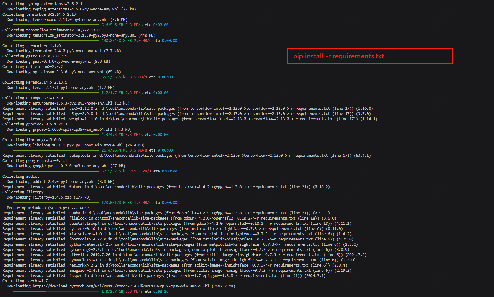

27K Star 超级逼真!!! 给张图就能换脸，别瞎搞就行

大家好，每天给大家带来不错的开源项目推荐,文末有**开源精选合集**

今天推荐的是一款开源的亦键盘换脸项目。

>项目地址：https://github.com/s0md3v/roop

先来上个效果，该工具需要两张图片，一张为目标脸的图片，一张为原型图，如下：


## roop项目简介

**Roop** 是一个开源项目，旨在提供一种简单易用的一键换脸解决方案。该工具允许用户通过一张目标脸的图像，快速替换视频中的脸部，无需数据集和训练

## 如何安装

因为是python开发，所以是需要python环境的，需要安装python3版本

然后需要克隆对应的仓库

```
git clone https://github.com/s0md3v/roop
```

然后通过pip安装对应的模块,部分包比较大，需要耐心等待

```
pip install -r requirements.txt
```


完成过后，直接执行如下即可

```
python run.py
```

## 功能特点

1. **一键换脸**：只需一张目标脸的图像，即可替换视频中的脸部。
2. **无需数据集和训练**：与其他深度伪造工具不同，Roop 不需要预先准备的数据集或进行复杂的模型训练。
3. **多平台支持**：支持在 Windows、macOS 和 Linux 上运行。
4. **高效处理**：利用 CPU 和 GPU 的全部潜力，加速处理过程。

## star数

   

 Roop 的设计初衷是为用户提供一个高效、易用的换脸工具，适用于各种视频处理需求。目前该项目已经在短短时间到了27k star，可见受欢迎程度！

 ## 简单聊几句

这个章节后面都会有，聊聊每天发生的、看到的一些事，希望和大家有共鸣。

不知道上班后大家有没有感觉，每周都过的很快，在写这篇文章的时候，是周三，大家看到的时候应该是周四了。

而且每周过的就和循环一般，基本差不多的点下班，坐的地铁是同一班，位置都每天一样

每天处理基本同样的问题，沟通交流的同事也基本一致，每天早出晚归，形同人偶一般。

转眼工作都第8年开始了，而这样的日子，很大的可能还要循环很久。


 >回复关键字**开源合集****获取精选开源工具**


