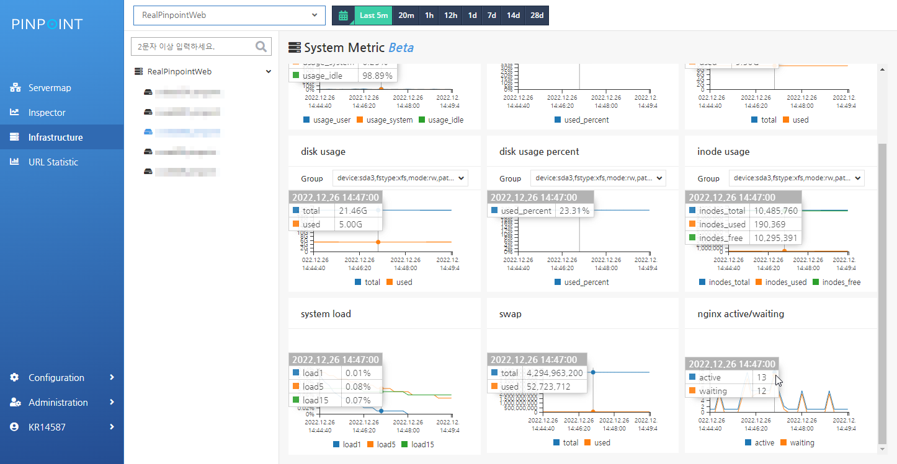

13.3k star！超强链路监控软件推荐

大家好，每天给大家带来不错的开源项目推荐,文末有**开源精选合集**

今天推荐的是一款开源链路监控软件，类似开源工具还有skywalking、cat等

>项目地址：https://github.com/pinpoint-apm/pinpoint

## pinpoint项目简介

pinpoint是在生产环境中常用到的APM监控软件，简单讲就是应用链路监控软件，适合于大规模的分布式系统。

目前最新版本页面还是比较酷炫的，可以看下：


## 如何安装

 


目前该工具的下载量还是蛮高的，已经有上百万次下载了，对应的docker部署，镜像拉取也有133k。

官方也提供了集群化部署或者是单节点部署，当然也可以通过docker部署

docker部署比较简单， 如下：

```
git clone https://github.com/pinpoint-apm/pinpoint-docker.git
cd pinpoint-docker
docker-compose pull && docker-compose up -d
```

这里简单介绍下单节点部署

pinpoint的存储是依赖于hbase的，所以需要提前部署habase，然后需要初始化数据。

```
#hbase部署
$ tar xzvf hbase-x.x.x-bin.tar.gz
$ cd hbase-x.x.x/
$ ./bin/start-hbase.sh
#启动收集器
$ java -jar -Dpinpoint.zookeeper.address=localhost pinpoint-collector-boot-2.2.1.jar
#启动web服务
$ java -jar -Dpinpoint.zookeeper.address=localhost pinpoint-web-boot-2.2.1.jar
```
然后你需要在启动的java服务中添加对应版本的agent

## 功能特点

- **事务跟踪**：Pinpoint 通过在分布式系统中跟踪事务，帮助用户了解系统的整体结构及其组件之间的相互关系。这对于调试和优化系统性能非常有用
- **实时监控**：用户可以通过 Pinpoint 的实时监控功能，随时查看应用的性能状态，及时发现和解决性能问题
- **代码级别可见性**：Pinpoint 提供代码级别的事务可见性，帮助开发者快速定位性能瓶颈，优化代码
- **无侵入性安装**：Pinpoint 的 APM 代理安装过程简单，无需修改任何代码，对系统性能的影响极小
- **多语言支持**：Pinpoint 支持多种编程语言，包括 Java、PHP 和 Python，适用于各种类型的分布式应用


## star数

  

 目前该工具已经有13kstar。
## 简答聊几句

又到周五，而且是月末

9月会很忙碌，中秋国庆期间连续5周有调休

所以除了要工作外，还是操心每个周末是否需要开闹钟，是否得去公司

下个月应该是这样的，上6休3上3休2上5休1上2休7再上5休1


哎！烦

 >回复关键字**开源合集**获取精选开源工具