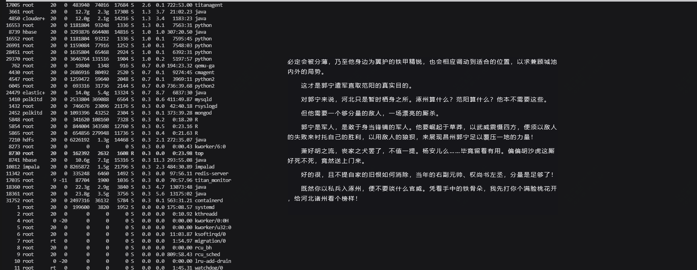
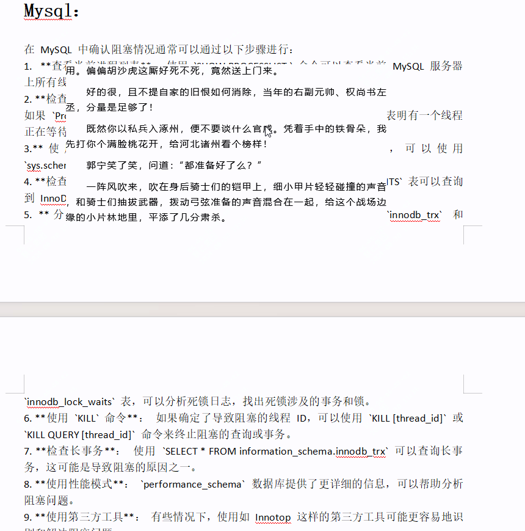

推荐个摸鱼神器，尤其适合周五！！

大家好，每天给大家带来不错的开源项目推荐,文末有**开源精选合集**

今天推荐的是一款开源电子书阅读神器

周五难熬，周五下午更难熬，玩手机太过于明显，看小说也很招摇，今天我是这样摸鱼看小说的。

其实还可以更隐蔽，颜色、字体啥的再调调，完全可以浑水摸鱼！！

>项目地址：https://github.com/binbyu/Reader

## 项目简介

Reader是一款小说阅读器，最大的特点在于可以无边框阅读，工具很简洁，快捷键很方便。

比如你可以开着word文档，然后，将小说置于其中，如下。

## 如何安装

 

 没想到这个小工具的下载量竟然有这么多了。

 可以直接到github的releases获取，如果没找到的，可以留言下。

 
## 功能特点

**Reader** 是一个开源的 Win32 文本文件阅读器，主要用于小说阅读。以下是其主要特点：

1. **多格式支持**：支持 TXT、EPUB 等多种文件格式。
2. **自定义设置**：提供丰富的自定义选项，包括字体、背景颜色、背景图片等。
3. **快捷键**：支持多种快捷键操作，如全屏、隐藏边框、快速翻页等。
4. **在线书源**：支持在线小说阅读，并提供书源配置功能。
5. **无边框模式**：支持无边框设置，适合在工作时“摸鱼”使用。
6. **自动翻页**：提供自动翻页功能，可以设置翻页时间间隔。
7. **书签功能**：支持添加书签，方便快速定位阅读位置。
8. **透明度调节**：可以调节窗口和字体的透明度，适应不同阅读环境。

这个工具旨在为网络文学爱好者提供便捷、舒适的阅读体验，同时也为软件开发者提供学习参考

## star数

  

 目前该工具获得了3.6k star，喜欢看小说的朋友，值得一试。

 >回复关键字**开源合集**获取精选开源工具