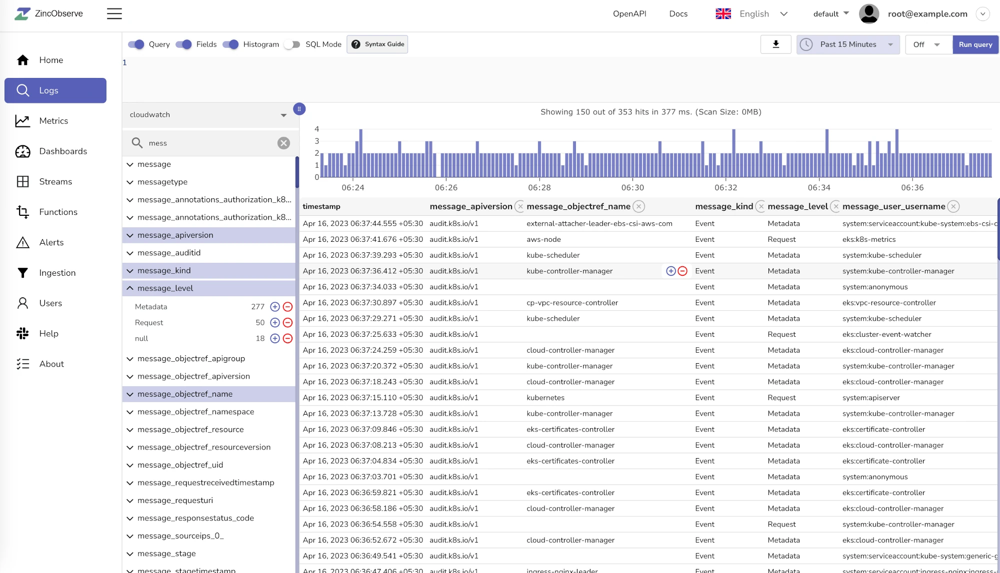
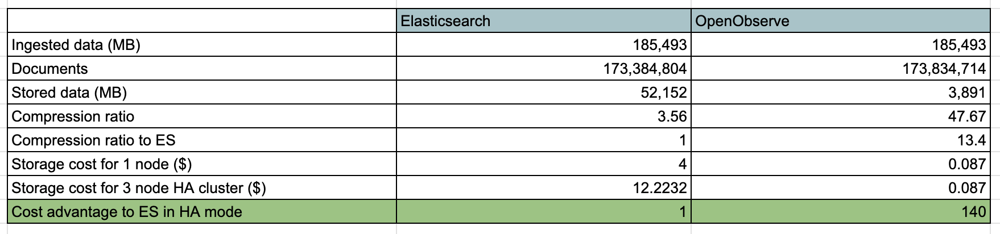
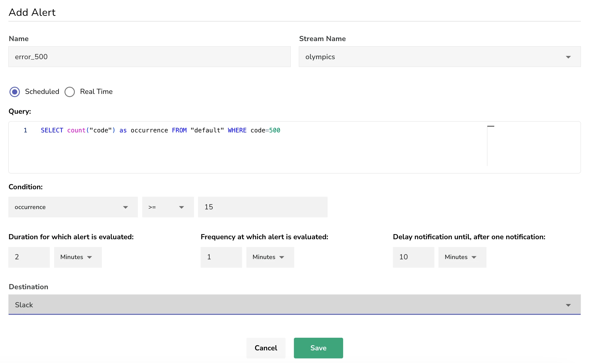
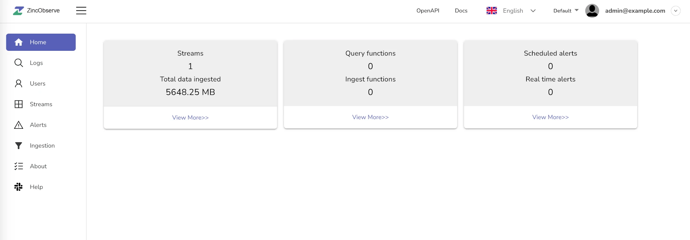

存储成本降低140倍，吊打elasticsearch？github 11.1k star软件推荐

大家好，每天给大家带来不错的开源项目推荐,文末有**开源精选合集**

今天推荐的是一款开源的云原生可观察性平台，专为PB级别数据设计。

比同类产品上手简单10倍，存储数据可节省空间140倍，高性能！

>项目地址：https://github.com/openobserve/openobserve



## openobserve项目简介

OpenObserve（简称 O2）是一个云原生可观察性平台，专为日志、指标、跟踪、分析、RUM（真实用户监控 - 性能、错误、会话重放）而构建，设计用于 PB 级工作。

与需要理解和调整大量设置的 Elasticsearch 相比，它简单且易于操作。在 2 分钟内即可启动并运行 OpenObserve。

## 如何安装

 

 

 可以看到该工具目前下载量已经达到了18k，相关docker镜像拉取已经有14k。

 如果你们目前的日志收集已经用到了fluent或者fluent-bit，官方提供了相关的配置可以直接切换为接入O2.

 官方还对使用 Fluent Bit 将日志从生产 Kubernetes 集群推送到 Elasticsearch 和 OpenObserve 的结果做了对比。

 

如果要快速启动，可以通过docker方式来启动

```
docker run -d \
      --name openobserve \
      -v $PWD/data:/data \
      -p 5080:5080 \
      -e ZO_ROOT_USER_EMAIL="root@example.com" \
      -e ZO_ROOT_USER_PASSWORD="Complexpass#123" \
      public.ecr.aws/zinclabs/openobserve:latest
```

## 功能特点



1. **高效易用**：比传统工具（如 Elasticsearch）更易于操作，安装和运行时间不到 2 分钟
2. **显著降低存储成本**：与 Elasticsearch 相比，日志存储成本降低约 140 倍
3. **全面的数据支持**：支持日志、指标、跟踪数据，并完全兼容 OpenTelemetry
4. **真实用户监控（RUM）**：包括性能跟踪、错误日志记录和会话重放
5. **高级查询功能**：支持 SQL 和 PromQL 查询，提供丰富的数据可视化选项
6. **高可用性和集群支持**：确保可靠和可扩展的性能
7. **动态模式**：能够无缝适应数据结构



## star数

  

## 简单聊几句


 >回复关键字**开源合集**获取精选开源工具