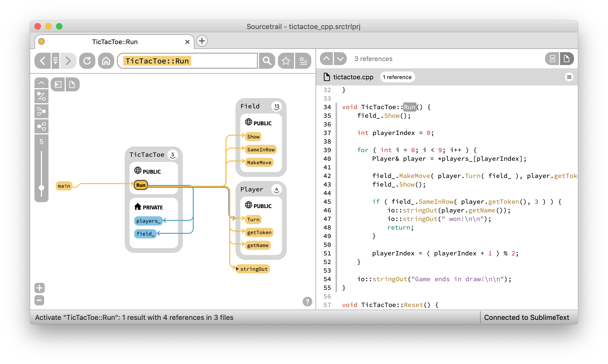
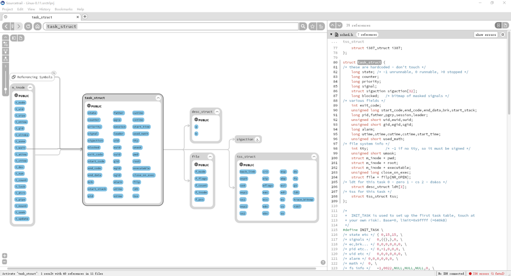
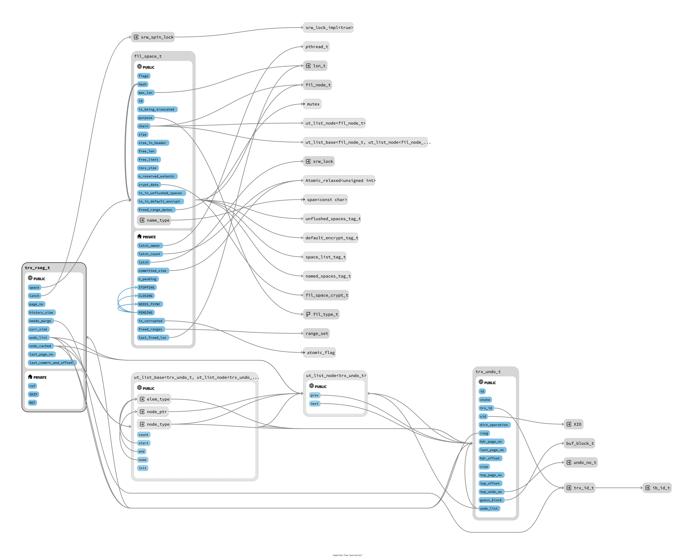

代码结构分析神器：sourcetrail

大家好，每天给大家带来不错的开源项目推荐,文末有**开源精选合集**

今天推荐的是一款开源的代码结构神器！

>项目地址：https://github.com/CoatiSoftware/Sourcetrail

## Sourcetrail项目简介

Sourcetrail是一个免费的开源跨平台源代码浏览器，可以高效的处理和查看你不熟悉的源代码。

## 如何安装

 

可以看到该工具的下载量已经有361k了。

## 功能特点

- 可以跨平台使用，支持mac、linux、windows
- 支持大部分语言如c语言、c++、java和python
- 官方提供了sdk可以编写你习惯的其它语言
- 该工具的是自由免费使用的，而且支持离线工作。

## star数

  

 目前该项目已经获得了15k star

 ## 简单聊几句

 昨天是8月底了，今天是9月份了

 周六过的浑浑噩噩，感觉休息了一天才把上周的班味散掉

 真的累啊，不是工作内容累，就算啥也不干，每天通勤2小时，坐在那儿啥也不干也很累

 而且最近还有点失眠，晚睡早醒，中午还睡不着。

 >回复关键字**开源合集**获取精选开源工具