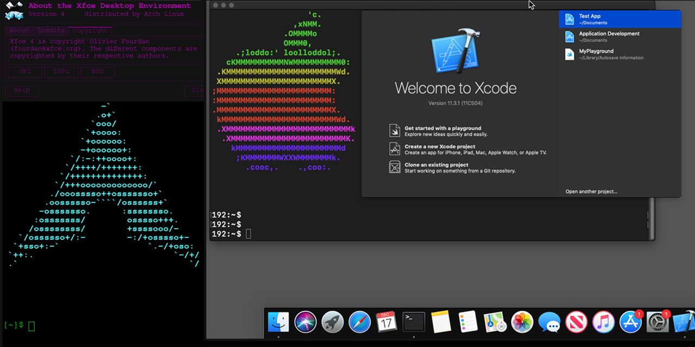

github热榜第一！使用docker安装苹果系统，告别黑苹果！

今天推荐的是一款开源软件，可以让你快速通过docker不熟macos系统，效果如下：



>项目地址：https://github.com/sickcodes/Docker-OSX

## 项目简介

**Docker-OSX** 是一个开源项目，允许用户在 Docker 容器中运行 macOS 虚拟机，几乎达到原生性能。

官方提供了多个版本的镜像，不过镜像最小的都接近1个G，所以部署安装需要一定的时间。

## 如何安装


需要主机已经安装好docker 环境，然后执行如下命令

启动Catalina系统
```
docker run -it \
    --device /dev/kvm \
    -p 50922:10022 \
    -v /tmp/.X11-unix:/tmp/.X11-unix \
    -e "DISPLAY=${DISPLAY:-:0.0}" \
    sickcodes/docker-osx:latest

# docker build -t docker-osx .
```
启动Big Sur系统
```
docker run -it \
    --device /dev/kvm \
    -p 50922:10022 \
    -v /tmp/.X11-unix:/tmp/.X11-unix \
    -e "DISPLAY=${DISPLAY:-:0.0}" \
    sickcodes/docker-osx:latest

# docker build -t docker-osx .
```

或许游戏朋友对macos系统的命名不太了解，实际上从 2001 年到 2012 年，从 Cheetah（猎豹）到 Mountain Lion（山狮），Mac OS 的各个版本都以各种大型猫科动物命名

上述Catalina为macOS 10.15，发布于19年，而Big Sur为macOS 11发布于2020年，更多其它版本操作系统可以到github上查看

## 功能特点

以下是该项目的一些主要特点：

1. **高性能**：利用 KVM 技术，Docker-OSX 可以在 Linux 和 Windows 系统上运行 macOS，性能接近原生。
2. **X11 转发**：支持 X11 转发，使得图形界面应用程序可以在远程显示器上运行。
3. **USB 直通**：支持 USB 设备直通，方便进行 iPhone 等设备的调试和测试。
4. **安全研究**：特别适用于 macOS 安全研究，支持 iMessage 安全研究等。
5. **多版本支持**：支持多个 macOS 版本，包括 Catalina 和 Big Sur。

## star数

  

 目前该项目斩获了43k star！

 >回复关键字**开源合集**获取精选开源工具