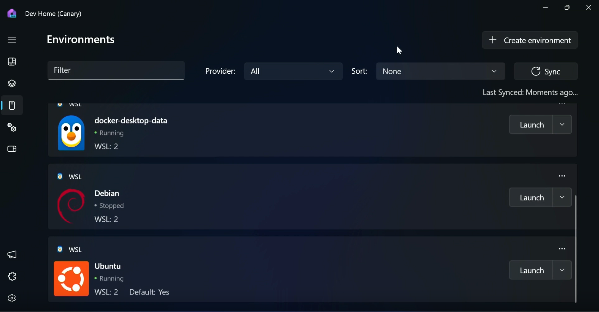
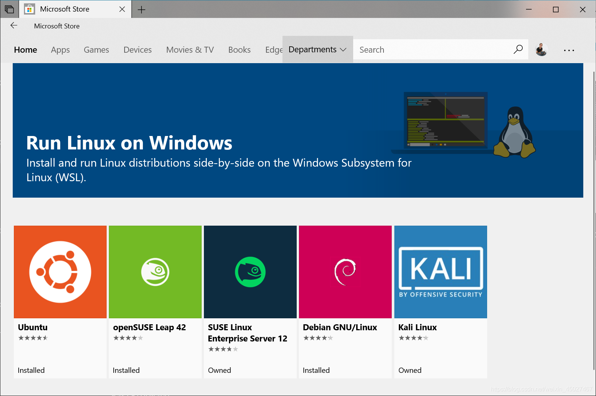

windows用户：放弃虚拟机，使用WSL

很多朋友不了解wsl，在需要使用linux做个测试的情况下，依旧会去选择安装常规的虚拟机软件，但费时费力，但现在你可以有一个新的选择。

那就是windows自带的wsl，它是Windows Subsystem for Linux的缩写，意思是基于windows的linux子系统。



### Windows Subsystem for Linux (WSL) 简介

Windows Subsystem for Linux (WSL) 是 Windows 的一个功能，允许用户在 Windows 机器上运行 Linux 环境，而无需使用虚拟机或双启动。

WSL可以为开发人员提供无缝且高效的体验，开发过程中可以同时使用 Windows 和 Linux。

### 如何使用 WSL



1. **安装 WSL**：
   - 打开 PowerShell 或 Windows 命令提示符，以管理员身份运行。
   - 输入以下命令并重启计算机：
     ```bash
     wsl --install
     ```
   - 这将启用 WSL 并安装默认的 Ubuntu 发行版⁶。

2. **安装其他 Linux 发行版**：
   - 使用以下命令查看可用的 Linux 发行版：
     ```bash
     wsl --list --online
     ```
   - 安装特定发行版：
     ```bash
     wsl --install -d <DistributionName>
     ```

3. **使用 WSL**：
   - 打开已安装的 Linux 发行版，使用 Bash 命令行工具进行操作。
   - 例如，更新软件包列表：
     ```bash
     sudo apt update
     ```
   - 安装软件包：
     ```bash
     sudo apt install <package_name>
     ```

### WSL 的特点

1. **无缝集成**：WSL 允许用户在 Windows 上直接运行 Linux 二进制文件，无需虚拟机或双启动。
2. **多发行版支持**：用户可以安装和运行多个 Linux 发行版，如 Ubuntu、Debian、Kali 等。
3. **文件系统隔离**：每个 Linux 发行版都有独立的文件系统，确保数据安全。
4. **命令行工具**：支持常见的 Bash 命令行工具，如 grep、sed、awk 等。
5. **图形应用支持**：可以在 Windows 桌面上直接运行 Linux 图形应用。
6. **GPU 加速**：支持使用设备 GPU 加速在 Linux 上运行的机器学习工作负载。
7. **系统调用兼容性**：WSL 2 提供了完整的系统调用兼容性和更高的文件系统性能¹。

WSL 为开发人员提供了一个强大的工具，使他们能够在 Windows 环境中高效地使用 Linux 工具和应用程序。如果你对跨平台开发或需要使用 Linux 特定工具，WSL 是一个理想的选择。
