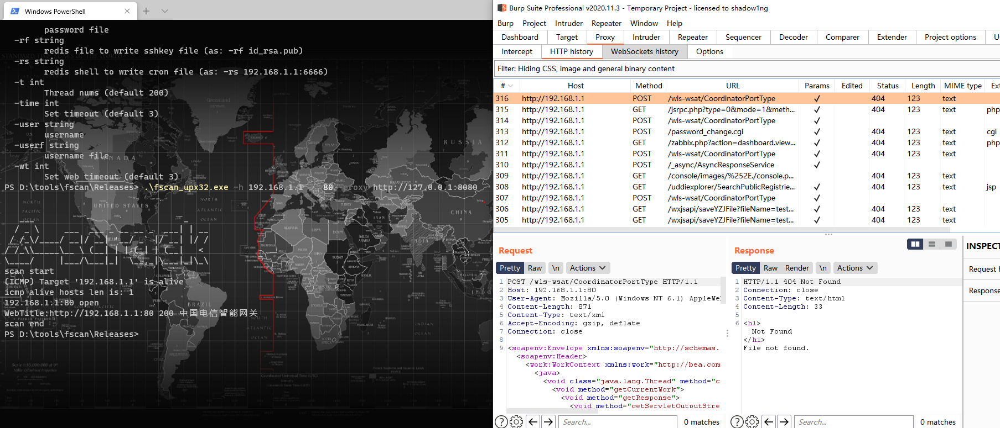

9.7k star,强大、开源的一款内网综合扫描工具

大家好，每天给大家带来不错的开源项目推荐,文末有**开源精选合集**

今天推荐的是一款功能强大的内网综合扫描工具

>项目地址：https://github.com/shadow1ng/fscan

效果如下:

## fscan项目简介

fscan是一款go语言开发的内网扫描工具，非常适合运维、安全或者其他相关人员使用。

支持一键自动化的漏洞扫描工作，支持大部分场景使用，如主机存活、端口扫描、常见服务的爆破、ms17010、redis批量写公钥、计划任务反弹shell、读取win网卡信息、web指纹识别、web漏洞扫描、netbios探测、域控识别等功能。

## fscan如何安装

 

 可以看到该工具已经被下载过400k+

安装使用直接到github releases中下载对应的二进制包即可

## 功能特点

1. **信息搜集**：
   - 存活探测（ICMP）
   - 端口扫描

2. **爆破功能**：
   - 各类服务爆破（如 SSH、SMB、RDP 等）
   - 数据库密码爆破（如 MySQL、MSSQL、Redis、PostgreSQL、Oracle 等）

3. **系统信息与漏洞扫描**：
   - NetBIOS 探测、域控识别
   - 获取目标网卡信息
   - 高危漏洞扫描（如 MS17010 等）

4. **Web 探测功能**：
   - Web 标题探测
   - Web 指纹识别（常见 CMS、OA 框架等）
   - Web 漏洞扫描（如 WebLogic、Struts2 等，支持 xray 的 POC）

5. **漏洞利用**：
   - Redis 写公钥或写计划任务
   - SSH 命令执行
   - MS17017 利用（如植入 shellcode，添加用户等）
  

1. **其他功能**：
   - 文件保存
   - 支持多种扫描模式和参数设置

## star数

  

 可以看到该项目目前获得了9.7k star

 >回复关键字**开源合集**获取精选开源工具