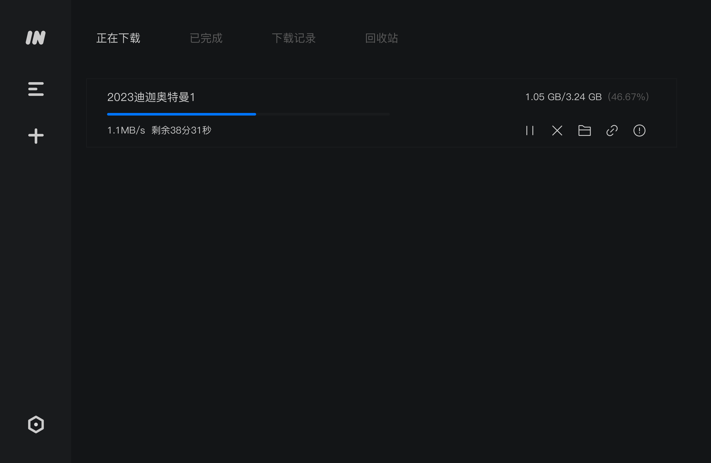

超强！全功能、无限速，某雷平替

如果你是资源党，那么今天推荐的这款下载工具一点要了解下，之前推荐过的开源下载工具motrix，今天这款是它的开源fork的工具，在motrix的基础上功能做了细化和升级。

跨平台支持，下载地址在文末

无论你是电影、热播剧集爱好者，或者是打工人，这款工具的下载能力都可以让你满足。

>项目地址：https://github.com/imfile-io/imfile-desktop

## 项目简介

imfile是一款全功能的下载管理器。

推出这款工具的一个大前提是因为motrix很久没有更新了，这款在motrix的基础上解决一些现存的问题，做了一些更新。

它支持HTTP、FTP、BitTorrent、Magnet等下载，而且界面很简单

## 如何安装

 

目前该工具的下载安装量已经有11万次。

可以直接在官网获取对应安装包，也可以直接去github 的releases中拿到对应的包

## 功能特点

- 简单、干净的管理页面，对于大部分用户来讲都很合适
- 支持 BitTorrent 和 Magnet、可以对BitTorrent 选择性下载
- 每天自动更新跟踪器列表
- 最多 10 个并发下载任务、单任务支持 64 个线程
- 托盘速度计显示实时速度
- 自动保存任务，重启不丢失任务
## star数

  

>下载地址：https://imfile.io/

