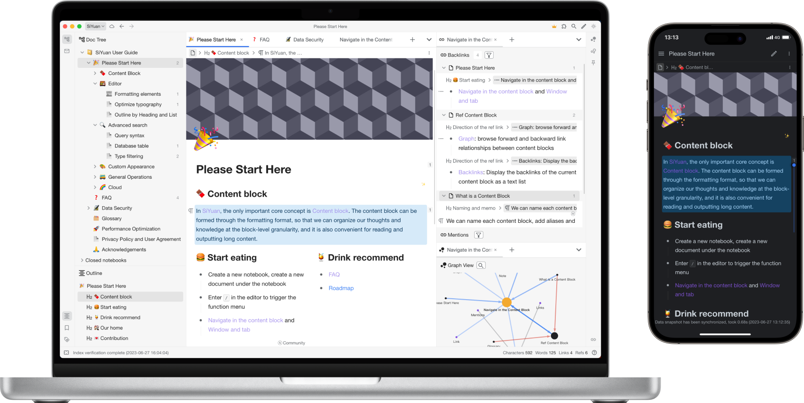
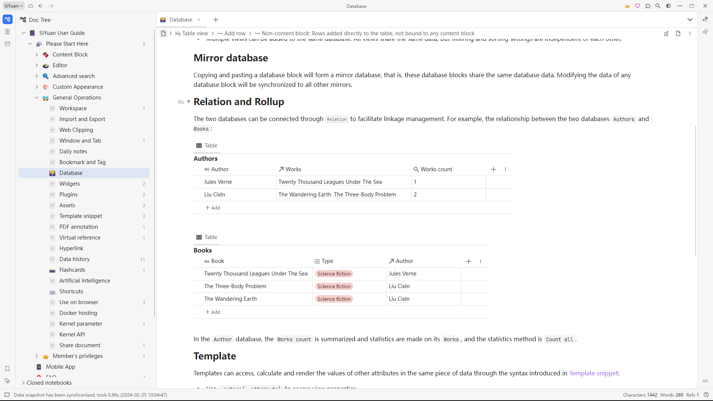
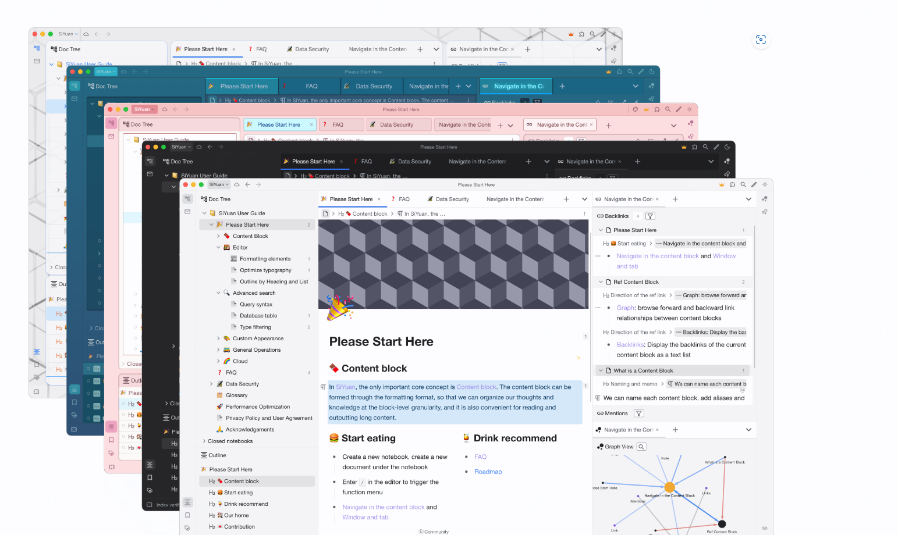

18.1K star,Docker搭建一款个人知识管理的笔记软件

大家好，每天给大家带来不错的开源项目推荐,文末有**开源精选合集**

今天推荐的是一款开源的可以快速通过docker部署的知识管理笔记软件，效果如下：





>项目地址：https://github.com/siyuan-note/siyuan

## siyuan项目简介

思源笔记是一款支持融合块、大纲和双向链接，并且以隐私优先的个人知识管理系统，支持完全离线使用，同时也支持端到端加密同步。

通过该工具可以完善你的思路，重构你的思维。



## siyuan如何安装

 

 

 可以看到该工具的下载量很高，超过10万级别的一个下载量，而镜像的拉取量更是达到了上百万之多。

 如何安装下载，如果你是需要客户端那么在github 的releases或者是官网可以直接下载对应的安装包

 

如果你是要通过docker来部署的话，可以通过如下下步骤来完成

```
docker run -d -v workspace_dir_host:workspace_dir_container -p 6806:6806 b3log/siyuan --workspace=workspace_dir_container --accessAuthCode=xxx
```
然后去访问对应的端口即可，上述注意将xxx根据实际替换掉

## 功能特点

看了下官网的介绍，功能真的很齐全，需要的不需要的基本都实现了， 这里简单介绍几个重要的。

而且开源版本，大部分功能都是免费可使用的。

关于编辑相关的功能，支持块式，Markdown 所见即所得，列表大纲，百万字大文档编辑，数学公式、图表、流程图、甘特图、时序图、五线谱等，PDF注释链接

关于AI功能通过 OpenAI API 进行 AI 写作和问答聊天

还有就是一个安全隐私性，端到端加密同步 通过端到端加密技术确保隐私安全，通过增量同步技术节省流量，提升数据同步效率。

Docker 部署 通过 Docker 镜像将思源部署在服务器上来搭建自己的云端笔记，通过授权码控制访问权限，方便多人协作。

## star数

  

 目前该工具已经获得了18k star，感兴趣的可以关注下。

 >回复关键字**开源合集**获取精选开源工具
