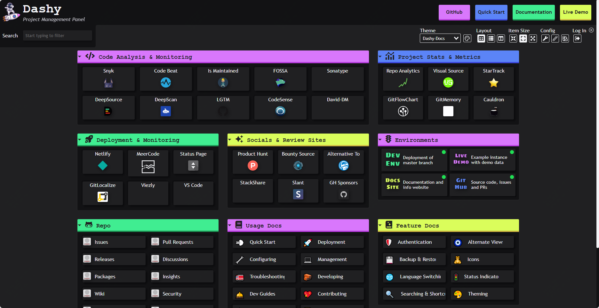
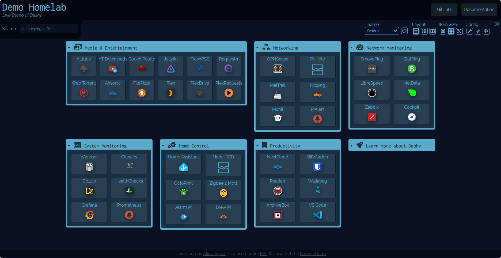
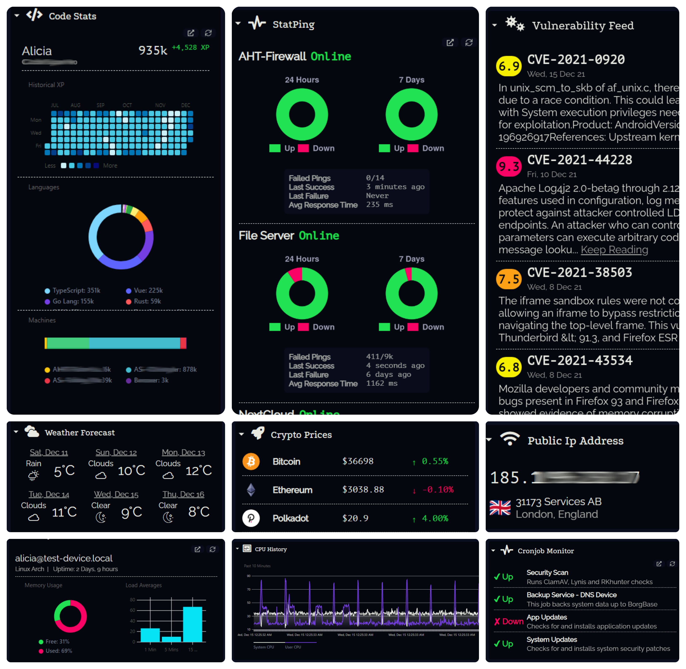

16.8k star,Docker快速搭建一个强大又炫酷的个人面板

大家好，每天给大家带来不错的开源项目推荐,文末有**开源精选合集**

今天推荐的是一款开源的可自托管的个人仪表盘，可以安装部署在nas中。




>项目地址：https://github.com/Lissy93/dashy

## 项目简介

Dashy 提供了一个仪表盘可以管理你的各类服务，



## 如何安装

 

镜像被拉取的数量有10万次，通过docker部署方式也简单，具体如下：

```
docker run -p 8080:8080 lissy93/dashy
```

或者可以

```
docker run -d \
  -p 4000:8080 \
  -v /root/my-local-conf.yml:/app/user-data/conf.yml \
  --name my-dashboard \
  --restart=always \
  lissy93/dashy:latest

```


## 功能特点

1. **实时状态监控**
   Dashy 提供实时状态监控功能，用户可以通过仪表盘实时查看每个服务的运行状态。这对于确保关键服务的正常运行非常重要，特别是在自托管环境中，用户可以及时发现并解决问题。

2. **小部件支持**
   小部件是 Dashy 的一个强大功能，允许用户在仪表盘上显示各种动态内容和信息。用户可以添加不同类型的小部件，如天气、系统状态、RSS 订阅等，极大地增强了仪表盘的实用性和可定制性。

3. **多种主题和自定义 CSS**
   Dashy 内置了多种颜色主题，用户可以根据个人喜好选择不同的主题。此外，Dashy 还支持 UI 颜色编辑和自定义 CSS，用户可以完全按照自己的需求定制仪表盘的外观。

4. **可选认证和多用户支持**
   Dashy 支持多用户访问和可配置权限，用户可以根据需要设置不同用户的访问权限。这对于团队协作和共享仪表盘非常有用。此外，Dashy 还支持单点登录（SSO），简化了用户管理。

5. **云备份和恢复**
   Dashy 提供可选的加密免费云备份和恢复功能，用户可以将仪表盘配置备份到云端，并在需要时恢复。这为用户提供了额外的安全保障，确保数据不会丢失。


## star数

  

 目前该项目获得了17k star

 >回复关键字**开源合集**获取精选开源工具