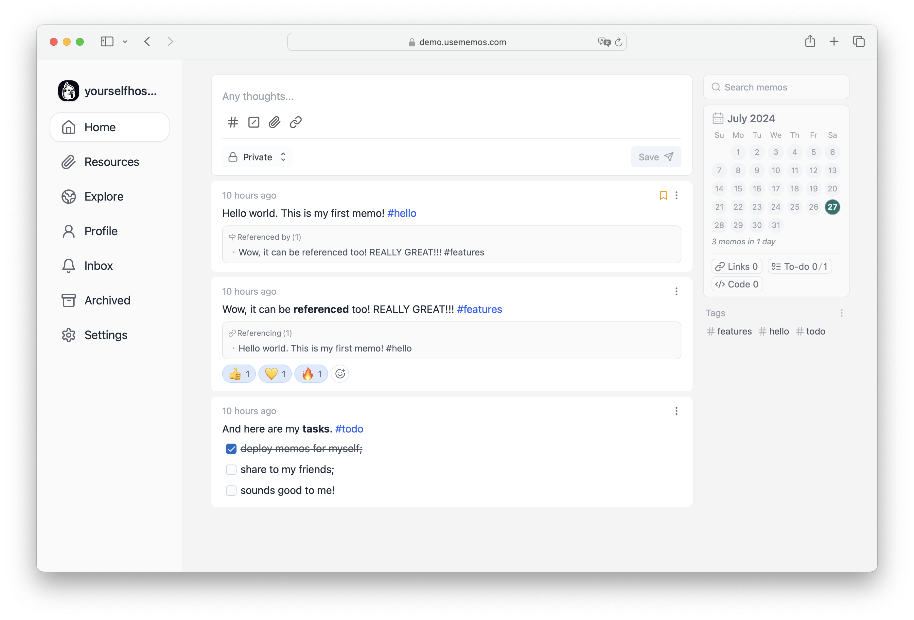
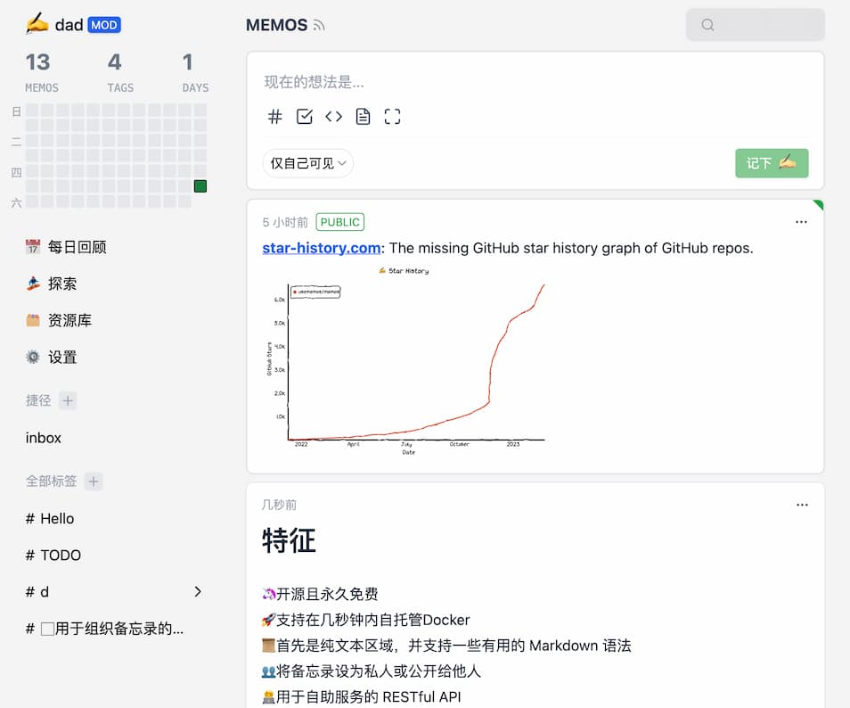
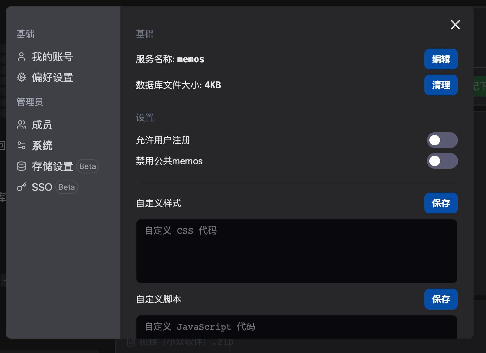

29.9k star,Docker搭建开源的个人碎片化知识管理系统

大家好，每天给大家带来不错的开源项目推荐,文末有**开源精选合集**

今天推荐的是一款开源的轻量级笔记服务，可以轻松获取和分享你此刻的想法。

>项目地址：https://github.com/usememos/memos



## memos项目简介

memos是一个注重隐私的轻量级笔记服务，使用 Go + React.js + SQLite 架构，整体包非常轻量级。



## memos如何安装

目前memos的镜像拉取及安装量如下：

 

 

如果你使用docker部署的话，只需要几秒就可以完成部署，具体如下

```
docker run -d --name memos -p 5230:5230 -v ~/.memos/:/var/opt/memos neosmemo/memos:stable
```
上述这个命令适合在linux或者unix系统启动，如果是windows环境，部分配置需要调整

可以到github项目中查看


## 功能特点

- 1.开源免费使用，目前该项目的所有功能都是免费可使用的，而且官方也明确表示不会以任何形式收费
- 2.docker启动快捷，只需要很短时间都可以启动，docker部署可以自己托管
- 3.支持markdown格式，适合需要极简编辑方式的你
- 4.可以轻松定义和共享你的笔记
- 5.支持第三方服务的restful api

## star数

   

 目前该项目已经获得了30k star。

 >回复关键字**开源合集**获取精选开源工具