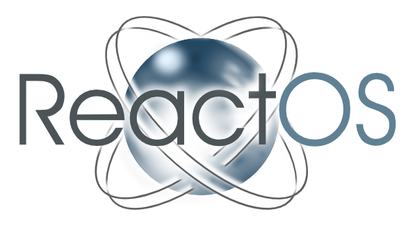
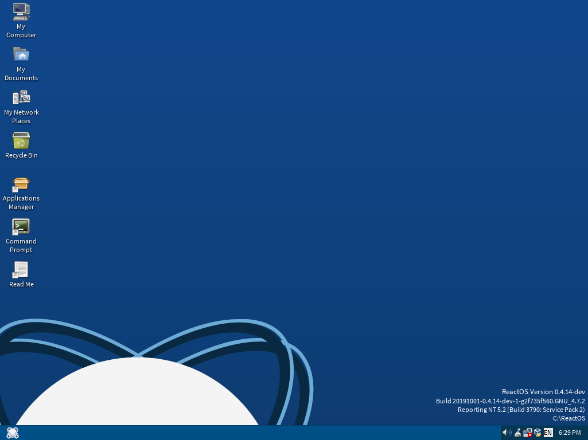

14.6k star,什么？Win系统居然还有开源替代版

ReactOS 是一个免费且开源的操作系统，旨在提供与 Microsoft Windows 兼容的替代方案。它基于 Windows NT 架构，支持现有的应用程序和驱动程序。

ReactOS 的目标是为用户提供一个与 Windows 相似的使用体验，同时保持开源社区的灵活性和创新能力。

#### 功能特点

1. **Windows 软件兼容性**：ReactOS 能够运行大多数 Windows 应用程序，这使得用户可以继续使用他们熟悉的软件，而无需进行额外的适配。
2. **Windows 驱动程序支持**：ReactOS 支持 Windows 驱动程序，这意味着用户可以在 ReactOS 上使用他们现有的硬件，而无需担心兼容性问题。
3. **Windows 外观和感觉**：ReactOS 的用户界面设计与 Windows 十分相似，用户可以轻松上手，无需重新学习。
4. **开源和免费**：ReactOS 是完全开源的，用户可以自由下载、使用和修改源代码。这不仅降低了使用成本，还促进了社区的协作和创新。

#### 吸引用户的特点

1. **成本效益**：作为一个免费的操作系统，ReactOS 为那些希望降低软件成本的个人和企业提供了一个极具吸引力的选择。用户无需支付昂贵的许可证费用即可享受类似 Windows 的体验。
2. **社区支持**：ReactOS 拥有一个活跃的开源社区，用户可以从中获得帮助和支持。社区成员不断改进和更新系统，确保其稳定性和安全性。
3. **灵活性和可定制性**：由于 ReactOS 是开源的，用户可以根据自己的需求对系统进行定制和优化。这种灵活性使得 ReactOS 成为开发者和技术爱好者的理想选择。
4. **学习和发展机会**：参与 ReactOS 项目的开发和维护，可以帮助开发者深入了解操作系统的内部工作原理，提升他们的编程技能和职业竞争力。

#### 快速使用指南

1. **下载和安装**：访问 ReactOS 官方网站reactos.org，下载最新的安装镜像文件。将镜像文件刻录到光盘或创建一个可启动的 USB 驱动器，然后按照安装向导的指示进行安装。
2. **初始设置**：安装完成后，启动 ReactOS 并进行初始设置。这包括设置语言、时区和网络连接等基本配置。
3. **安装应用程序**：ReactOS 提供了一个应用程序管理器，用户可以通过它来安装常用的软件。用户还可以直接从官方网站或其他可信来源下载 Windows 应用程序并进行安装。
4. **驱动程序安装**：如果需要安装特定的硬件驱动程序，可以从硬件制造商的网站下载相应的 Windows 驱动程序，并按照常规的安装步骤进行安装。
5. **系统更新**：定期检查和安装 ReactOS 的更新，以确保系统的安全性和稳定性。用户可以通过系统设置中的更新选项来进行检查和安装。

ReactOS 作为一个免费的 Windows 替代操作系统，凭借其强大的兼容性和灵活性，吸引了众多用户和开发者的关注。无论是个人用户还是企业用户，都可以从中受益，享受一个稳定、安全且高效的操作系统体验。
