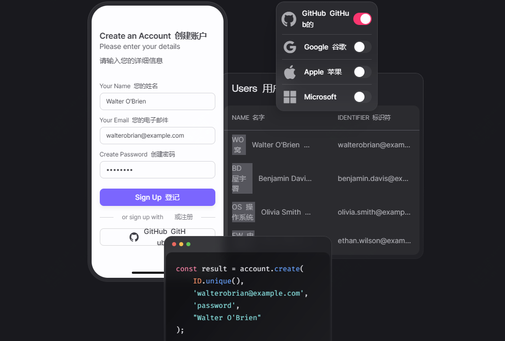
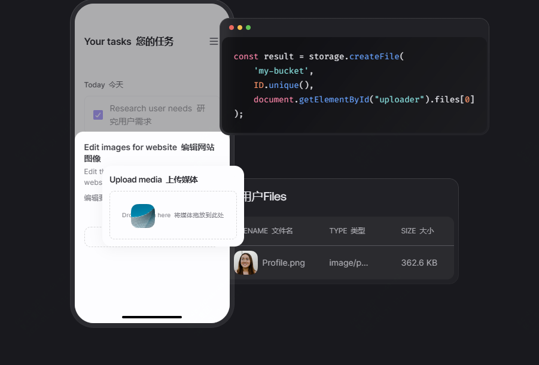

46.5k star,以一当百，一个人完成一个团队的任务

如果你是后端开发者，那么日常一定会遇到类似的问题：

- 很多基础的功能需要重新写一遍，如用户管理
- 数据库信息需要重新配置，需要不断的和DBA沟通
- 常规功能如文件的上传、下载，如何更加安全，保证数据安全
- 图像文件的处理，如裁剪、调整等
- 等等

今天推荐一款开源的项目appwrite，不仅可以一次性的解决上述问题，让你的开发效率加倍，还可以有很多延展功能。

就算用不到，作为开源项目，也可以作为学习练手的项目。


## 关于appwrite

Appwrite 是一个用于开发 Web、Mobile 和 Flutter 应用程序的后端平台。由开源社区构建，并针对您喜爱的编码语言的开发人员体验进行了优化。

## 如何部署该项目

如果你想快速体验，可以通过docker部署。

linux环境可以执行如下命令

```bash
docker run -it --rm \
    --volume /var/run/docker.sock:/var/run/docker.sock \
    --volume "$(pwd)"/appwrite:/usr/src/code/appwrite:rw \
    --entrypoint="install" \
    appwrite/appwrite:1.6.0
```

windows环境执行如下，不过需要稍微等待几分钟

```cmd
docker run -it --rm ^
    --volume //var/run/docker.sock:/var/run/docker.sock ^
    --volume "%cd%"/appwrite:/usr/src/code/appwrite:rw ^
    --entrypoint="install" ^
    appwrite/appwrite:1.6.0
```

上述执行启动后，可以通过访问本机的http://localhost/ 地址查看页面，也可以通过docker-compose方式启动，官方也提供如k8s等容器编排环境的启动方式。

## appwrite功能具体介绍

- 最核心用到最多的应该是它的认证功能了，支持通过邮件、短信等认证方式



- 数据库管理，可以存储、查询和管理数据，支持大部分数据库


- 文件存储管理，支持文件加密、压缩存储，同样支持图片文件


- 支持项目管理


>开源地址：https://github.com/appwrite/appwrite