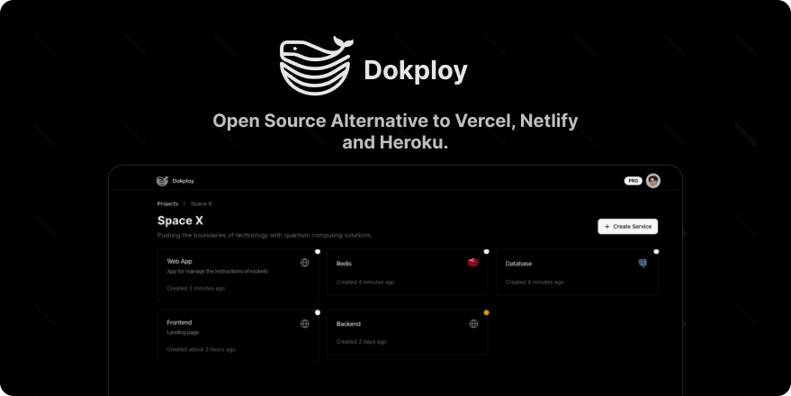
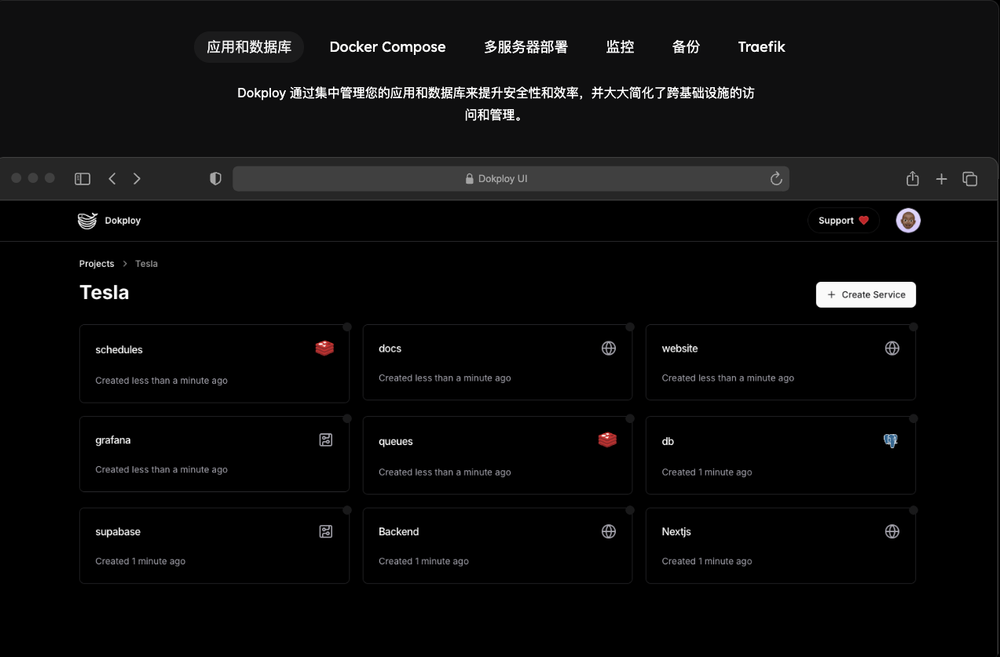
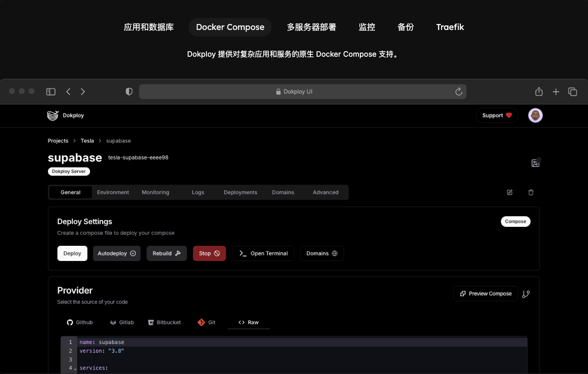
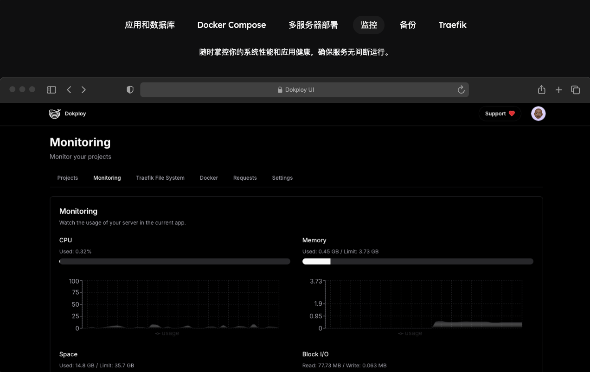

11.1k star，放弃宝塔，推荐一款私活效率工具！

在当今快速发展的技术环境中，开发者们面临着越来越多的挑战，尤其是在应用程序的部署和管理方面。为了解决这些问题，Dokploy应运而生，成为一个开源的替代方案，旨在简化应用程序和数据库的部署过程。其功能丰富，支持多种编程语言和数据库，极大地提升了开发者的工作效率。



### Dokploy的核心特性

1. **多样化的应用支持**：Dokploy允许用户部署各种类型的应用程序，包括Node.js、PHP、Python、Go和Ruby等。这种灵活性使得开发者能够根据项目需求选择合适的技术栈。

2. **数据库管理**：Dokploy支持多种数据库的创建和管理，包括MySQL、PostgreSQL、MongoDB、MariaDB和Redis。用户可以轻松地进行数据库的配置和维护，确保数据的安全性和可用性。



3. **自动备份功能**：为了防止数据丢失，Dokploy提供了自动备份的功能，用户可以将数据库备份到外部存储位置，确保数据的安全。


4. **Docker Compose支持**：Dokploy原生支持Docker Compose，帮助用户管理复杂的应用程序，简化了容器的配置和管理过程。



5. **多节点扩展**：通过Docker Swarm，Dokploy允许用户将应用程序扩展到多个节点，提升了应用的可用性和性能。



6. **实时监控**：Dokploy提供实时监控功能，用户可以随时查看CPU、内存、存储和网络使用情况，及时发现并解决潜在问题。


7. **CLI/API管理**：用户可以通过命令行或API管理应用程序和数据库，提供了更高的灵活性和自动化能力。

### 开始使用Dokploy

要开始使用Dokploy，用户只需在VPS上运行以下命令即可快速安装：

```bash
curl -sSL https://dokploy.com/install.sh | sh
```

对于那些希望跳过安装过程的用户，Dokploy还提供了云服务选项，方便用户直接使用。

### 结论

Dokploy作为一个开源的PaaS平台，凭借其强大的功能和灵活性，成为开发者们的得力助手。无论是小型项目还是大型应用，Dokploy都能提供高效的解决方案，帮助开发者专注于代码的编写，而不是繁琐的部署过程。想要了解更多信息，可以访问开源

地址：github.com/Dokploy/dokploy
