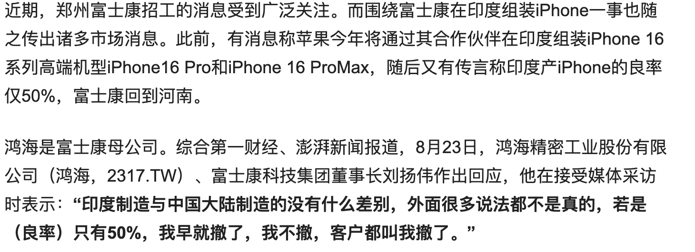
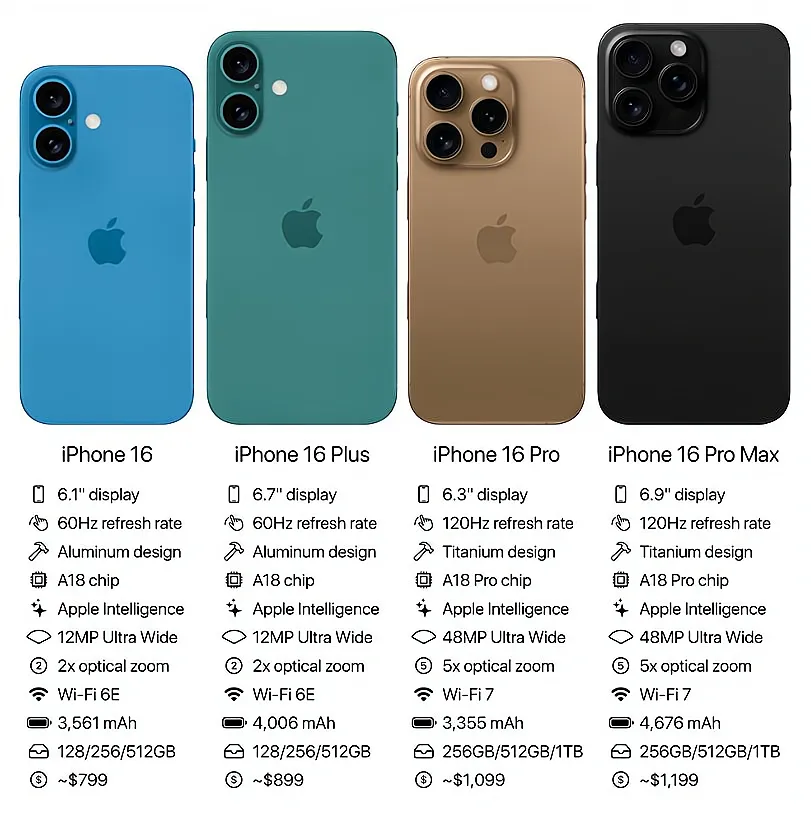

iphone 16 pro,还有两周！印度产？简单聊聊

2023年苹果的销量依旧是全球冠军，虽然销量这些年一直在减少，尤其是在今年富士康在印度的工厂承接了部分iphone组装的情况下。

在一些文章的评论中也会有聊到这个问题，如果是印度组装，是否会影响你换iphone 16 ，可以在评论区聊聊

而且就在最近，富士康的董事长也就组装的良率问题做了解释。

但其实苹果官方其实也做了解释，确保国行每一部都保证是国内组装，而印度产的基本是在印度销售。

而且目前印度的产量并不高，虽然有计划在明年达到25%，但今年只有14%的占比。

所以不需要担心新购的iphone16 pro是印度组装，而更应该关注的是价格以及性能。

说到价格，随着发布会的接近，其实网上已有蛮多预测了。

个人感觉，iphone16基础版基本与iphone 15保持一致，而pro款或许会有1000-2000的涨幅。

在即将到来的9月份发布会，与往年一致，将会发布iphone 16、iphone16 plus、iphone 16 pro、iphone 16 pro max。

你对哪款更感兴趣呢？

在性能上，新款都会搭载最新的A18芯片，提升会有，但不会太多，毕竟A17pro的性能其实已经过剩了。

其实更应该关注的其实是散热情况。

关于充电情况，据说会带来史诗级的升级，将会配置40w快充，可以期待一波。

目前预估是9月10号带来发布会！

