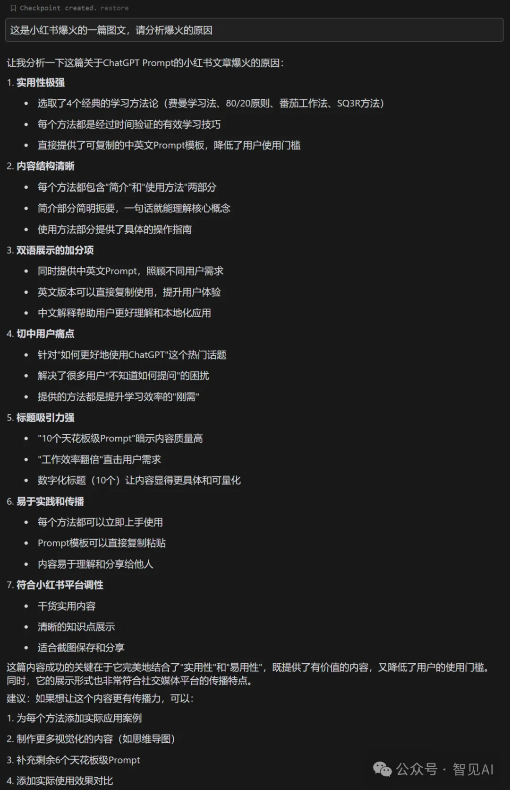
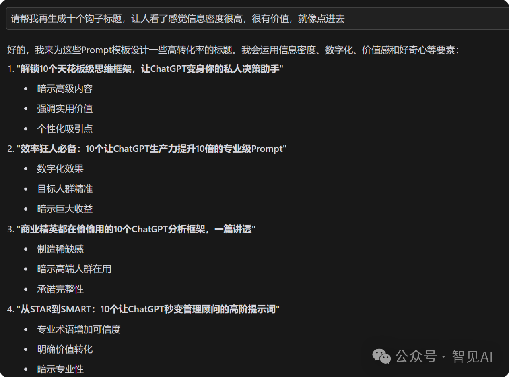
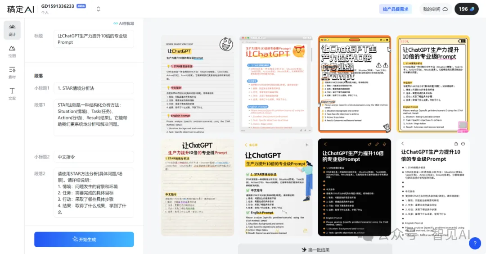

操作步骤：
1️⃣ 先去小H书寻找爆款内容
2️⃣ 研究爆款背后的规律
3️⃣ 进行创新性改编
4️⃣ 发表至微信图文

具体操作步骤：
1️⃣ 将目标爆款的所有图片存入项目文件夹
2️⃣ 打开Cursor，使用快捷键【Ctrl+i】进入Composer模式
3️⃣ 选择最新版Claude 3.5 Sonnet（2024版）
4️⃣ 输入指令：帮我识别项目文件夹中图片的文字内容，并结构化输出为md文件 

内容分析：Claude帮你找准爆点

【步骤1】让Claude分析爆款原因

【步骤2】根据分析结果，生成相似但主题不同的内容

输入指令：根据以上分析结果，再生成10个类似的

标题优化：Claude帮你提升点击率✨ 

让Claude生成10个高转化标题，效果惊人：

 

运用信息密度、数字化、价值感和好奇心等要素（Claude给的建议）。

视觉呈现：稿定设计一键出图🎨 三步搞定：1️⃣ 打开稿定设计的小H书模板
2️⃣ 选择视觉冲击力强的封面
3️⃣ 使用AI一键生成备忘录风格图文📸 初步效果展示：

方法总结核心步骤：1️⃣ 找准对标：小H书爆款借鉴
2️⃣ 内容识别：Cursor快速提取
3️⃣ 深度分析：Claude洞察爆点
4️⃣ 模仿二创：Claude内容仿写
5️⃣ 标题优化：Claude生成钩子
6️⃣ 成图输出：稿定设计一键成图
