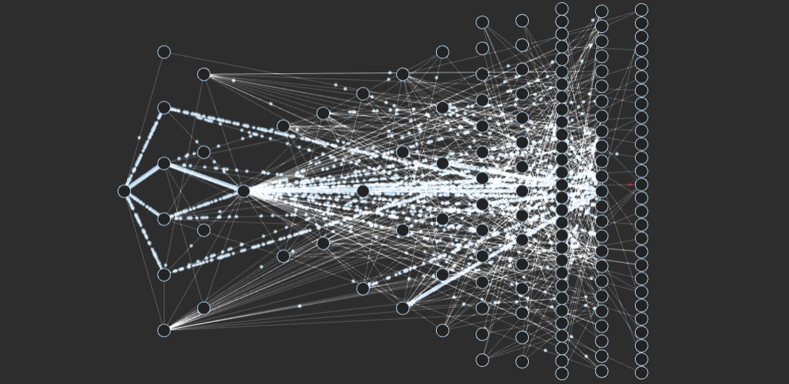
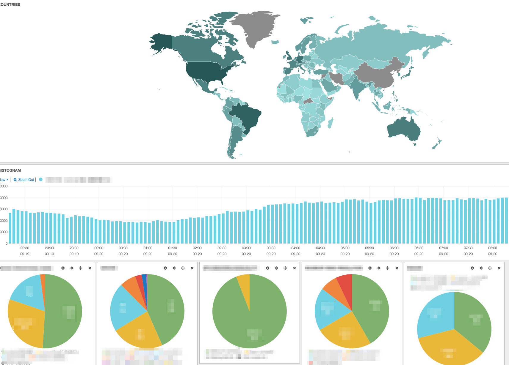

Netflix SRE之道：1亿+会员,每天观看超过1.25亿小时,数百个微服务,成千上万的实例,只有少于10个核心SRE。

这篇文章是发布于6年前的，讲述了Netflix模式下的SRE是怎样的，至今读来依旧受益匪浅

下面是文章原文翻译

在Netflix，“自由与责任”的原则已经深深地融入了我们的文化结构中，并由此产生了很多东西。一方面，工程团队可以自由地将新功能和服务推向生产，而无需任何批准或繁文缛节。另一方面，他们也有责任成为服务的所有者，这包括他们生产服务的运营责任。

这种方法赋予团队能力，并允许灵活性和快速实现新功能的能力。但是这种方法如何在这样的系统中扩展呢？

在此可视化中，每个圆圈表示由如上所述的工程团队拥有的不同服务。许多服务每周都会更新多次。我们的服务之一，API服务，每天都会收到数十次更新。拥有能够实现这一点的系统对于开发人员的速度来说是非常棒的。但在我们的尺度上，这也是“左手不知道右手在做什么”的定义。公司里没有人能跟踪我们所有系统的所有变化。此外，随着我们增加新的产品功能和设备以及扩大我们的会员基础，我们的系统变得越来越复杂。

尽管存在这些挑战，但整个系统需要协同工作，以提供出色的客户体验和非常高的可靠性。这是怎么回事？

## Netflix上的Core SRE

许多不同团队的大量工作、工具和良好决策都有助于完成这项工作。但我们秘密的一部分是我们的核心SRE团队，一个由经验丰富的SRE和系统工程师组成的小团队，我们可以称之为服务的中枢神经系统。

Netflix的核心SRE团队的工作是尽可能多地了解我们的系统，并利用这些知识使我们的系统更好，更可靠和可用。更具体地说，核心SRE：

- 1. 了解事件
- 2. 查看事件模式和正常运营
- 3. 将模式转化为工具和最佳实践，以最大限度地减少和防止未来的事件

### 了解事件

在事故发生时，SRE通常是第一反应者，但并不总是如此。然后，该人员将进行故障排除并深入研究事件，确定其严重性，并找出需要谁（如果有人）来缓解问题并找到导致问题的因素。这可能是上述可视化中一个或多个服务的所有者，也可能是外部合作伙伴（例如，设备伙伴）。核心SRE团队将有助于确定在任何特定情况下（例如，将交通转移到其他地区）。因为他们对整个系统了解最多，SRE通常能够快速理解问题。有了这些知识，在许多情况下，我们可以在许多甚至任何客户体验不佳之前缓解事件。

### 在事故和健康运营中发现模式

当一个事件结束时，Netflix的SRE工作才刚刚开始。下一步是以批判的眼光看待事件，并提出许多问题，例如：

- 是什么导致了这一事件？
- 是什么阻止了这一事件？是否有未遵循的最佳实践？当团队遵循最佳实践时，它是否具有预期的效果？
- 团队可以做哪些后续工作来防止类似事件发生？
- 我们当时能有什么样的洞察力，让我们更快地理解是什么促成了这一事件的发生？
- 什么工具可以帮助我们使事件不那么严重或更短？
- 以前发生过这种事吗？有规律吗？
- 参与这一事件的球队是否在水下犯下了比我们通常期望的更多的“非受迫性错误”？那里怎么了？

除了在每次事件发生后问自己这些问题外，我们还分析了所有事件的数据，无论这些事件多么轻微，都可以看到随着时间的推移而出现的模式。重要的是，我们还想了解当事情进展顺利时会发生什么，而不仅仅是当事情破裂时。这为我们提供了更丰富的数据集。

### 将模式转化为工具和最佳实践，以最大限度地减少和防止未来的事件

虽然我们的SRE没有嵌入到拥有个人服务的工程团队中，但我们运行着一个“管理”计划。该计划将关键工程团队与SRE配对。与关键团队保持紧密联系，使核心SRE团队能够更好地了解痛点（这可以转化为对工具和其他学习的改进），并直接与团队倡导最佳实践。除了管理计划外，我们还以其他方式在整个组织中推动计划，例如发布最佳实践，定期讲座以及准备生产就绪服务的指导方针。

当然，开发人员和运营工具和指标在所有这些方面都起着关键作用。我们的服务和设备收集有关系统健康的各种指标：单个服务可能有数千个指标。寻找导致问题的因素组合往往感觉像大海捞针。因此，Netflix的团队和Core SRE团队强调了定义良好指标的重要性，保持它们的更新，并将它们转化为直观的仪表板（如下图）和可操作的警报。

此外，随着我们系统的复杂性越来越高，我们在自动化分析方面的投资也越来越多。例如，我们自动寻找与趋势的偏差，并运行算法来关联时间序列。所有这些努力的目标是减少SRE和开发人员的认知负荷，以便我们能够更快地理解事件。

除了不断改进我们的工具和见解外，我们还希望最大限度地减少在事件发生期间和之后所做的手动工作。例如，我们希望能够无缝地寻呼人员，让合作伙伴保持在循环中，跟踪受影响的设备等等。

在某些情况下，我们在团队中构建工具。在其他方面，我们与整个Netflix的团队合作。仅举几例，我们与Mantis团队合作，给予我们对系统健康状况的实时洞察，Spinnaker团队推动我们的许多最佳实践，Chaos团队在系统故障变成事故之前了解它们。

## 未来

虽然多年来我们的可用性在许多方面都有所提高，我们的见解和工具也在不断发展，但我们相信我们只是触及了可能性的表面。我们可以更深入地分析更多的数据，更好地理解我们的模式。例如，我们希望了解更好的低信号指标。如果我们有一个问题影响到极少数客户，我们希望拥有所需的工具和洞察力，以快速找到这一小部分糟糕的客户体验，并能够更快地缓解或解决问题。随着我们客户群的增长和地理位置的多样化，我们将有更多的机会进入这些领域。