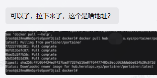
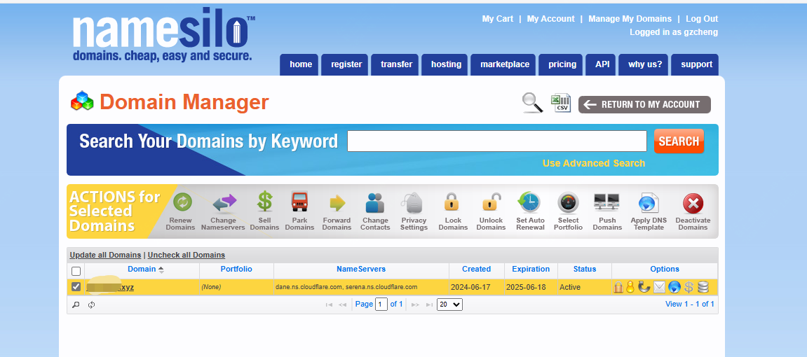
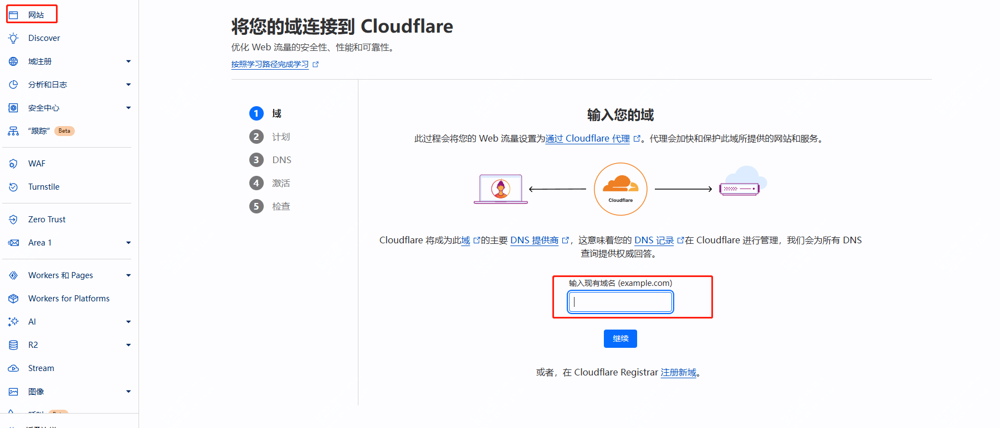
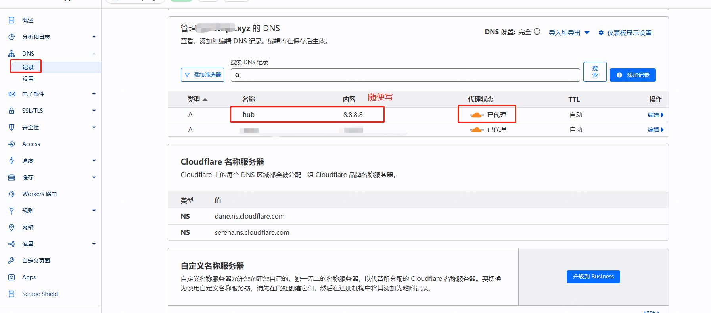
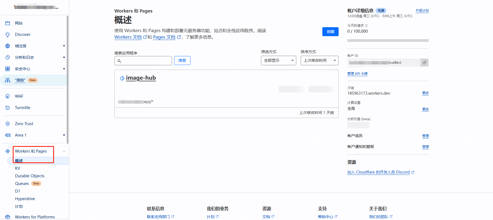
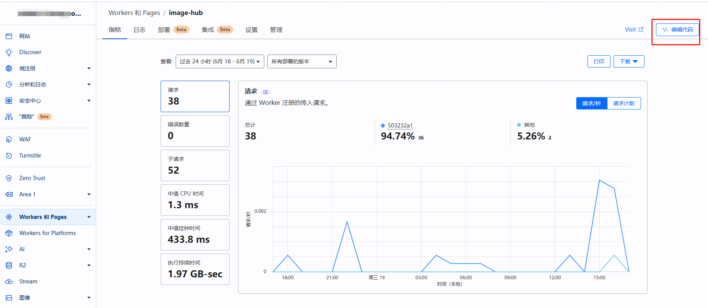
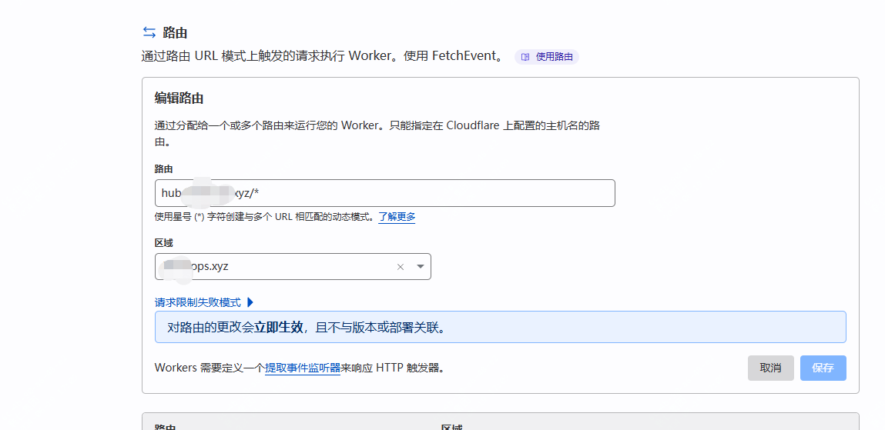
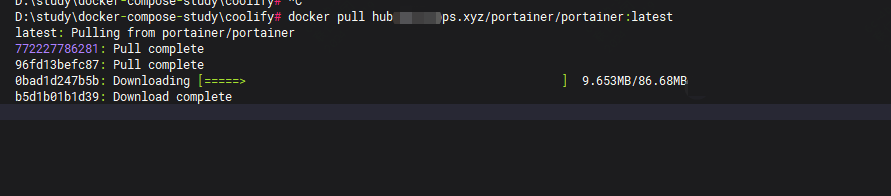

今天有位研发同事找过来问，是不是网络策略有问题了，docker pull拉镜像一直有问题。

于是就是一顿科普，最后回归到问题，要怎么解决，我司开发很敏感，所以不可能直接甩篇文章过去的。

于是提供了几种方案。

- 科学上网，先弄到本地再说，一切可解决 最后老哥操作半天没解决
- github action，就是之前一篇文章介绍过的，没听，可能没懂
- 利用CloudFlare做了个替换 最后采用的这种，不过是我这边帮忙配置好了，直接发的docker pull地址



这篇文章，就来介绍下第三种方案，灵感来源于,** B站某位大佬**


## 需要准备什么？

- 一个域名 可在https://nic.eu.org 申请，但周期长，而且被拒，我是在namesilo注册的xyz域名，10元一年，而且不会涨价
- 一个cloudflare账户，里面有免费计划，可直接使用
  

## namesilo 域名申请

地址：https://www.namesilo.com/


按步骤来即可，支持支付宝支付的

 


## cloudflare配置

### cloudflare配置网站



配置完成后，需要修改域名的 nameserver，对应如下地方

```
dane.ns.cloudflare.com
serena.ns.cloudflare.com
```

 

添加一条DNS记录



### cloudflare新建worker



### cloudflare配置Workers



核心是如下粘贴这段代码，下面有具体解释

```
'use strict'
const hub_host = 'registry-1.docker.io'
const auth_url = 'https://auth.docker.io'
// 请将 hub.org 替换为自己的域名
const workers_url = 'https://hub.org'
const PREFLIGHT_INIT = {
    status: 204,
    headers: new Headers({
        'access-control-allow-origin': '*',
        'access-control-allow-methods': 'GET,POST,PUT,PATCH,TRACE,DELETE,HEAD,OPTIONS',
        'access-control-max-age': '1728000',
    }),
}
function makeRes(body, status = 200, headers = {}) {
    headers['access-control-allow-origin'] = '*'
    return new Response(body, {status, headers})
}
function newUrl(urlStr) {
    try {
        return new URL(urlStr)
    } catch (err) {
        return null
    }
}
addEventListener('fetch', e => {
    const ret = fetchHandler(e)
        .catch(err => makeRes('cfworker error:\n' + err.stack, 502))
    e.respondWith(ret)
})
async function fetchHandler(e) {
  const getReqHeader = (key) => e.request.headers.get(key);
  let url = new URL(e.request.url);
  if (url.pathname === '/token') {
      let token_parameter = {
        headers: {
        'Host': 'auth.docker.io',
        'User-Agent': getReqHeader("User-Agent"),
        'Accept': getReqHeader("Accept"),
        'Accept-Language': getReqHeader("Accept-Language"),
        'Accept-Encoding': getReqHeader("Accept-Encoding"),
        'Connection': 'keep-alive',
        'Cache-Control': 'max-age=0'
        }
      };
      let token_url = auth_url + url.pathname + url.search
      return fetch(new Request(token_url, e.request), token_parameter)
  }
  url.hostname = hub_host;
  let parameter = {
    headers: {
      'Host': hub_host,
      'User-Agent': getReqHeader("User-Agent"),
      'Accept': getReqHeader("Accept"),
      'Accept-Language': getReqHeader("Accept-Language"),
      'Accept-Encoding': getReqHeader("Accept-Encoding"),
      'Connection': 'keep-alive',
      'Cache-Control': 'max-age=0'
    },
    cacheTtl: 3600
  };
  if (e.request.headers.has("Authorization")) {
    parameter.headers.Authorization = getReqHeader("Authorization");
  }
  let original_response = await fetch(new Request(url, e.request), parameter)
  let original_response_clone = original_response.clone();
  let original_text = original_response_clone.body;
  let response_headers = original_response.headers;
  let new_response_headers = new Headers(response_headers);
  let status = original_response.status;
  if (new_response_headers.get("Www-Authenticate")) {
    let auth = new_response_headers.get("Www-Authenticate");
    let re = new RegExp(auth_url, 'g');
    new_response_headers.set("Www-Authenticate", response_headers.get("Www-Authenticate").replace(re, workers_url));
  }
  if (new_response_headers.get("Location")) {
    return httpHandler(e.request, new_response_headers.get("Location"))
  }
  let response = new Response(original_text, {
            status,
            headers: new_response_headers
        })
  return response;
}
function httpHandler(req, pathname) {
    const reqHdrRaw = req.headers
    // preflight
    if (req.method === 'OPTIONS' &&
        reqHdrRaw.has('access-control-request-headers')
    ) {
        return new Response(null, PREFLIGHT_INIT)
    }
    let rawLen = ''
    const reqHdrNew = new Headers(reqHdrRaw)
    const refer = reqHdrNew.get('referer')
    let urlStr = pathname
    const urlObj = newUrl(urlStr)
    /** @type {RequestInit} */
    const reqInit = {
        method: req.method,
        headers: reqHdrNew,
        redirect: 'follow',
        body: req.body
    }
    return proxy(urlObj, reqInit, rawLen, 0)
}
async function proxy(urlObj, reqInit, rawLen) {
    const res = await fetch(urlObj.href, reqInit)
    const resHdrOld = res.headers
    const resHdrNew = new Headers(resHdrOld)
    // verify
    if (rawLen) {
        const newLen = resHdrOld.get('content-length') || ''
        const badLen = (rawLen !== newLen)
        if (badLen) {
            return makeRes(res.body, 400, {
                '--error': `bad len: ${newLen}, except: ${rawLen}`,
                'access-control-expose-headers': '--error',
            })
        }
    }
    const status = res.status
    resHdrNew.set('access-control-expose-headers', '*')
    resHdrNew.set('access-control-allow-origin', '*')
    resHdrNew.set('Cache-Control', 'max-age=1500')
    resHdrNew.delete('content-security-policy')
    resHdrNew.delete('content-security-policy-report-only')
    resHdrNew.delete('clear-site-data')
    return new Response(res.body, {
        status,
        headers: resHdrNew
    })
}
```

这段代码是用 **JavaScript** 编写的，它实现了一个 **Cloudflare Worker**。Cloudflare Workers 允许您在 Cloudflare 的边缘网络上运行服务器less 代码。这段特定的代码是一个 **反向代理**，它可以拦截对 Docker Registry API 的请求，并处理认证和路由。

功能概述如下：

- `fetch` 事件监听器：当 Worker 接收到外部请求时，会触发此事件。
- `fetchHandler` 函数：处理传入的 HTTP 请求，并根据请求的路径（例如 `/token`）进行路由。
- `makeRes` 函数：创建一个新的响应对象，可以自定义状态码和头部信息。
- `newUrl` 函数：尝试创建一个新的 URL 对象，如果 URL 无效则返回 `null`。
- `httpHandler` 和 `proxy` 函数：处理重定向和响应的修改，确保跨域请求的正确处理。

代码中的注释 `// 请将 hub.org 替换为自己的域名` 提示用户需要将指定的域名替换为自己的域名，以便代码能够正确地代理请求到用户的 Docker Registry。

这个 Worker 的主要作用是允许用户通过自己的域名来访问 Docker Registry，同时处理跨域请求和认证过程。


###  cloudflare配置Workers 路由

进入设置-触发器-添加路由

如下：


## 测试结果 

然后就可以去测试结果了




因为这个免费计划，是有限额的，所以没有展示出来，如果有需要的朋友，可以私聊