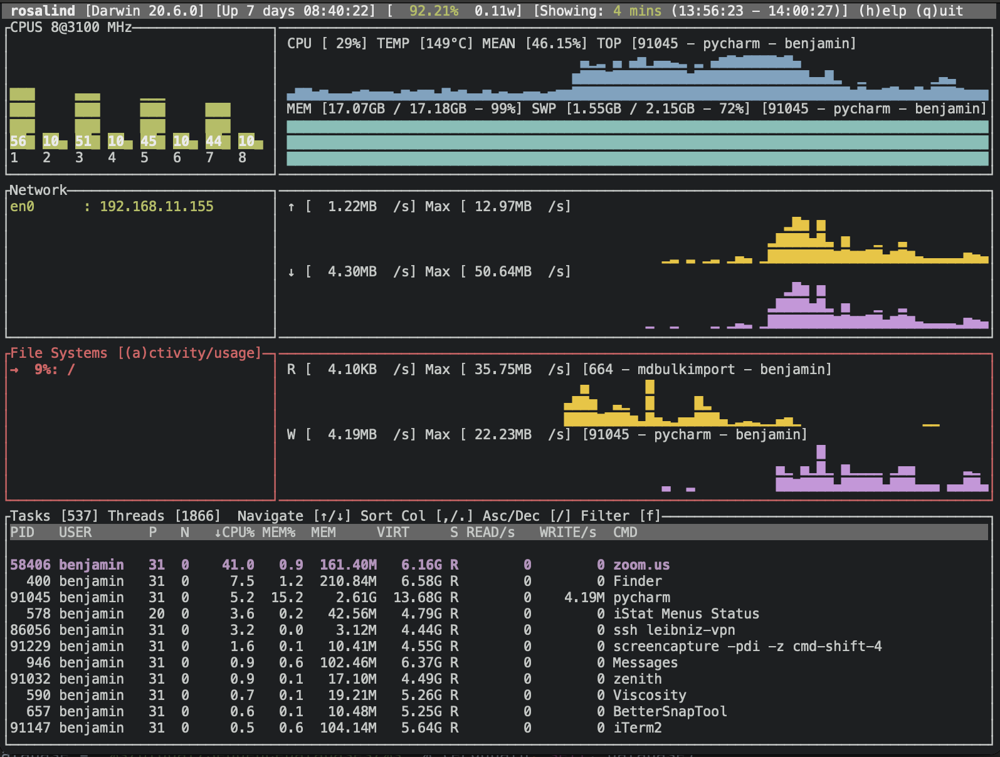
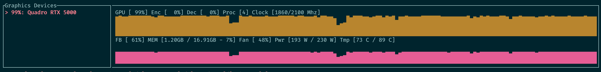
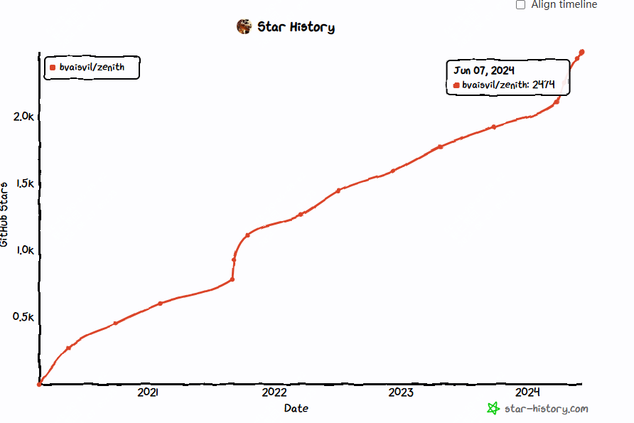

2.5k star,推荐一个好玩的开源工具

今天推荐的这款工具很酷炫，部分场景下还是很有用的，尤其是当你厌倦了以前用的工具之后。

先来看下效果图：



## zenith简介

zenith是一个类似top或者htop的系统状态展示，但是它有可以缩放的图表，可以查看CPU、GPU、网络、磁盘等状态信息。

这个工具是用rust写的，如果最近有在了解学习rust语言的，那么这个项目可以作为参考。


## zenith 有哪些特点？

- 包含常见的系统监控指标，包括不限于cpu、内存、磁盘使用情况
- 可以快速浏览磁盘的可用空间、cpu使用频率等
- 展示使用率较高的top进程或者用户
- 可以显示电池使用的百分比、充电、放电时间以及所用的功率
- 可以过滤进程
- NVIDIA GPU的GPU利用率测试（使用 --features nvidia ），包括每个进程的GPU使用率


- 目前支持mac及linux平台

## 如何快速部署安装

### 可以直接安装二进制进程，在release中

### 如果是基于debian或者ubuntu的linux用户，可以直接命令安装

但是需要基于Debian >= 9或Ubuntu >= 16.04的发行版

```
sudo apt install curl
curl -sL https://raw.githubusercontent.com/wimpysworld/deb-get/main/deb-get | sudo -E bash -s install deb-get
```

然后执行
```
deb-get install zenith
```
### Arch linux

```
pacman -S zenith
```

### mac 用户

直接通过brew安装即可

```
brew install zenith
```

## 总结

Zenith -有点像top或htop，但具有可缩放的图表，CPU，GPU，网络和磁盘使用情况

>传送门：https://github.com/bvaisvil/zenith

