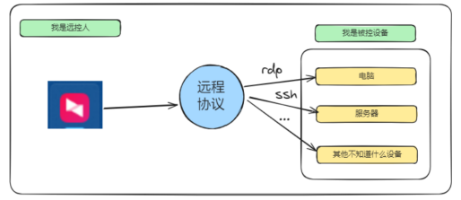
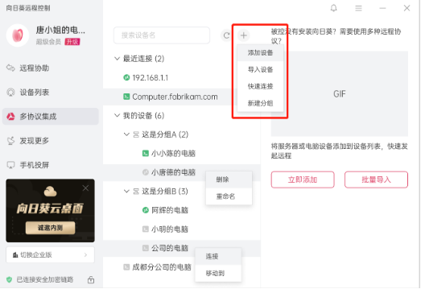
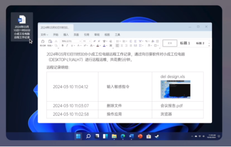
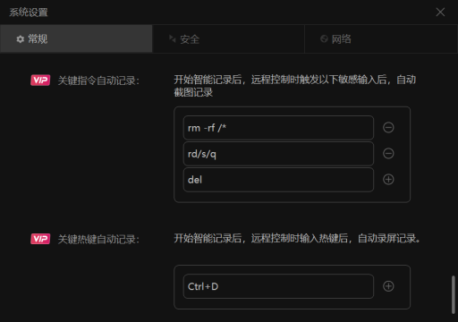
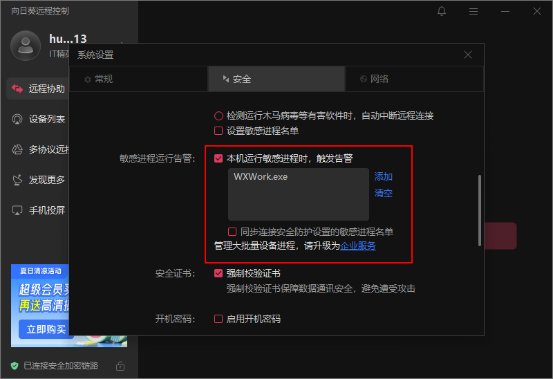

珍藏远程工具推荐，大幅提升效率

前段时间看到一条消息，开源的rustdesk远程桌面工具，国内用不了了！！

说到远程工具，其实每次出差都会备个1-2个，包括向日葵，restdesk，todesk等，但说实话，一直没有卸载过的也就只有向日葵了。

远程控制软件作为IT或者出差党最常用的工具软件之一，其本身是否高效可靠，直接关系到远程工作的效率。

与此同时，单纯的远程桌面控制已经无法满足进阶的办公需求。

能否在各种远程桌面协议中快速切换？能够帮助我们更好的总结运维工作的进展？能否兼顾一些信息安全需求？

## 软件介绍：
贝锐向日葵是一款国民级远程控制软件，自09年问世以来，广泛应用在远程办公、IT运维、技术支持等场景下，是我们熟知的装机必备工具类软件之一。

如果是常规的需求，免费版本完全可以完成需求，但是如果你有一些专业性的需求，那么：

现在，贝锐向日葵针对进阶IT运维需求，推出面向专业IT人群的服务版本——“IT精英版”，该版本搭载了“远控多协议集成”、“AI远控报告”、“全时段进程监测”等特色功能，能够大幅提升IT相关工作的效率，辅助您成为更加专业的IT人士。

就是“贝锐向日葵远程控制”全新推出的“IT精英版”服务

#### 远控多协议集成：

在现代企业环境中，往往存在多种类型的设备和系统，它们可能使用不同的通信协议。多协议集成管理能够将多种协议集成在一起，从而实现集中管理远控多样化设备，提升工作运维效率。

向日葵IT精英版支持将RDP、SSH协议集成导入向日葵远程控制软件，统一在向日葵界面发起这些第三方协议的远程控制。

向日葵远控多协议集成支持“快速连接”与“设备添加”两种发起远控方式。
快速连接：点击搜索框右侧【+】号，选择快速连接，输入IP地址与端口即可发起远程控制。
添加设备：支持输入设备名称、计算机、端口号、用户名添加；同时支持cav文件导入批量添加。已添加的设备支持分组管理，让运维更高效。

### AI远控报告：
支持远控后自动生成智能远控工作报告，降低IT工作负担，提升IT人员自身业务价值。

开启AI远控报告功能后，向日葵会检测下列关键行为并生成报告：
● 关键指令/关键热键输入
默认记录一些常见的指令，也可以自定义增删需要记录的指令，主控端触发对应指令时自动截图记录。

● OCR应用操作检测
向日葵AI远控报告结合OpenCV+OpenVINO+OCR技术，实现远控图像的识别和实时分析；检测并记录应用软件的关键操作，并且不断训练AI提升检测精度和支持的软件数量。适配Intel NPU，利用Intel NPU AI算力，降低用户cpu利用率，避免系统卡顿。
● 数据传输检测
检测并记录文件的传输、复制、拖拽等数据操作。
● 手动截屏记录
当然，向日葵也支持远控过程中手动截屏记录，让专业IT人士对远控报告拥有充分的自主权。

全时段进程监测：
为了满足IT运维专业人员对系统安全性的高要求，向日葵IT精英版新增全时段敏感进程监测功能：当设备运行所设置的敏感进程时，系统将立即通知用户，以便其迅速采取必要的安全措施。

不同于个人版服务仅能在远控期间监测敏感进程，IT精英版支持全时段监测，只需要被控端的向日葵软件在线即可。当检测到敏感进程时，将会进行消息通知，渠道包含：各端消息中心、公众号推送。

## 总结：
作为一款面向专业IT人士的远控服务，IT精英版可以很好的整合进阶IT运维工作中的各种复合需求，帮助我们大幅提升工作效率，降低工作负担，为我们提供专业的“辅助”，帮助我们成为业务更加精进的IT精英。

【插入跳转链接】

