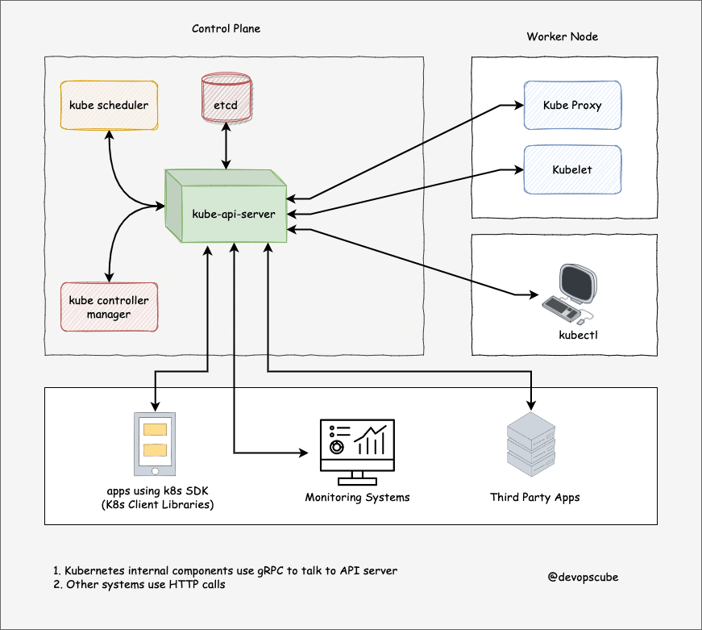
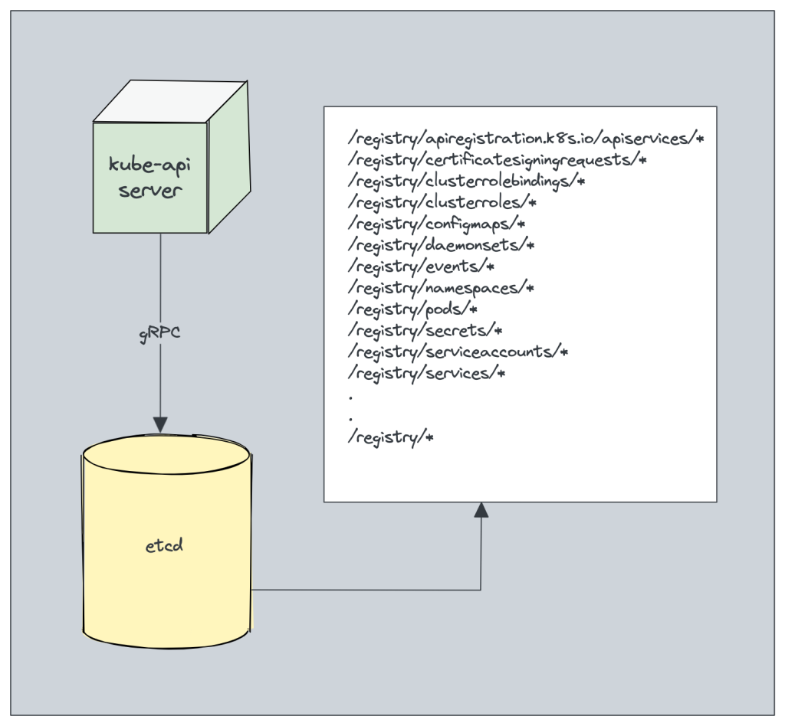
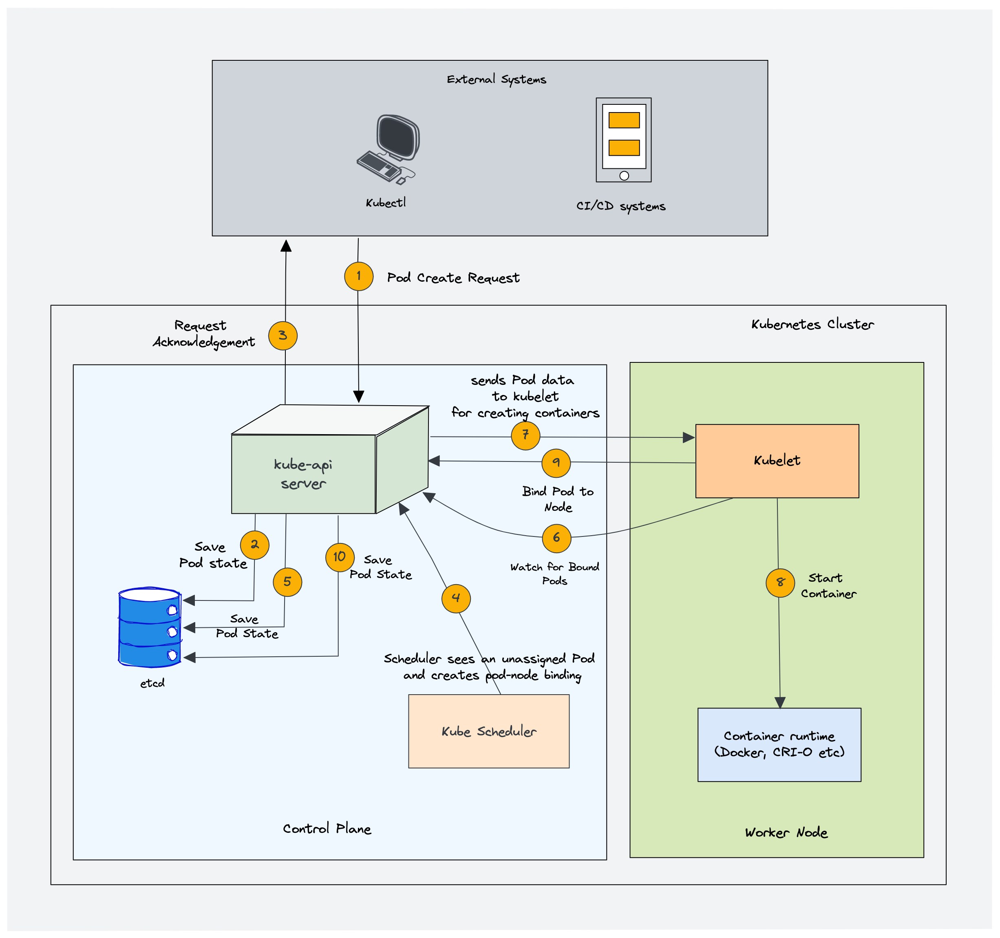
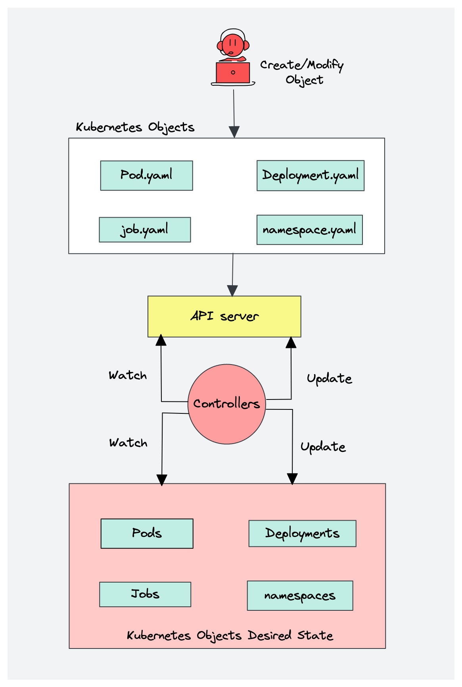
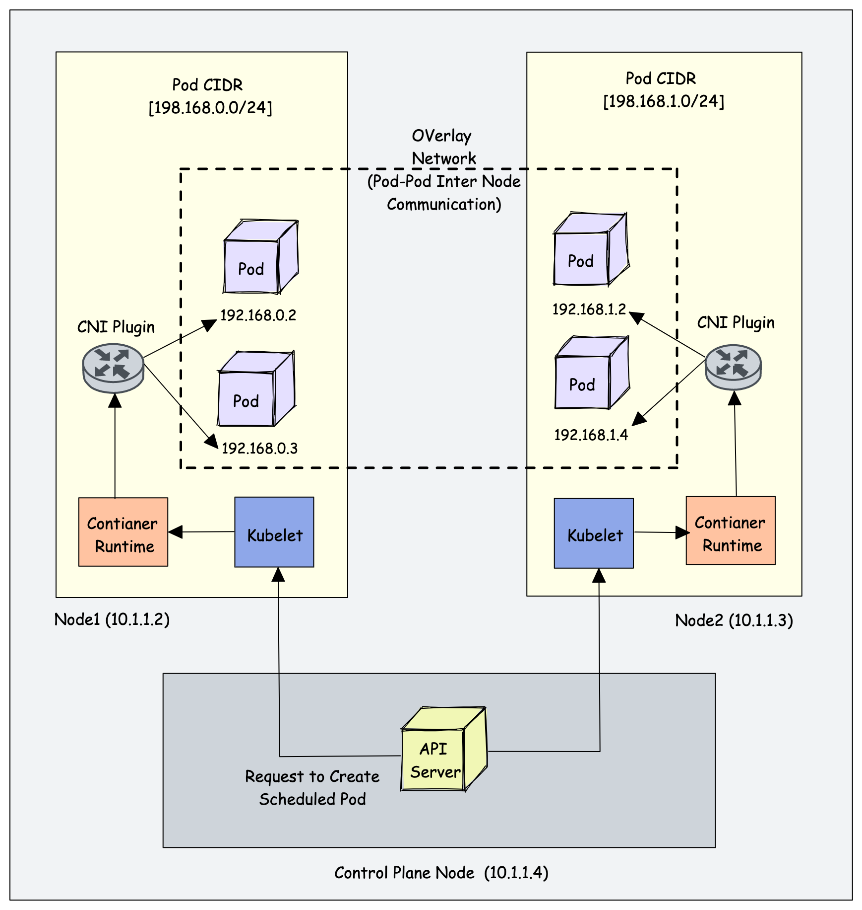

【运维干货分享】一份完整的图文手册，理解kubetnetes架构

作者：bibinwilson

译自：https://devopscube.com/kubernetes-architecture-explained/#Kubernetes_Native_Objects

这是一份完整的手册通过插图的形式去详细解释每个kubernetes组件

你将从这篇文章中了解：

- 1.理解kubernetes架构
- 2.理解kubernetes的基本概念
- 3.学习关于kubernetes架构的组件
- 4.探讨这些组件的工作流程

然后你将发现这份架构指南非常宝贵

# 什么是kubernetes架构

下面的 Kubernetes 架构图展示了 Kubernetes 集群的所有组件以及外部系统如何连接到 Kubernetes 集群。

关于 Kubernetes，你首先应该了解的也是最重要的一点是，它是一个分布式系统。这意味着它有多个组件分布在网络上的不同服务器上。这些服务器可以是虚拟机或裸机服务器。我们称之为 Kubernetes 集群。

Kubernetes 集群由控制平面节点和工作节点组成。

## 控制平面

控制平面负责容器编排并维护集群的所需状态。它具有以下组件。

- kube-apiserver
- etcd
- kube-scheduler
- kube-controller-manager
- cloud-controller-manager

一个集群可以有一个或多个控制平面节点。

## 工作节点

Worker 节点负责运行容器化应用程序。工作节点具有以下组件。

- kubelet
- kube-proxy
- Container runtime

# 控制平面组件

首先，让我们看一下每个控制平面组件以及每个组件背后的重要概念。

## 1.kube-apiserver

kube-api 服务器是 Kubernetes 集群的中心枢纽，公开 Kubernetes API。它具有高度可扩展性，可以处理大量并发请求。

最终，用户和其他集群组件通过 API 服务器与集群通信。很少情况下，监控系统和第三方服务会与 API 服务器通信以与集群交互。

因此，当您使用 kubectl 管理集群时，在后端您实际上是通过 HTTP REST API 与 API 服务器进行通信。然而，内部集群组件（如调度程序、控制器等）使用 gRPC 与 API 服务器通信。

API 服务器与集群中其他组件之间的通信通过 TLS 进行，以防止对集群进行未经授权的访问。

### Kubernetes api-server 负责以下工作。

- 1.API管理：公开集群API端点并处理所有API请求。 API是版本化的，同时支持多个API版本。
- 2.身份验证（使用客户端证书、不记名令牌和 HTTP 基本身份验证）和授权（ABAC 和 RBAC 评估）
- 3.处理 API 请求并验证 API 对象（如 Pod、服务等）的数据（验证和变更准入控制器）
- 4.它是唯一与 etcd 通信的组件。
- 5.api-server 协调控制平面和工作节点组件之间的所有进程。
- 6.api-server 有一个内置的 apiserver proxy。它是 API 服务器进程的一部分。它主要用于支持从集群外部访问 ClusterIP 服务，即使这些服务通常只能在集群本身内部访问。
- 7.API 服务器还包含一个聚合层，允许您扩展 Kubernetes API 以创建自定义 API 资源和控制器。
- 8.API 服务器还支持监视资源的变化。例如，客户端可以对特定资源建立监视，并在创建、修改或删除这些资源时接收实时通知

>**安全注意事项：为了减少集群攻击面，保护 API 服务器的安全至关重要。 Shadowserver 基金会进行了一项实验，发现了 380,000 个可公开访问的 Kubernetes API 服务器。**

## 2.etcd
Kubernetes 是一个分布式系统，它需要像 etcd 这样高效的分布式数据库来支持其分布式特性。它既充当后端服务发现又充当数据库。 你可以将其称为 Kubernetes 集群的大脑。
etcd 是一个开源的强一致性、分布式键值存储。那么这意味着什么呢？

- 1.强一致性：如果对一个节点进行更新，强一致性将确保它立即更新到集群中的所有其他节点。另外，如果你看看 CAP 定理，实现 100% 可用性、强一致性和分区容错性是不可能的。
- 2.分布式：etcd 被设计为作为集群在多个节点上运行，而不牺牲一致性。
- 3.键值存储：将数据存储为键和值的非关系数据库。它还公开了一个键值 API。该数据存储构建在 BboltDB 之上，BboltDB 是 BoltDB 的一个分支。

etcd 使用 raft 共识算法来实现强一致性和可用性。它以领导者-成员的方式工作，以实现高可用性并承受节点故障。

那么 etcd 如何与 Kubernetes 配合使用呢？

简单来说，当您使用 kubectl 获取 kubernetes 对象详细信息时，您是从 etcd 获取的。此外，当您部署像 pod 这样的对象时，会在 etcd 中创建一个条目。

简而言之，以下是您需要了解的有关 etcd 的信息。

- 1.etcd 存储 Kubernetes 对象的所有配置、状态和元数据（pod、秘密、守护进程集、部署、配置映射、状态集等）。
- 2.etcd 允许客户端使用 Watch() API 订阅事件。 Kubernetes api-server 使用 etcd 的监视功能来跟踪对象状态的变化。
- 3.etcd 使用 gRPC 公开键值 API。此外，gRPC 网关是一个 RESTful 代理，它将所有 HTTP API 调用转换为 gRPC 消息。这使其成为 Kubernetes 的理想数据库。
- 4.etcd 以键值格式存储 /registry 目录键下的所有对象。例如，default命名空间中名为Nginx的pod的信息可以在/registry/pods/default/nginx下找到

此外，etcd 是控制平面中唯一的 Statefulset 组件。

## 3.kube-scheduler

kube-scheduler 负责在工作节点上调度 Kubernetes Pod。

部署 Pod 时，您可以指定 Pod 要求，例如 CPU、内存、关联性、污点或容忍度、优先级、持久卷 (PV) 等。调度程序的主要任务是识别创建请求并为 Pod 选择最佳节点。满足要求的 Pod。

下图显示了调度程序如何工作的高级概述。

在一个 Kubernetes 集群中，会有多个工作节点。那么调度程序如何从所有工作节点中选择节点呢？

以下是调度程序的工作原理。

- 1.为了选择最佳节点，Kube 调度程序使用过滤和评分操作。
- 2.在过滤过程中，调度程序会找到最适合调度 Pod 的节点。例如，如果有五个具有资源可用性的工作节点来运行 Pod，则它会选择所有五个节点。如果没有节点，则 pod 不可调度并移至调度队列。如果是一个大型集群，假设有 100 个工作节点，那么调度程序不会迭代所有节点。有一个名为 percentageOfNodesToScore 的调度程序配置参数。默认值通常为 50%。因此它尝试以循环方式迭代 50% 以上的节点。如果工作节点分布在多个区域，则调度程序将迭代不同区域中的节点。对于非常大的集群，默认 percentageOfNodesToScore 为 5%。
- 3.在评分阶段，调度程序通过为过滤后的工作节点分配分数来对节点进行排名。调度器通过调用多个调度插件来进行评分。最后，将选择排名最高的工作节点来调度 Pod。如果所有节点的等级相同，则将随机选择一个节点。
- 4.一旦选择了节点，调度程序就会在 API 服务器中创建一个绑定事件。意思是绑定 pod 和节点的事件。

这是您需要了解的有关调度程序的信息。
- 1.它是一个监听 API 服务器中 pod 创建事件的控制器。
- 2.调度程序有两个阶段。调度周期和绑定周期。它们一起称为调度上下文。调度周期选择工作节点，绑定周期将该更改应用于集群。
- 3.调度程序始终将高优先级 pod 放在低优先级 pod 之前进行调度。此外，在某些情况下，Pod 开始在选定节点中运行后，Pod 可能会被驱逐或移动到其他节点。如果您想了解更多信息，请阅读 Kubernetes Pod 优先级指南
- 4.您可以创建自定义调度程序并在集群中与本机调度程序一起运行多个调度程序。部署 Pod 时，您可以在 Pod 清单中指定自定义调度程序。因此，将根据自定义调度程序逻辑做出调度决策。
- 5.调度器有一个可插拔的调度框架。这意味着您可以将自定义插件添加到调度工作流程中。

## 4.Kube Controller Manager

什么是控制器？控制器是运行无限控制循环的程序。这意味着它连续运行并观察对象的实际和期望状态。如果实际状态和期望状态存在差异，它可以确保 kubernetes 资源/对象处于期望状态。

根据官方文档

>在 Kubernetes 中，控制器是控制循环，用于监视集群的状态，然后在需要时进行或请求更改。每个控制器都会尝试使当前集群状态更接近所需状态。

假设您想要创建一个deployment，您可以在清单 YAML 文件中指定所需的状态（声明式方法）。例如，2 个副本、1 个卷挂载、configmap 等。内置的deployment控制器可确保部署始终处于所需状态。如果用户使用 5 个副本更新部署，deployment控制器会识别它并确保所需状态为 5 个副本。

Kube controller manager是管理所有Kubernetes控制器的组件。 Kubernetes 资源/对象（例如 pod、命名空间、作业、副本集）由各自的控制器管理。另外，Kube调度器也是由Kube控制器管理器管理的控制器。

以下是重要的内置 Kubernetes 控制器的列表。
- 1.Deployment controller
- 2.Replicaset controller
- 3.DaemonSet controller
- 4.Job Controller (Kubernetes Jobs)
- 5.CronJob Controller
- 6.endpoints controller
- 7.namespace controller 
- 8.service accounts controller
- 9.Node controller

以下是您应该了解的有关 Kube controller manager的信息。

- 1.它管理所有控制器，控制器尝试将集群保持在所需的状态。
- 2.您可以使用与自定义资源定义关联的自定义控制器来扩展 Kubernetes。

## 5.Cloud Controller Manager (CCM)

当kubernetes部署在云环境中时，Cloud Controller Manager (CCM)充当云平台API和Kubernetes集群之间的桥梁。

这样，核心 kubernetes 核心组件就可以独立工作，并允许云提供商使用插件与 kubernetes 集成。 （例如kubernetes集群与AWS云API之间的接口）

云控制器集成允许 Kubernetes 集群配置云资源，例如实例（用于节点）、负载均衡器（用于服务）和存储卷（用于持久卷）。

云控制器管理器包含一组特定于云平台的控制器，可确保特定于云的组件（节点、负载均衡器、存储等）的所需状态。以下是属于云控制器管理器一部分的三个主要控制器。

- 1.节点控制器：该控制器通过与云提供商 API 对话来更新节点相关信息。例如，节点标记和注释、获取主机名、CPU 和内存可用性、节点健康状况等。
- 2.路由控制器：负责在云平台上配置网络路由。这样不同节点中的 Pod 就可以互相通信。
- 3.服务控制器：它负责为 kubernetes 服务部署负载均衡器、分配 IP 地址等。

以下是云控制器管理器的一些经典示例。

- 1.部署负载均衡器类型的 Kubernetes 服务。这里 Kubernetes 提供了一个特定于云的负载均衡器并与 Kubernetes 服务集成。
- 2.为云存储解决方案支持的 Pod 供应存储卷 (PV)。

总体云控制器管理器管理 kubernetes 使用的特定于云的资源的生命周期。

# Kubernetes工作节点组件

## Kubelet

Kubelet 是一个代理组件，运行在集群中的每个节点上。 它不作为容器运行，而是作为守护进程运行，由 systemd 管理。

它负责向 API 服务器注册工作节点，并主要使用来自 API 服务器的 podSpec（Pod 规范 - YAML 或 JSON）。 podSpec 定义了应该在 pod 内运行的容器、它们的资源（例如 CPU 和内存限制）以及其他设置，例如环境变量、卷和标签。

然后，它通过创建容器将 podSpec 带到所需的状态。

简单来说，kubelet 负责以下工作。

- 1.创建、修改和删除 Pod 的容器。
- 2.负责处理活跃度、就绪度和启动探测。
- 3.负责通过读取 pod 配置并在主机上创建相应的目录来挂载卷以进行卷挂载。
- 4.通过使用 cAdvisor 和 CRI 等实现调用 API 服务器来收集和报告节点和 Pod 状态。

Kubelet 也是一个控制器，用于监视 pod 更改并利用节点的容器运行时来拉取映像、运行容器等。

除了来自 API 服务器的 PodSpec 之外，kubelet 还可以接受来自文件、HTTP 端点和 HTTP 服务器的 podSpec。 “来自文件的 podSpec”的一个很好的例子是 Kubernetes 静态 Pod。

静态 Pod 由 kubelet 控制，而不是 API 服务器。

这意味着您可以通过向 Kubelet 组件提供 pod YAML 位置来创建 pod。但是，Kubelet 创建的静态 Pod 不受 API 服务器管理。

这是静态 Pod 的真实示例用例。

在引导控制平面时，kubelet 将 api 服务器、调度程序和控制器管理器作为来自位于 /etc/kubernetes/manifests 的 podSpec 的静态 Pod 启动

以下是有关 kubelet 的一些关键内容。

- 1.Kubelet 使用 CRI（容器运行时接口）gRPC 接口与容器运行时通信。
- 2.它还公开一个 HTTP 端点来流日志并为客户端提供执行会话。
- 3.使用CSI（容器存储接口）gRPC 配置块存储卷。
- 4.它使用集群中配置的 CNI 插件来分配 Pod IP 地址并为 Pod 设置任何必要的网络路由和防火墙规则。

## kube proxy

要了解 Kube proxy，您需要具备 Kubernetes Service & endpoint objects的基本知识。

Kubernetes 中的服务是一种向内部或外部流量公开一组 Pod 的方法。当您创建服务对象时，它会获得分配给它的虚拟 IP。它被称为 clusterIP。它只能在 Kubernetes 集群内访问。

Endpoint object 包含Service对象下所有Pod组的IP地址和端口。端点控制器负责维护 Pod IP 地址（端点）列表。服务控制器负责配置服务的端点。

您无法 ping ClusterIP，因为它仅用于服务发现，与可 ping 通的 pod IP 不同。

现在我们来了解一下 Kube Proxy。

Kube-proxy 是一个守护进程，作为守护进程集在每个节点上运行。它是一个代理组件，为 Pod 实现 Kubernetes 服务概念。 （一组具有负载平衡功能的 Pod 的单个 DNS）。它主要代理 UDP、TCP 和 SCTP，不理解 HTTP。

当您使用服务 (ClusterIP) 公开 Pod 时，Kube-proxy 会创建网络规则以将流量发送到分组在 Service 对象下的后端 Pod（端点）。这意味着，所有负载平衡和服务发现都由 Kube proxy处理。

**那么 Kube-proxy 是如何工作的呢？**

kube proxy与 API 服务器通信以获取有关服务 (ClusterIP) 以及相应 pod IP 和端口（端点）的详细信息。它还监视服务和端点的变化。
然后，Kube-proxy 使用以下任一模式来创建/更新规则，以将流量路由到服务后面的 Pod

- 1.iptables:这是默认模式。在 IPTables 模式下，流量由 IPtable 规则处理。这意味着对于每个服务，都会创建 IPtable 规则。这些规则捕获传入 ClusterIP 的流量，然后将其转发到后端 Pod。此外，在此模式下，kube-proxy 会随机选择后端 pod 进行负载均衡。一旦建立连接，请求就会发送到同一个 pod，直到连接终止。
  
- 2.ipvs:对于服务超过1000个的集群，IPVS提供性能提升。它支持后端以下负载均衡算法。
  - rr ：round-robin ：这是默认模式。
  - lc ：最少连接（打开连接的最小数量）
  - dh ：目标哈希
  - sh ：源哈希
  - sed ：最短预期延迟
  - nq ：从不排队
- 3.Userspace :用户空间（遗留且不推荐）
- 4.Kernelspace: 内核空间：此模式仅适用于Windows系统。

此外，您可以通过将其替换为 Cilium 来运行没有 kube-proxy 的 Kubernetes 集群。

1.29 Alpha 功能：Kubeproxy 有一个新的基于 𝗻𝗳𝘁𝗮𝗯𝗹𝗲𝘀 的后端。 nftables 是 IPtables 的继承者，旨在更简单、更高效

##  Container Runtime

您可能了解 Java 运行时 (JRE)。它是在主机上运行Java程序所需的软件。同样，容器运行时是运行容器所需的软件组件。

容器运行时运行在 Kubernetes 集群中的所有节点上。它负责从容器注册表中提取镜像、运行容器、为容器分配和隔离资源以及管理主机上容器的整个生命周期。

为了更好地理解这一点，让我们看一下两个关键概念： 

- 1.容器运行时接口（CRI）：它是一组 API，允许 Kubernetes 与不同的容器运行时交互。它允许不同的容器运行时与 Kubernetes 互换使用。 CRI 定义了用于创建、启动、停止和删除容器以及管理镜像和容器网络的 API。
- 2.开放容器倡议（OCI）：它是一组容器格式和运行时的标准

Kubernetes 支持多种符合容器运行时接口 (CRI) 的容器运行时（CRI-O、Docker Engine、containerd 等）。这意味着，所有这些容器运行时都实现 CRI 接口并公开 gRPC CRI API（运行时和图像服务端点）。

那么 Kubernetes 如何利用容器运行时呢？

正如我们在 Kubelet 部分中了解到的，kubelet 代理负责使用 CRI API 与容器运行时交互，以管理容器的生命周期。它还从容器运行时获取所有容器信息并将其提供给控制平面。

我们以 CRI-O 容器运行时接口为例。以下是容器运行时如何与 Kubernetes 配合使用的高级概述。

- 1.当 API 服务器发出对 pod 的新请求时，kubelet 与 CRI-O 守护进程通信，通过 Kubernetes 容器运行时接口启动所需的容器。
- 2.CRI-O 使用 containers/image 库检查并从配置的容器注册表中提取所需的容器映像。
- 3.然后，CRI-O 为容器生成 OCI 运行时规范 (JSON)。
- 4.然后，CRI-O 启动与 OCI 兼容的运行时 (runc)，以根据运行时规范启动容器进程。

# Kubernetes 集群插件组件

除了核心组件之外，kubernetes 集群还需要附加组件才能完全运行。选择插件取决于项目要求和用例。

以下是集群上可能需要的一些流行插件组件。

- 1.CNI插件（容器网络接口）
- 2.CoreDNS（对于 DNS 服务器）：CoreDNS 充当 Kubernetes 集群内的 DNS 服务器。通过启用此插件，您可以启用基于 DNS 的服务发现。
- 3.Metrics Server（用于资源指标）：此插件可帮助您收集集群中节点和 Pod 的性能数据和资源使用情况。
- 4.Web UI（Kubernetes 仪表板）：此插件使 Kubernetes 仪表板能够通过 Web UI 管理对象。
  
## CNI Plugin
首先，您需要了解容器网络接口（CNI）

它是一个基于插件的架构，具有供应商中立的规范和库，用于为容器创建网络接口。

它并非特定于 Kubernetes。通过 CNI，容器网络可以在 Kubernetes、Mesos、CloudFoundry、Podman、Docker 等容器编排工具之间实现标准化。

当谈到容器网络时，企业可能有不同的需求，如网络隔离、安全、加密等。随着容器技术的进步，许多网络提供商为容器创建了基于 CNI 的解决方案，并具有广泛的网络功能。您可以将其称为 CNI-Plugins

这使得用户可以从不同的提供商中选择最适合其需求的网络解决方案。

CNI 插件如何与 Kubernetes 配合使用？
- 1.Kube-controller-manager 负责为每个节点分配 pod CIDR。每个 Pod 从 Pod CIDR 获取唯一的 IP 地址。
- 2.Kubelet 与容器运行时交互以启动预定的 pod。 CRI 插件是容器运行时的一部分，它与 CNI 插件交互来配置 Pod 网络。
- 3.CNI 插件支持使用覆盖网络在相同或不同节点上分布的 Pod 之间进行联网。

以下是 CNI 插件提供的高级功能。
- 1.Pod 网络
- 2.Pod 网络安全和隔离使用网络策略来控制 Pod 之间以及命名空间之间的流量。
一些流行的 CNI 插件包括：

- 1.Calico
- 2.Flannel
- 3.Weave Net
- 4.Cilium (Uses eBPF)
- 5.Amazon VPC CNI 

# Kubernetes 原生对象

到目前为止，我们已经了解了 Kubernetes 的核心组件以及每个组件的工作原理。

所有这些组件都致力于管理以下关键 Kubernetes 对象。

- Pod
- Namespaces
- Replicaset
- Deployment
- Daemonset
- Statefulset
- Jobs & Cronjobs
- ConfigMaps and Secrets

在网络方面，以下 Kubernetes 对象起着关键作用。
- Services 
- Ingress
- Network policies

此外，Kubernetes 还可以使用 CRD 和自定义控制器进行扩展。因此，集群组件还管理使用自定义控制器和自定义资源定义创建的对象。

# Kubernetes 架构常见问题解答

## Kubernetes 控制平面的主要用途是什么？

控制平面负责维护集群及其上运行的应用程序的所需状态。它由 API 服务器、etcd、调度程序和控制器管理器等组件组成。

## Kubernetes 集群中工作节点的用途是什么？

工作节点是在集群中运行容器的服务器（裸机或虚拟）。它们由控制平面管理，并从控制平面接收有关如何运行属于 Pod 的容器的指令。

## Kubernetes 中控制平面和工作节点之间的通信如何安全？

控制平面和工作节点之间的通信使用 PKI 证书进行保护，不同组件之间的通信通过 TLS 进行。这样，只有受信任的组件才能相互通信。

## Kubernetes 中 etcd 键值存储的用途是什么？

Etcd主要存储kubernetes对象、集群信息、节点信息以及集群的配置数据，例如集群上运行的应用程序的期望状态。

## 如果 etcd 宕机，Kubernetes 应用程序会发生什么？

虽然如果 etcd 发生中断，正在运行的应用程序不会受到影响，但在没有正常运行的 etcd 的情况下将无法创建或更新任何对象

# 总结

了解 Kubernetes 架构有助于您进行日常 Kubernetes 实施和操作。

在实施生产级集群设置时，正确了解 Kubernetes 组件将有助于您运行应用程序并对其进行故障排除。