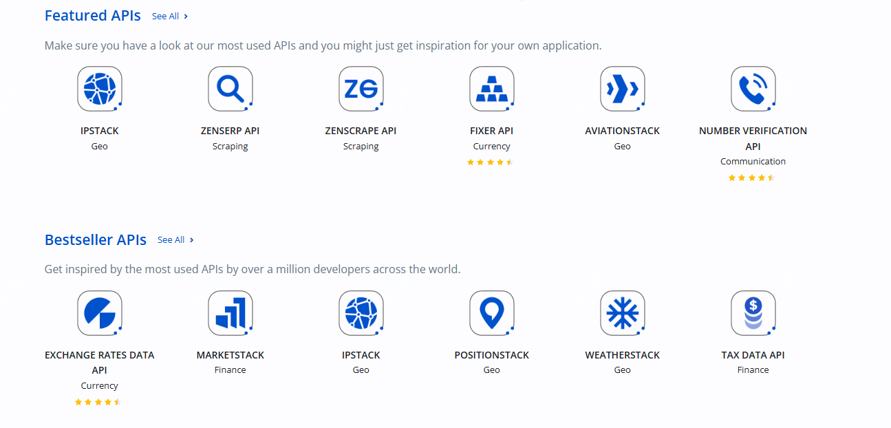
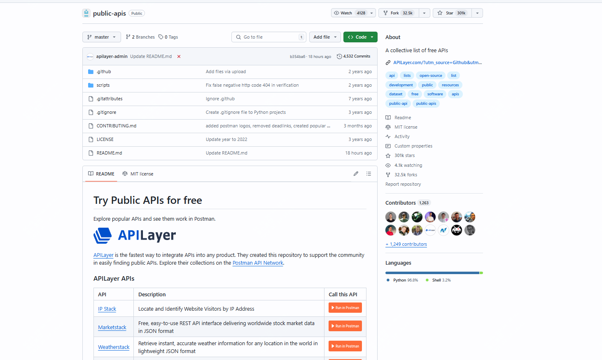
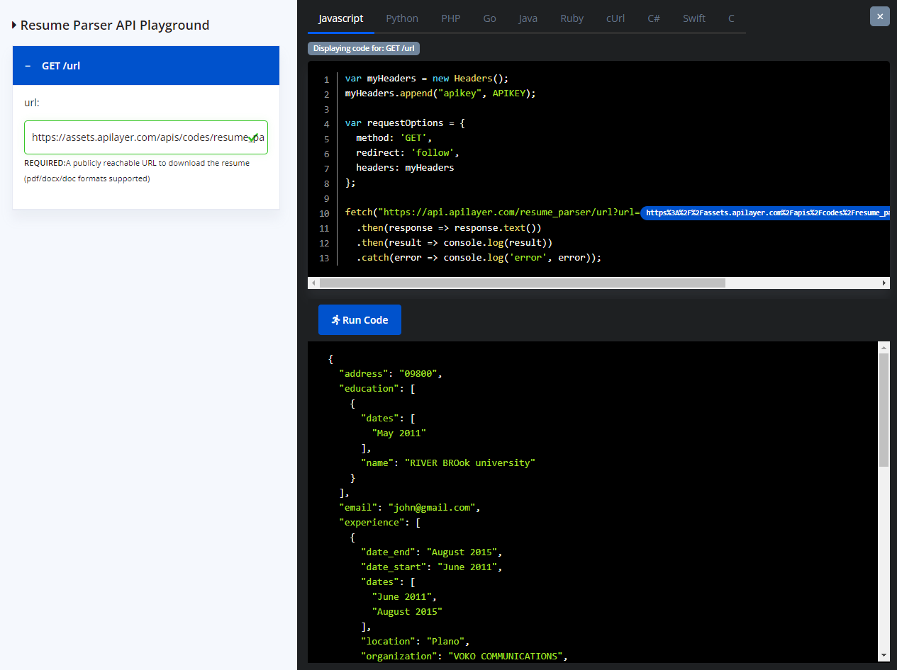
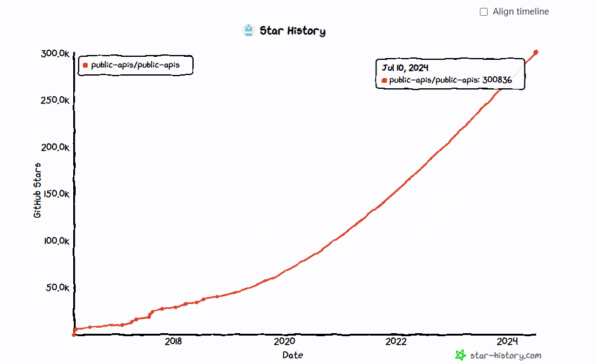

301k star,yyds开源项目

api作为现代开发中不可缺少的一环，使得很多功能的实现变的简单，最近发现了一个项目，里面汇集了很多可免费使用的api。

## public-apis简介

public-apis项目是由apilayer汇集整理的一个公共api集合，现在github上已经有30万star，它里面汇集了很多免费的api，而且含有很多不同方向的api。

如动物、区块链、商业、云存储、教育、音乐、书籍等

## public-apis特点

## public-apis热门api

- HTTP Cat：为每个HTTP状态码提供猫咪图片的API。
- OpenWeatherMap：提供全球天气数据的API。
- CoinGecko：提供加密货币市场数据的API。

## demo功能

也可以去官网体验下在线demo，可以直接在浏览器端发起api测试请求

>开源地址：https://github.com/public-apis/public-apis

