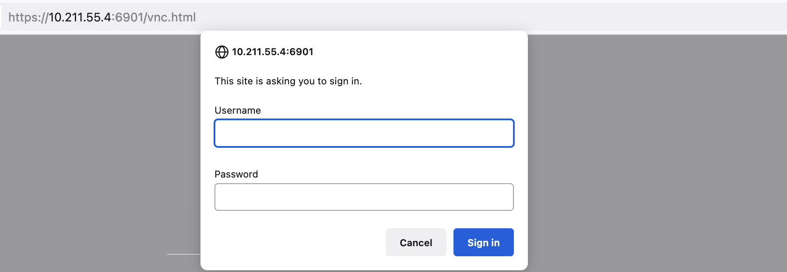

2.8k star,推荐一款支持web端访问的VNC工具

如果你之前有使用过vnc工具，如TigerVNC，RealVNC和TurboVNC，那么一定知道，除了需要安装服务端外，还需要安装一个客户端。

今天推荐的这款vnc工具最大的特点在于支持在web端，也就是浏览器上直接访问。


而另外一个特点就是，它的配置文件是yaml格式的，对于开发者而言，更加熟悉，配置也更加清晰简洁。

## kasmvnc简介

kasmvnc是一个更适用于当下技术栈的vnc工具，基于web访问，不支持从传统的vnc工具连接。

##  kasmvnc特点

- 支持从浏览器去访问vnc服务端，包括应用程序或者桌面环境
- 支持通过yaml配置文件
- 提供了开发者api，可以有更自动化的操作
- 采用了webp压缩方式，可以更好的利用宽带
- 无缝的剪贴板支持
- 全屏视频检测，进入可配置的视频模式，以获得更好的全屏视频播放性能。
- 有数据防丢失功能
- 界面上有网络和CPU瓶颈统计

## kasmvnc如何安装

官网提供了debian、ubuntu、kali及centos的安装方式，下面是在centos中如何安装

```
# Please choose the package for your distro here (under Assets):
# https://github.com/kasmtech/KasmVNC/releases
wget <package_url>

# Ensure KasmVNC dependencies are available
sudo yum install epel-release

sudo yum install ./kasmvncserver_*.rpm

# Add your user to the kasmvnc-cert group
sudo usermod -a -G kasmvnc-cert $USER

# YOU MUST DISCONNECT AND RECONNECT FOR GROUP MEMBERSHIP CHANGE TO APPLY

# start KasmVNC, you will be prompted to create a KasmVNC user and select a desktop environment
vncserver

# Tail the logs
tail -f ~/.vnc/*.log
```

>开源地址：https://github.com/kasmtech/KasmVNC

