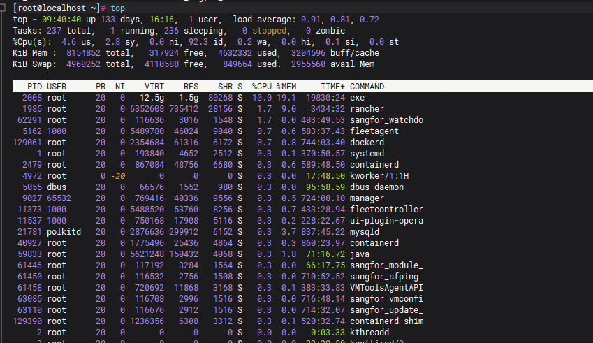
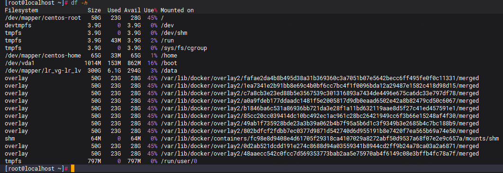
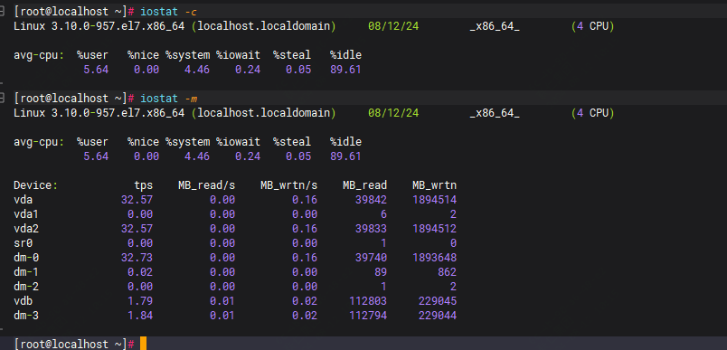

linux服务器常用巡检命令,新手友好版！


## 查看系统情况

### 系统信息显示

```
uname -a  
```

```
[root@localhost ~]# uname -a
Linux localhost.localdomain 3.10.0-957.el7.x86_64 #1 SMP Thu Nov 8 23:39:32 UTC 2018 x86_64 x86_64 x86_64 GNU/Linux
```

上述结果含义：

1. **Linux**: 这表明正在使用的是Linux操作系统。

2. **localhost.localdomain**: 这是主机名，通常用于本地测试或开发环境。"localhost"是一个特殊的主机名，它总是指向本机。

3. **3.10.0-957.el7**: 这是Linux内核版本和发行版特定的版本号。在这个例子中，内核版本是3.10.0，而"-957.el7"表示这是针对Red Hat Enterprise Linux 7（或CentOS 7，因为它们共享相同的内核）的第957次更新。

4. **x86_64**: 这表示系统架构是64位的x86架构，也称为AMD64。

5. **#1 SMP**: 这表示系统是一个单核对称多处理（Symmetric Multi-Processing，SMP）系统。"#1"表示这是第一个也是唯一的CPU核心。

6. **Thu Nov 8 23:39:32 UTC 2018**: 这是内核编译的时间和日期，按照UTC时间标准。

7. **x86_64 x86_64 x86_64**: 这三个"x86_64"分别表示：
   - 可执行的二进制文件的架构（即64位）。
   - 内核的架构（即64位）。
   - 硬件的架构（即64位x86）。

8. **GNU/Linux**: 这表明您的Linux操作系统使用了GNU工具集，并且遵循Linux标准。


###  显示操作系统发行版信息

```
cat /etc/*release* 
```

```
#cat /etc/*release* 
CentOS Linux release 7.6.1810 (Core) 
Derived from Red Hat Enterprise Linux 7.6 (Source)
NAME="CentOS Linux"
VERSION="7 (Core)"
ID="centos"
ID_LIKE="rhel fedora"
VERSION_ID="7"
PRETTY_NAME="CentOS Linux 7 (Core)"
ANSI_COLOR="0;31"
CPE_NAME="cpe:/o:centos:centos:7"
HOME_URL="https://www.centos.org/"
BUG_REPORT_URL="https://bugs.centos.org/"

CENTOS_MANTISBT_PROJECT="CentOS-7"
CENTOS_MANTISBT_PROJECT_VERSION="7"
REDHAT_SUPPORT_PRODUCT="centos"
REDHAT_SUPPORT_PRODUCT_VERSION="7"

CentOS Linux release 7.6.1810 (Core) 
CentOS Linux release 7.6.1810 (Core) 
cpe:/o:centos:centos:7
```

### 查看系统启动信息及最近的内核消息

```
dmesg | tail
```

```
[root@localhost ~]# dmesg | tail
[5144016.399622] overlayfs: Warning: Copying up pack-a0f5abc7891019798be2e3b4db9baa2f4e64350b.pack, but open R/O on fd 7 which will cease to be coherent [pid=8738 git]
[8704261.830380] docker0: port 3(veth7b24749) entered blocking state
[8704261.830385] docker0: port 3(veth7b24749) entered disabled state
[8704261.830483] device veth7b24749 entered promiscuous mode
[8704261.830638] IPv6: ADDRCONF(NETDEV_UP): veth7b24749: link is not ready
[8704262.170287] IPv6: ADDRCONF(NETDEV_UP): eth0: link is not ready
[8704262.170616] IPv6: ADDRCONF(NETDEV_CHANGE): eth0: link becomes ready
[8704262.170685] IPv6: ADDRCONF(NETDEV_CHANGE): veth7b24749: link becomes ready
[8704262.170809] docker0: port 3(veth7b24749) entered blocking state
[8704262.170811] docker0: port 3(veth7b24749) entered forwarding state
```

显示最近的内核消息，通常用于诊断硬件问题

### 查看系统运行时间

```
uptime 
```


显示系统已运行时间、当前登录用户数、系统负载平均值（1分钟、5分钟、15分钟）

## 资源使用情况

###  实时查看系统资源使用情况

```
top
```

以下是 `top` 命令输出中每行的含义：



| 行号 | 含义 |
|------|------|
| 1    | 系统时间、系统运行时间、当前登录用户数、过去1、5、15分钟的平均负载。 |
| 2    | 任务总数及其状态：运行中、睡眠中、停止、僵尸进程。 |
| 3    | CPU使用情况：用户进程、系统进程、优先级调整过的进程、空闲时间、等待时间、硬件中断、软件中断、偷取时间。 |
| 4    | 内存使用情况：总量、使用量、空闲量、缓冲区。 |
| 5    | 交换分区使用情况：总量、使用量、空闲量、缓存交换区。 |
| 6及以后 | 各个进程的详细信息，包括PID、用户、优先级、虚拟内存、常驻内存、共享内存、状态、CPU使用率、内存使用率、运行时间、命令等。 |


###  查看运行内存使用情况

```
free -h
```

###  查看磁盘空间使用情况

```
df -h
```



### 查看磁盘IO

```
iostat 
```
被用于监视系统输入输出设备和CPU的使用情况。它的特点是汇报磁盘活动统计情况，同时也会汇报出CPU使用情况。

但它不能对某个进程进行深入分析，仅对系统的整体情况进行分析。



```
-c：仅显示CPU使用情况；
-d：仅显示设备利用率；
-k：显示状态以千字节每秒为单位，而不使用块每秒；
-m：显示状态以兆字节每秒为单位；
-p：仅显示块设备和所有被使用的其他分区的状态；
-t：显示每个报告产生时的时间；
-V：显示版号并退出；
-x：显示扩展状态。

```

标示 | 说明
--- | ---
Device | 监测设备名称
rrqm/s | 每秒需要读取需求的数量
wrqm/s | 每秒需要写入需求的数量
r/s | 每秒实际读取需求的数量
w/s | 每秒实际写入需求的数量
rsec/s | 每秒读取区段的数量
wsec/s | 每秒写入区段的数量
rkB/s | 每秒实际读取的大小，单位为KB
wkB/s | 每秒实际写入的大小，单位为KB
avgrq-sz | 需求的平均大小区段
avgqu-sz | 需求的平均队列长度
await | 等待I/O平均的时间（milliseconds）
svctm | I/O需求完成的平均时间
%util | 设备带宽的使用率，达到100%表示饱和，达到性能瓶颈，如果是支持处理并发请求的设备则不代表性能瓶颈。

###  显示当前系统网络连接和网络监听情况

```
ss
```
比 netstat 好用的socket统计信息，iproute2 包附带的另一个工具，允许你查询 socket 的有关统计信息

ss命令 用来显示处于活动状态的套接字信息。

ss命令可以用来获取socket统计信息，它可以显示和netstat类似的内容。但ss的优势在于它能够显示更多更详细的有关TCP和连接状态的信息，而且比netstat更快速更高效。
```
[root@localhost ~]# ss -t -a
State       Recv-Q Send-Q                            Local Address:Port                                Peer Address:Port
LISTEN      0      0                                             *:3306                                           *:*
LISTEN      0      0                                             *:http                                           *:*
LISTEN      0      0                                             *:ssh                                            *:*
LISTEN      0      0                                     127.0.0.1:smtp                                           *:*
ESTAB       0      0                                112.124.15.130:42071                              42.156.166.25:http
ESTAB       0      0                                112.124.15.130:ssh                              121.229.196.235:33398
```

### 显示当前系统上运行的进程
```
ps
```
报告当前系统的进程状态


```
ps axo pid,comm,pcpu # 查看进程的PID、名称以及CPU 占用率
ps aux | sort -rnk 4 # 按内存资源的使用量对进程进行排序
ps aux | sort -nk 3  # 按 CPU 资源的使用量对进程进行排序
ps -A # 显示所有进程信息
ps -u root # 显示指定用户信息
ps -efL # 查看线程数
```

## 查看系统日志

```
journalctl
```
检索 systemd 日志，是 CentOS 7 才有的工具

显示本次启动后的所有日志：

```shell
journalctl -b
```
- `journalctl -b -1` 显示上次启动的信息

只显示错误、冲突和重要告警信息

```shell
journalctl -p err..alert
```

## 服务状态

```
systemctl
```

**systemctl命令** 是系统服务管理器指令，它实际上将 service 和 chkconfig 这两个命令组合到一起。

| 任务 | 旧指令 | 新指令 |
| ---- | ---- | ---- |
| 使某服务自动启动 | chkconfig --level 3 httpd on | systemctl enable httpd.service |
| 使某服务不自动启动 | chkconfig --level 3 httpd off | systemctl disable httpd.service |
| 检查服务状态 | service httpd status | systemctl status httpd.service （服务详细信息） systemctl is-active httpd.service （仅显示是否 Active) |
| 显示所有已启动的服务 | chkconfig --list | systemctl list-units --type=service |
| 启动服务 | service httpd start | systemctl start httpd.service |
| 停止服务 | service httpd stop | systemctl stop httpd.service |
| 重启服务 | service httpd restart | systemctl restart httpd.service |
| 重载服务 | service httpd reload | systemctl reload httpd.service | 


## 网络状态

### 显示网络接口信息

```
ficonfig
```
配置和显示Linux系统网卡的网络参数

 **显示网络设备信息（激活状态的）：** 

```shell
[root@localhost ~]# ifconfig
eth0      Link encap:Ethernet  HWaddr 00:16:3E:00:1E:51  
          inet addr:10.160.7.81  Bcast:10.160.15.255  Mask:255.255.240.0
          UP BROADCAST RUNNING MULTICAST  MTU:1500  Metric:1
          RX packets:61430830 errors:0 dropped:0 overruns:0 frame:0
          TX packets:88534 errors:0 dropped:0 overruns:0 carrier:0
          collisions:0 txqueuelen:1000
          RX bytes:3607197869 (3.3 GiB)  TX bytes:6115042 (5.8 MiB)

lo        Link encap:Local Loopback  
          inet addr:127.0.0.1  Mask:255.0.0.0
          UP LOOPBACK RUNNING  MTU:16436  Metric:1
          RX packets:56103 errors:0 dropped:0 overruns:0 frame:0
          TX packets:56103 errors:0 dropped:0 overruns:0 carrier:0
          collisions:0 txqueuelen:0
          RX bytes:5079451 (4.8 MiB)  TX bytes:5079451 (4.8 MiB)
```

说明：

**eth0** 表示第一块网卡，其中`HWaddr`表示网卡的物理地址，可以看到目前这个网卡的物理地址(MAC地址）是`00:16:3E:00:1E:51`。

**inet addr** 用来表示网卡的IP地址，此网卡的IP地址是`10.160.7.81`，广播地址`Bcast:10.160.15.255`，掩码地址`Mask:255.255.240.0`。

**lo** 是表示主机的回坏地址，这个一般是用来测试一个网络程序，但又不想让局域网或外网的用户能够查看，只能在此台主机上运行和查看所用的网络接口。比如把 httpd服务器的指定到回坏地址，在浏览器输入127.0.0.1就能看到你所架WEB网站了。但只是您能看得到，局域网的其它主机或用户无从知道。

*   第一行：连接类型：Ethernet（以太网）HWaddr（硬件mac地址）。
*   第二行：网卡的IP地址、子网、掩码。
*   第三行：UP（代表网卡开启状态）RUNNING（代表网卡的网线被接上）MULTICAST（支持组播）MTU:1500（最大传输单元）：1500字节。
*   第四、五行：接收、发送数据包情况统计。
*   第七行：接收、发送数据字节数统计信息。 
*   

###  测试网络连通性

```
ping
```
测试主机之间网络的连通性(ipv4)

ping命令 用来测试主机之间网络的连通性。执行ping指令会使用ICMP传输协议，发出要求回应的信息，若远端主机的网络功能没有问题，就会回应该信息，因而得知该主机运作正常。


###  跟踪数据包的路由路径

```
traceroute
```
**traceroute命令** 用于追踪数据包在网络上的传输时的全部路径，它默认发送的数据包大小是40字节。

通过traceroute我们可以知道信息从你的计算机到互联网另一端的主机是走的什么路径。

当然每次数据包由某一同样的出发点（source）到达某一同样的目的地(destination)走的路径可能会不一样，但基本上来说大部分时候所走的路由是相同的。

```shell
traceroute www.58.com
traceroute to www.58.com (211.151.111.30), 30 hops max, 40 byte packets
 1  unknown (192.168.2.1)  3.453 ms  3.801 ms  3.937 ms
 2  221.6.45.33 (221.6.45.33)  7.768 ms  7.816 ms  7.840 ms
 3  221.6.0.233 (221.6.0.233)  13.784 ms  13.827 ms 221.6.9.81 (221.6.9.81)  9.758 ms
 4  221.6.2.169 (221.6.2.169)  11.777 ms 122.96.66.13 (122.96.66.13)  34.952 ms 221.6.2.53 (221.6.2.53)  41.372 ms
 5  219.158.96.149 (219.158.96.149)  39.167 ms  39.210 ms  39.238 ms
 6  123.126.0.194 (123.126.0.194)  37.270 ms 123.126.0.66 (123.126.0.66)  37.163 ms  37.441 ms
 7  124.65.57.26 (124.65.57.26)  42.787 ms  42.799 ms  42.809 ms
 8  61.148.146.210 (61.148.146.210)  30.176 ms 61.148.154.98 (61.148.154.98)  32.613 ms  32.675 ms
 9  202.106.42.102 (202.106.42.102)  44.563 ms  44.600 ms  44.627 ms
10  210.77.139.150 (210.77.139.150)  53.302 ms  53.233 ms  53.032 ms
11  211.151.104.6 (211.151.104.6)  39.585 ms  39.502 ms  39.598 ms
12  211.151.111.30 (211.151.111.30)  35.161 ms  35.938 ms  36.005 ms
```

记录按序列号从1开始，每个纪录就是一跳 ，每跳表示一个网关，我们看到每行有三个时间，单位是ms，其实就是`-q`的默认参数。探测数据包向每个网关发送三个数据包后，网关响应后返回的时间；如果用`traceroute -q 4 www.58.com`，表示向每个网关发送4个数据包。

有时我们traceroute一台主机时，会看到有一些行是以星号表示的。出现这样的情况，可能是防火墙封掉了ICMP的返回信息，所以我们得不到什么相关的数据包返回数据。

有时我们在某一网关处延时比较长，有可能是某台网关比较阻塞，也可能是物理设备本身的原因。当然如果某台DNS出现问题时，不能解析主机名、域名时，也会 有延时长的现象；您可以加`-n`参数来避免DNS解析，以IP格式输出数据。