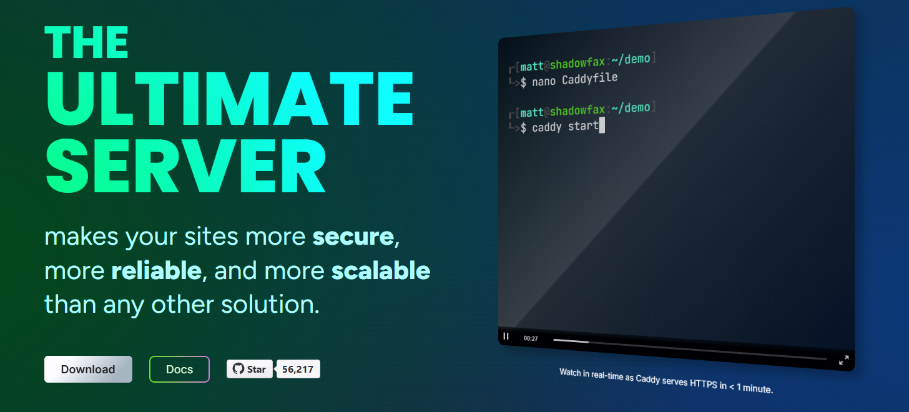

56.2k star,快速、可拓展的开源项目推荐

web服务器有很多，今天推荐的这款是go语言写的

最大的特点在于可以自适应https功能，支持http/1-2-3



## Caddy 服务器介绍

**Caddy** 是一个用 Go 语言编写的强大且易用的开源 Web 服务器。它以其自动 HTTPS 功能和灵活的配置选项而闻名，适用于各种网站、服务和应用程序。

## caddy简介

Caddy 是一个现代化的 Web 服务器，旨在简化配置和管理。它支持自动获取和更新 TLS 证书，确保所有站点默认通过 HTTPS 提供服务。Caddy 的设计目标是提供一个安全、快速且易于使用的服务器解决方案。

### caddy的特点

1. **自动 HTTPS**：Caddy 默认启用 HTTPS，并自动管理 TLS 证书。
2. **易于配置**：支持简单的 Caddyfile 配置文件和强大的 JSON 配置。
3. **动态配置**：通过 JSON API 实现在线配置管理。
4. **反向代理**：提供灵活且强大的 HTTP 反向代理功能。
5. **静态文件服务器**：生产就绪的静态文件服务器，有过数万亿请求验证，可拓展到数十万个站点，官方已验证。
6. **跨平台支持**：支持 Linux、Windows、macOS 等多种操作系统。
7. **高性能**：使用 Go 语言编写，具备高性能和内存安全性。

### 关于caddy自动https
Caddy是第一个也是唯一一个_默认_自动使用HTTPS的Web服务器。

自动HTTPS为你的所有站点提供TLS证书并保持更新。它还为你将HTTP重定向到HTTPS！Caddy使用安全且现代的默认设置——无需停机、额外配置或单独的工具。

Caddy使用来自公开的ACME CA的证书，通过HTTPS提供公共DNS名称，例如Let's Encrypt或者ZeroSSL.

### caddy快速开始

以下是使用 Caddy 的快速入门指南：

1. **安装 Caddy**：
   - 通过包管理器安装（例如 Homebrew、APT 等）。
   - 或者从 [Caddy 官方网站](https://caddyserver.com/docs/install) 下载二进制文件。

2. **创建 Caddyfile**：
   在项目根目录下创建一个名为 `Caddyfile` 的文件，内容如下：
   ```plaintext
   :2015
   respond "Hello, world!"
   ```

3. **运行 Caddy**：
   在终端中运行以下命令启动 Caddy：
   ```bash
   caddy run
   ```

4. **访问网站**：
   打开浏览器，访问 `http://localhost:2015`，你将看到 "Hello, world!" 的响应。

通过以上步骤，你已经成功启动了一个简单的 Caddy 服务器。更多高级配置和使用方法，请参考 [Caddy 官方文档](https://caddyserver.com/docs/)。
