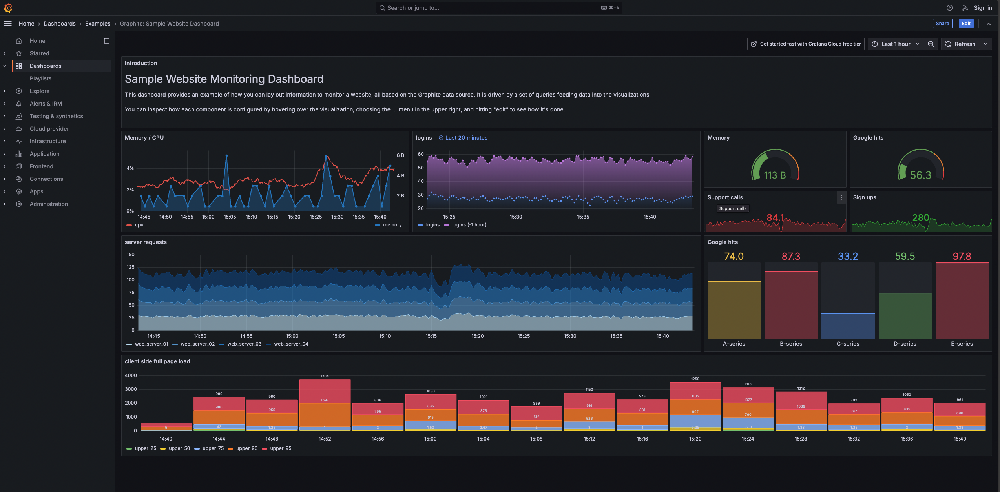
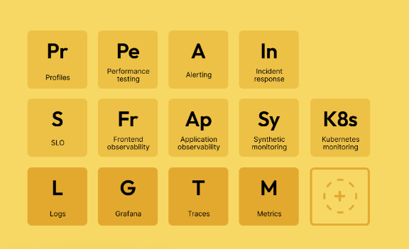

63.3k star,超强的开源工具，每天都用到！

竟然一直没有介绍过grafana，刚毕业工作就要到的工具之一了。

一直在迭代更新，功能也是一直完善，今天看github的趋势榜看到了，就简单介绍下。



### Grafana 简介

Grafana 是一款开源的数据可视化和监控工具，广泛应用于 IT 系统的指标监控、日志管理和时间序列数据分析。它支持从多种数据源（如 Prometheus、Graphite、InfluxDB、Elasticsearch 等）获取数据，并通过灵活的仪表盘展示这些数据。Grafana 的目标是帮助用户更好地理解和分析数据，从而做出更明智的决策。

### 如何快速开始

#### 1. 安装 Grafana

Grafana 提供多种安装方式，包括 Docker、二进制文件、包管理器（如 APT、YUM）等。以下是使用 Docker 安装的步骤：

```bash
docker run -d -p 3000:3000 --name=grafana grafana/grafana
```

#### 2. 访问 Grafana

安装完成后，可以通过浏览器访问 `http://localhost:3000`。默认的用户名和密码都是 `admin`，首次登录后会提示修改密码。

#### 3. 添加数据源

登录后，点击左侧菜单中的“Configuration” -> “Data Sources”，然后点击“Add data source”。选择你需要的数据库类型（如 Prometheus），并填写相应的连接信息。

#### 4. 创建仪表盘

添加数据源后，点击左侧菜单中的“Create” -> “Dashboard”，然后点击“Add new panel”开始创建新的面板。你可以选择不同的图表类型（如折线图、柱状图、饼图等），并配置查询以展示数据。

### 功能特点



#### 1. 多数据源支持

Grafana 支持多种数据源，包括但不限于：

- **Prometheus**：流行的监控系统和时间序列数据库。
- **Graphite**：另一种时间序列数据库。
- **InfluxDB**：高性能的时间序列数据库。
- **Elasticsearch**：分布式搜索和分析引擎。
- **MySQL、PostgreSQL**：关系型数据库。

这种多数据源支持使得 Grafana 能够整合来自不同系统的数据，提供统一的视图。

#### 2. 灵活的仪表盘

Grafana 提供了高度可定制的仪表盘，用户可以根据需要创建各种图表和面板。每个面板都可以独立配置查询、时间范围和显示选项。仪表盘还支持变量和模板，使得同一个仪表盘可以适应不同的环境和数据集。

#### 3. 强大的查询编辑器

Grafana 的查询编辑器支持多种查询语言，如 PromQL（用于 Prometheus）、InfluxQL（用于 InfluxDB）等。用户可以通过图形界面或直接编写查询语句来获取数据。查询编辑器还支持自动补全和语法高亮，提升了用户体验。

#### 4. 警报功能

Grafana 提供了强大的警报功能，用户可以为任意面板设置警报规则。当数据满足特定条件时，Grafana 可以通过电子邮件、Slack、PagerDuty 等渠道发送通知。警报功能帮助用户及时发现和处理异常情况。

#### 5. 插件生态系统

Grafana 拥有丰富的插件生态系统，用户可以通过插件扩展 Grafana 的功能。这些插件包括数据源插件、面板插件和应用插件等。例如，用户可以安装 Zabbix 插件来集成 Zabbix 监控数据，或安装 Worldmap 插件来创建地理位置相关的可视化。

#### 6. 用户管理和权限控制

Grafana 支持细粒度的用户管理和权限控制。管理员可以创建多个组织和团队，并为不同的用户分配不同的权限。这样可以确保数据的安全性和访问的灵活性。

### 总结

Grafana 是一款功能强大且灵活的数据可视化和监控工具，适用于各种规模的 IT 系统。通过支持多种数据源、提供灵活的仪表盘和强大的查询编辑器，Grafana 帮助用户更好地理解和分析数据。此外，丰富的插件生态系统和强大的警报功能进一步增强了 Grafana 的实用性。如果你正在寻找一款高效的数据可视化工具，Grafana 无疑是一个值得考虑的选择。¹²³

