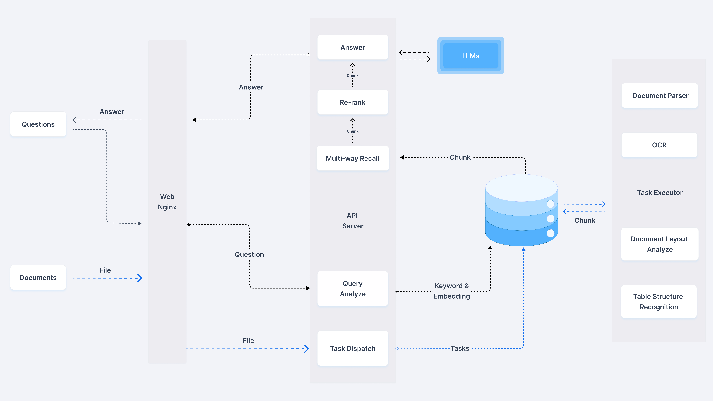

14.5k star,企业级开源工具推荐


### RAGFlow 工具简介

RAGFlow 是一款基于深度文档理解的开源 RAG（Retrieval-Augmented Generation）引擎。它旨在为各种规模的企业和个人提供简化的 RAG 工作流程，结合大语言模型（LLM），从复杂格式的数据中提取可靠的问答和有理有据的引用¹。

### 如何快速开始

#### 前提条件

在开始使用 RAGFlow 之前，确保你的系统满足以下要求：

- CPU：至少 4 核
- 内存：至少 16 GB
- 硬盘：至少 50 GB
- Docker：版本 >= 24.0.0
- Docker Compose：版本 >= v2.26.1

如果你尚未安装 Docker，可以参考官方文档进行安装²。

#### 安装步骤



1. **克隆仓库**：
   ```bash
   git clone https://github.com/infiniflow/ragflow.git
   ```

2. **进入 Docker 文件夹并启动服务器**：
   ```bash
   cd ragflow/docker
   chmod +x ./entrypoint.sh
   docker compose -f docker-compose-CN.yml up -d
   ```

3. **确认服务器状态**：
   ```bash
   docker logs -f ragflow-server
   ```

服务器启动成功后，可以在浏览器中输入服务器的 IP 地址并登录 RAGFlow。

### 功能特点

#### 深度文档理解

RAGFlow 基于深度文档理解技术，能够从各种复杂格式的非结构化数据中提取有价值的信息。这使得它在处理大量数据时，能够快速找到关键内容¹。

#### 模板化文本切片

RAGFlow 提供多种文本模板选项，支持智能且可解释的文本切片。这不仅提高了数据处理的效率，还允许用户根据需要进行手动调整²。

#### 有理有据的引用

RAGFlow 在回答问题时，提供关键引用的快照，并支持追根溯源。这大大降低了生成内容中的幻觉（hallucination），确保答案的可靠性¹。

#### 兼容多种数据源

RAGFlow 支持多种文件类型，包括 Word 文档、PPT、Excel 表格、txt 文件、图片、PDF、影印件、结构化数据和网页等。这使得它在处理不同格式的数据时，具有很高的灵活性²。

#### 自动化工作流

RAGFlow 提供全面优化的 RAG 工作流，支持从个人应用到超大型企业的各种生态系统。它支持大语言模型（LLM）和向量模型的配置，基于多路召回和融合重排序¹。

#### 易用的 API

RAGFlow 提供易用的 API，用户可以轻松将其集成到各种企业系统中。这使得 RAGFlow 在实际应用中具有很高的可操作性²。

### 结论

RAGFlow 是一款功能强大且灵活的 RAG 引擎，适用于各种规模的企业和个人用户。通过深度文档理解、模板化文本切片和有理有据的引用，RAGFlow 提供了高效且可靠的数据处理解决方案。其兼容多种数据源和自动化工作流的特点，使得它在实际应用中具有广泛的适用性。

