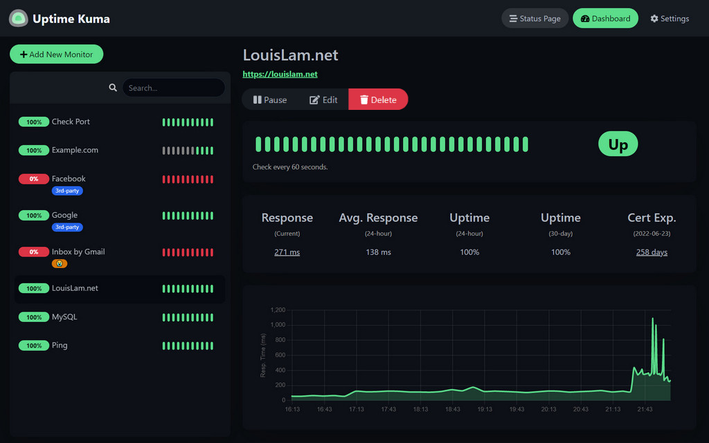
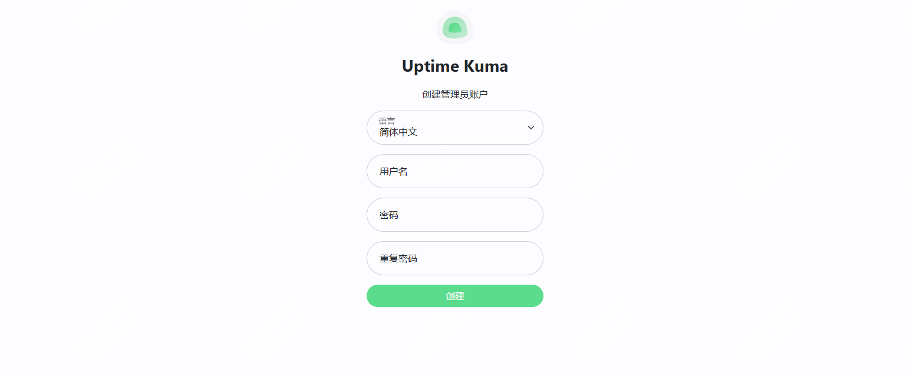
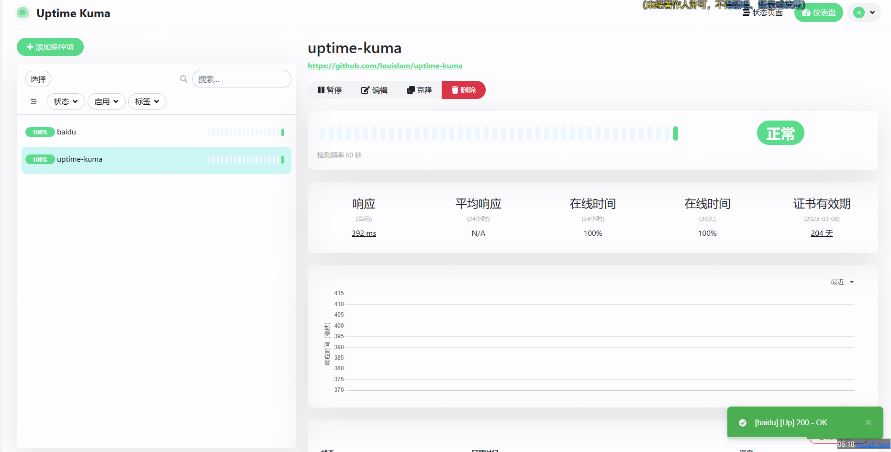
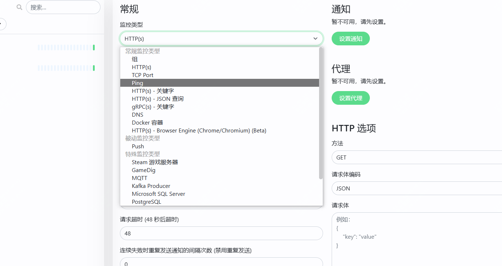

王炸！这个开源监控项目太强了

今天推荐的这个项目目前下载量有442k，star数有54k

如果这些数据还不足以让你心动话，那么看下这些酷炫的使用截图，你就知道它为啥这么火了！



## uptime-kuma项目简介

>项目地址：https://github.com/louislam/uptime-kuma

官方定义为一个花哨自托管的监控工具，它可以监控和预警，监控内容支持如下：

监控 HTTP（s） / TCP / HTTP（s） 关键字 / HTTP（s） Json 查询 / Ping / DNS 记录 / 推送 / Steam 游戏服务器 / Docker 容器的运行时间

而告警推送的话，支持多达90种方式，你可以采用任何你喜欢的方式去预警。

页面相比于一些传统监控，确实很酷炫，如果你还在自己写脚本去监控url服务状态，那快去用现成的吧。

## uptime-kuma工具截图







## 如何使用及特点

 

 直接docker启动即可，如下命令：

 ```
 docker run -d --restart=always -p 3001:3001 -v uptime-kuma:/app/data --name uptime-kuma louislam/uptime-kuma:1
 ```
如果想要体验demo地址，如下地址：

>demo.kuma.pet/start-demo
如果要查看具体的参考文档，可以到如下地址

>github.com/louislam/uptime-kuma/wiki

## uptime-kuma总结

 

 真的好用，想起最开始工作那会，没啥拨测监控组件，都是自己去写脚本的。
 