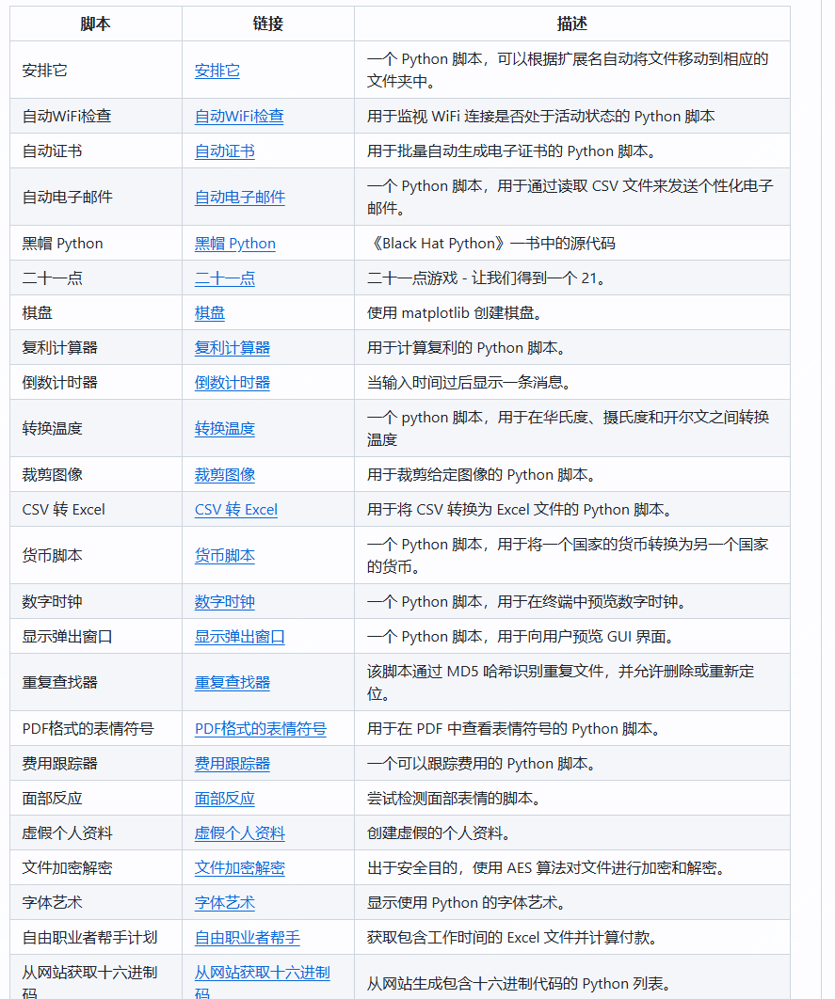

推荐60个Python自动化办公脚本，提升工作效率，开源！

在日常工作中，不可避免会遇到一些重复性的工作内容

也有一些自动化工具可以帮助完成。

但如果你会一点儿python，那么一定要看下这个开源项目

它包含了60多个python脚本，每个脚本都可以帮你完成一个小任务，如果有能力完全可以自己改一下。

>项目地址：https://github.com/DhanushNehru/Python-Scripts

该项目中，包含了一些文件处理的脚本如（格式转化、图像压缩等），也有一些自动化任务（自动发送邮件、自动检查wifi连接情况）

还有数据处理（JSON文件转换为CSV格式、根据IP地址获取地理位置、记录和跟踪开支）

娱乐和游戏（经典的21点游戏、 石头剪刀布游戏）

实用工具（生成二维码、缩短URL链接）

如果你是python学习者，那么其中的一些脚本可以用来熟悉一些基础语法，如果你使用者，那么里面丰富的内容，足够你处理一些日常繁琐任务

如上，希望有所帮助！！