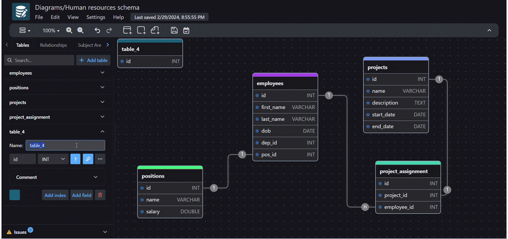
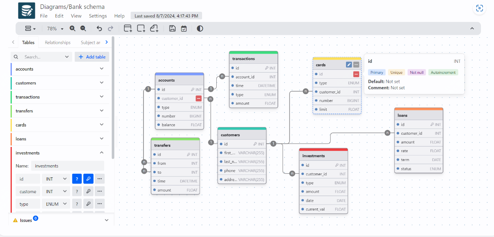

19.1k star!简单、直观好用的在线数据库设计工具

如果你是开发人员、DBA或者是其他IT从业人员，那么今天推荐的这款软件一定会使用到。

drawdb是一款可以在浏览器中打开的sql设计工具。

它使用简单，简单到你只需要几步就可以完成构建图表，然后直接导出sql脚本。

效果图如下：

项目开源地址：

>https://github.com/drawdb-io/drawdb

官方文档参考：

> https://www.drawdb.app/ 

这款工具目前支持大部分常用数据库，如（mysql、postgresql、sqlite、mariadb、sqlserver）

drawdb不仅仅是一款编辑器，它还可以完成更多，如下:

1. **在线数据库设计**：
   - 提供直观的界面，用户可以通过简单的拖放操作设计数据库实体关系图。
   - 简化了在实体之间建立关系的过程，使得数据库设计对各种技能水平的用户都变得可访问。

2. **SQL 生成器**：
   - 设计完数据库模式后，DrawDB 能够自动生成 SQL 脚本，省去了手动编写脚本的繁琐过程。
   - 这一功能简化了从视觉表现到实际数据库结构的过渡过程，使用户能够更快速地将设计转化为可操作的数据库结构。

3. **可定制化编辑器**：
   - 提供灵活的自定义编辑环境，用户可以根据自己的喜好调整工具，以适应其个性化的工作流程。
   - 支持自定义工作区、模板、快捷键等功能⁴。

4. **多数据库支持**：
   - 支持多种数据库，包括 MySQL、PostgreSQL、SQLite、MariaDB 和 SQLServer。

5. **无需安装**：
   - 直接在浏览器中运行，无需下载或安装任何软件。

6. **导出功能**：
   - 可以将设计好的数据库实体关系图导出为 SQL 脚本，方便在数据库中实现。

7. **免费使用**：
   - DrawDB 完全免费使用，用户无需创建账户即可访问所有功能。

8. **部署方式**：
   - 提供 Docker 和静态页面两种部署方式，用户可以根据需要选择适合的方式进行部署。

9. **团队合作**：
   - 支持实时协作功能，团队成员可以同时在同一个数据库模型上工作，轻松共享想法、提供建议，并确保数据库设计的一致性和准确性。

10. **学习和原型设计**：
    - 对于正在学习数据库概念和设计的学生和初学者，DrawDB 提供了一个直观的界面和简单易用的功能，帮助他们理解数据库实体关系模型和 SQL 脚本生成的基本原理。
    - 对于开发人员和项目团队，DrawDB 是一个理想的工具，可以帮助他们快速创建数据库实体关系图，设计数据库架构，并生成相应的 SQL 脚本。

总的来说，DrawDB 是一款功能强大的数据库设计工具，以用户友好的方式提供了多种特性，适用于各种数据库设计和管理需求。

