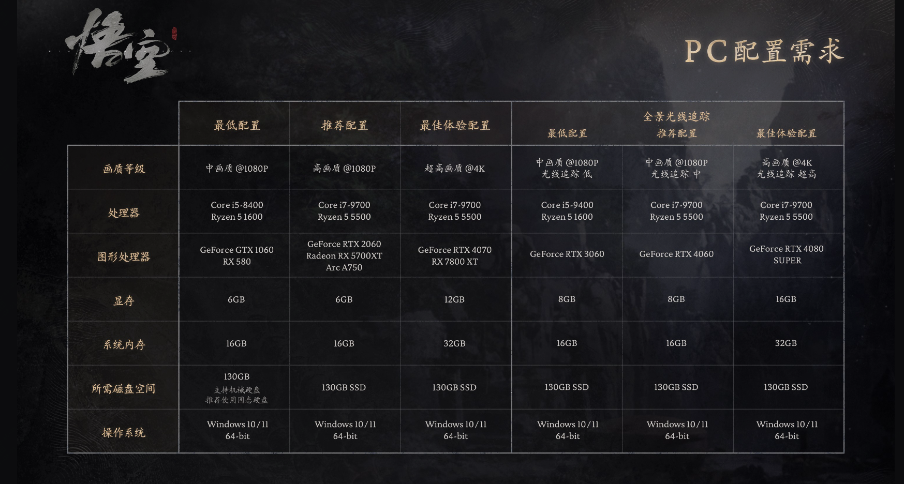

黑神话悟空配置要求

今天一大早来了就问了同事昨天玩的怎样？结果打大头娃娃就死了一小时

不过体验还是不错的，另外一个同事干脆今天没来了。

那么关于黑神话悟空如果要玩，电脑配置要求是怎样的呢？

## 黑神话悟空配置要求

其实官方也给出了配置要求

不开光追的情况下，最低处理器i5-8400Core或者Ryzen 5 1600，而显卡是要求GTX1060，或者RX580

显存需要6G，系统内存16GB，而磁盘是需要130G的，虽然可以使用机械硬盘，但还是建议固态，不然就像网上贴出的第一关解压就要很久了。

可想而知，这个最低配，体验肯定是要差的。

但是要开光追的话，那么配置就得升级一大截了。

最低配置中画质都是需要升级处理器到9400，显卡更是要升级到3060了。

简单来讲，要想有不错的体验，最起码还是配置在3060往上了。

但其实更建议使用PS5，因为手柄反馈真的舒服！！

最近身边一直听到什么是3A游戏？为什么对显卡要求高，这里简单解释下：

**3A游戏**（AAA游戏）通常指的是那些开发成本高、开发周期长、资源消耗大的顶级游戏作品。这个术语来源于美国，代表了游戏行业的最高水平。3A游戏的特点包括：

1. **高成本**：开发和推广费用非常高，通常达到数亿美元。
2. **高质量**：游戏画面精美，内容丰富，细节处理非常到位。
3. **高体量**：游戏世界庞大，内容丰富，玩法多样。

由于这些特点，3A游戏对显卡的要求也非常高，主要原因包括：

1. **高清画质**：3A游戏通常使用先进的游戏引擎和高分辨率的纹理贴图，这需要显卡有强大的渲染能力。
2. **复杂的物理效果和光影效果**：这些效果需要显卡进行大量的计算，以确保游戏画面的真实感和流畅度。
3. **大规模的游戏世界**：3A游戏的开放世界通常非常庞大，包含大量的动态元素和细节，这对显卡的显存和处理能力提出了更高的要求。

