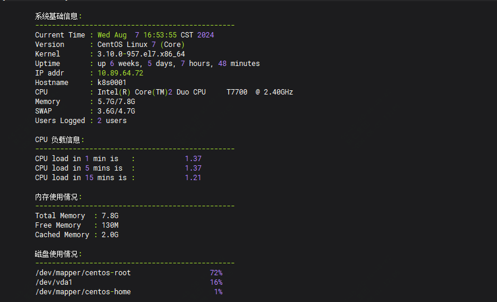

这个脚本，让你的逼格慢慢！

不管是开发还是运维，日常工作还是自己玩，都会有linux环境需要登录

如何在登录后更加的有逼格，例如直接展示下面这个信息。



今天推荐一个shell脚本，让你每次登录都逼格满满，如果还想打印其它信息，可自行添加。

脚本如下：

cat systeminfo.sh 

```
#!/bin/bash

# 系统状态检查脚本，你值得拥有

# 日志文件路径
LOGFILE="$HOME/system_status_check.log"

# 打印时间戳
log() {
    echo "$(date '+%Y-%m-%d %H:%M:%S') - $1" >> "$LOGFILE"
}

# 检查日志文件夹
if [ ! -w "$(dirname "$LOGFILE")" ]; then
    log "Error: Unable to write to log file."
    exit 1
fi

# 检查所需命令是否有
required_commands=("hostname" "awk" "free" "df" "uptime" "lscpu" "uname" "who" "cat")
for cmd in "${required_commands[@]}"; do
    if ! command -v "$cmd" &> /dev/null; then
        log "Error: Command '$cmd' is required but not found."
        exit 1
    fi
done

# 展示系统信息
display_system_info() {
    # 查看主机名及ip信息
    IP_ADDR=$(hostname -I | cut -d' ' -f1)
    HOSTNAME=$(hostname)
    
    # 检查cpu
    CPU_MODEL=$(lscpu | awk -F': ' '/^Model name:/ {sub(/^[ \t]+/, ""); print $2}')


    CPU_MODEL=$(echo "$CPU_MODEL" | sed 's/^[ \t]*//')


    
    log "Starting basic system information check."
    echo
    echo -e "\t系统基础信息:"
    echo -e "\t------------------------------------------------"
    echo -e "\tCurrent Time : $(date)"
    echo -e "\tVersion      : $(cat /etc/os-release | grep -w "PRETTY_NAME" | cut -d= -f2 | tr -d '"')"
    echo -e "\tKernel       : $(uname -r)"
    echo -e "\tUptime       : $(uptime -p)"
    echo -e "\tIP addr      : $IP_ADDR"
    echo -e "\tHostname     : $HOSTNAME"
    echo -e "\tCPU          : $CPU_MODEL"
    echo -e "\tMemory       : $(free -h | awk '/^Mem:/ { print $3 "/" $2 }')"
    echo -e "\tSWAP         : $(free -h | awk '/^Swap:/ { print $3 "/" $2 }')"
    echo -e "\tUsers Logged : $(who | wc -l) users"
    echo
    log "Completed basic system information check."
}

# cpu 负载情况
display_cpu_load() {
    log "Starting CPU load information check."
    echo -e "\tCPU 负载信息:"
    echo -e "\t------------------------------------------------"
    echo -e "\tCPU load in 1 min is   : $(awk '{printf "%15s", $1}' /proc/loadavg)"
    echo -e "\tCPU load in 5 mins is  : $(awk '{printf "%15s", $2}' /proc/loadavg)"
    echo -e "\tCPU load in 15 mins is : $(awk '{printf "%15s", $3}' /proc/loadavg)"
    echo
    log "Completed CPU load information check."
}

# 内存信息
display_memory_info() {
    log "Starting memory information check."
    echo -e "\t内存使用情况:"
    echo -e "\t------------------------------------------------"
    echo -e "\tTotal Memory  : $(free -h | awk '/Mem/{print $2}')"
    echo -e "\tFree Memory   : $(free -h | awk '/Mem/{print $4}')"
    echo -e "\tCached Memory : $(free -h | awk '/Mem/{print $6}')"
    echo
    log "Completed memory information check."
}

# 磁盘
rank_disk_usage() {
    log "Starting disk usage ranking check."
    echo -e "\t磁盘使用情况:"
    echo -e "\t------------------------------------------------"
    df -h -x tmpfs -x devtmpfs | sort -nr -k 5 | awk '/dev/{printf "\t%-39s %5s\n", $1, $5}'
    echo
    log "Completed disk usage ranking check."
}

# Main execution logic
log "Script execution started."
display_system_info
display_cpu_load
display_memory_info
rank_disk_usage
log "Script execution completed."

```
如果要在每次登录展示，还需要如下两步

cp systeminfo.sh /etc/profile.d/
chmod +x /etc/profile.d/systeminfo.sh
