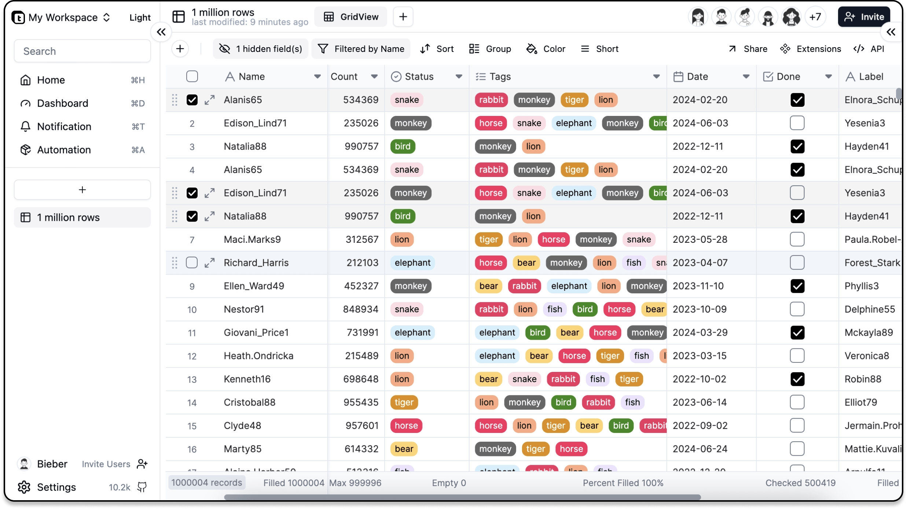

卧槽!这个无代码数据库项目太强了

今天这个项目可以理解为是下一代airtable的替代方案，是一个无代码的postgres

## teable项目简介

>项目地址：https://github.com/teableio/teable 

teable是一个建立在postgres的基础上的超快速的、实时、专业的无代码数据库。

它可以使用一个简单的电子表格来创建复杂的数据库应用程序。

对于代码能力不强的非常友好。


## 工具截图



## 如何使用及特点

快速部署可以通过docker去部署

```
cd dockers/examples/standalone/
docker-compose up -d
```

- 它会提供一个类似表格的界面，可以直接单元格编辑、支持公式编辑、支持数据排序及过滤
- 聚合功能：自动汇总每列的统计数据，提供即时计算，如总和、平均值、计数、最大值和最小值，以简化数据分析。
- 数以百万计的数据很容易处理，并且没有过滤和排序的压力，自动数据库索引，实现最高速度
- 与熟悉的软件可以无缝集成


## 总结

 