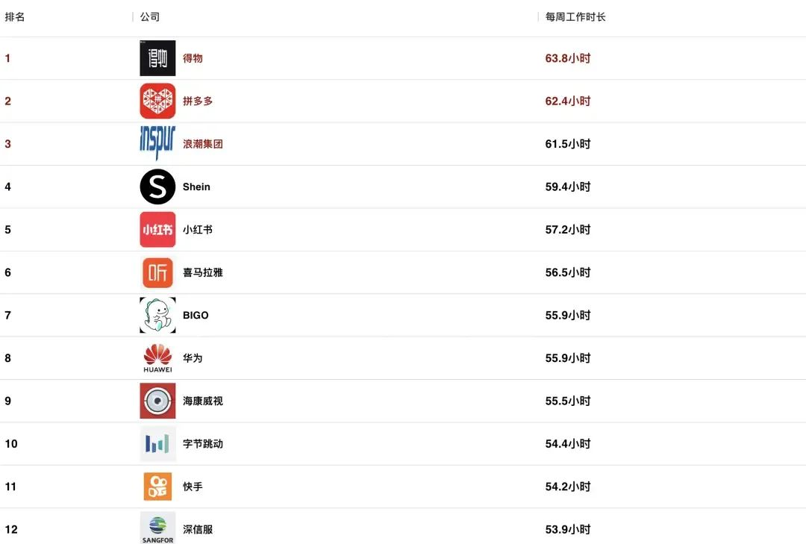

2024互联网公司工作时长排行榜出炉！最狠的竟然是...

不知道还有多少公司依旧是996模式，个人感觉现在加班相较于前几年已经明显减少了。

一方面可能业务没那么多，另一方面可能整体环境稍好。

今天看到一份2024年互联网攻击你公司的加班时长排行榜，没想到排名前面的，加班还是有些狠的

看完这份榜单，你的感受是？

也有网友翻看了后面的一些公司，发现排名后面的基本是一些外企，而且工资也不低

其实也有网友说了，如果是摸鱼的996，工资不低，也还能熬得住

但是工资没到位，还必须加班，那还是早早换工作吧。

说到换工作，就这两年身边的朋友明显没有动静了，搁几年前，基本隔几个月就又会有变动的。

现在反而是听说有被裁员的，不是主动换的。

目前还是苟住为上，即使年终奖没发、迟发、少发，即使变相降薪。