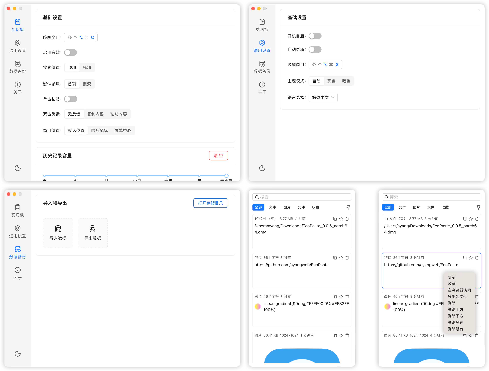

这个小工具，酷炫又不简单，推荐！

今天推荐一款适用于mac及windows的开源剪贴板工具

如果你之前用过ditto这类工具，那么这款界面更加好看，功能确一点都不简单

>开源地址：https://github.com/ayangweb/EcoPaste

部分截图：


## EcoPaste简介

一款不错的剪贴板管理工具

## 如何安装？

windows的话，直接到github去下载安装包

mac环境可以通过包管理器去安装即可

```
brew tap ayangweb/EcoPaste
brew install ecopaste
```

## EcoPaste特点介绍

- 功能不弱，但是体积不大，采用了tauri构建，资源占用极少
- 不使用状态下，在后台启动，可以通过快捷键快速调用
- 所有剪贴板复制内容，均留存在本地，不会发生数据泄露情况
- 保存的剪贴板数据可以按照类型去管理
- 支持搜索，历史复制内容，可以快速找到

