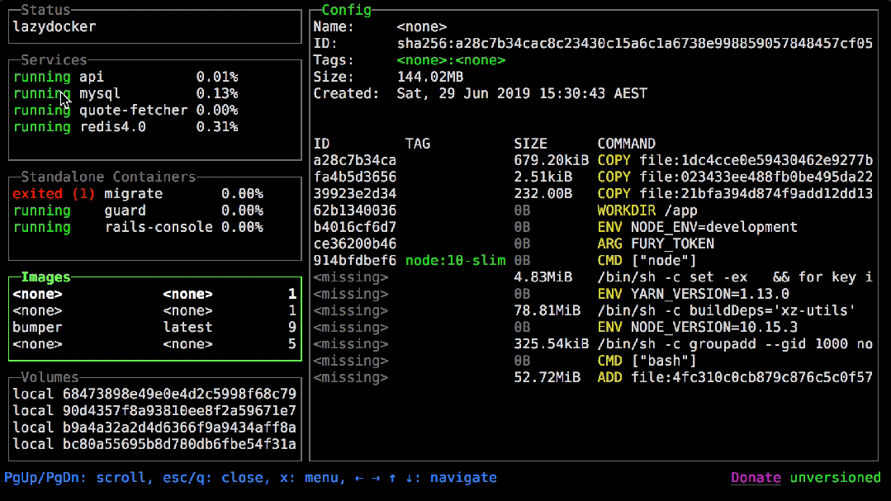
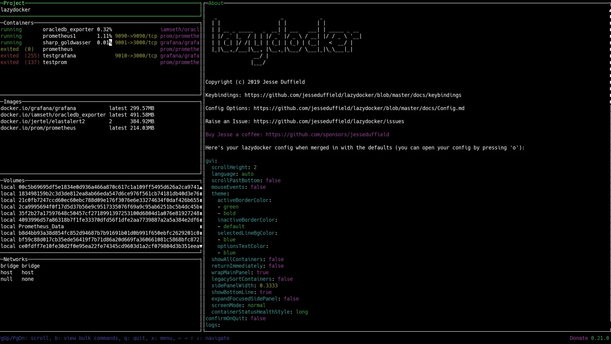

牛逼!推荐个好用到离谱的软件工具

如果你平时有用到docker或者docker-compose，那么这款开源工具一定可以帮助到你

对于不是很数字docker命令的开发来讲，每次都要去翻命令，确实浪费时间

那么有没有一种方式可以让自己更舒服一些，答案是有的，那就是lazy-docker

目前该工具在github有36k star，下载量更是到了659k，快去了解下吧！

## lazydocker项目简介

>项目地址：https://github.com/jesseduffield/lazydocker

让你管理docker变得更加懒惰的一个小工具，或者说管理起来更加简单

## lazydocker工具截图

先来看下效果图





## lazydocker如何使用及特点

 

 安装使用也很简单，可以通过包管理器下载，也可以直接到releases下去获取二进制包

 如果windows可以使用如下：

 ```
 scoop install lazydocker
 #或者
 choco install lazydocker
 ```

 mac用户的话，可以直接使用brew


## 总结

 

 让你更容易的上手使用docker，对于已经常规使用docker 的朋友，可以让你的工作更加高效。