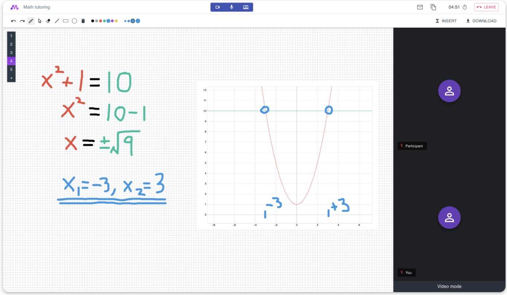

2.3k star！开源，自建视频会议系统！


## 项目简介

nettu-meet是一款免费开源的视频会议系统，可以用来作为公司内部自建的会议系统，如果是教辅类的，还可以作为教辅实用。

它支持实时的音视频会议，可以有白板作为共享，实时分享想法

>项目地址：https://github.com/fmeringdal/nettu-meet


## 工具截图



## 如何使用及特点

要快速开始使用 Nettu Meet，可以按照以下步骤进行：

1. **克隆仓库**：
   ```bash
   git clone https://github.com/fmeringdal/nettu-meet.git
   cd nettu-meet
   ```

2. **设置环境变量**：
   复制 `.env.template` 文件并进行必要的调整：
   ```bash
   cp integrations/.env.template integrations/.env
   ```

3. **启动后端服务**：
   使用 Docker Compose 启动 Redis 和 MongoDB：
   ```bash
   npm run infra
   ```
   安装后端依赖并启动服务器：
   ```bash
   cd server
   npm install
   npm start
   ```

4. **启动前端应用**：
   在另一个终端中运行以下命令：
   ```bash
   cd frontend
   npm install
   npm start
   ```

5. **创建会议**：
   使用以下命令创建一个新的会议：
   ```bash
   curl -X POST "http://localhost:5000/api/v1/meeting" -H "authorization: nettu_meet_default_secret" -H "Content-Type: application/json" -d '{"title": "First Nettu Meet meeting"}'
   ```

#### 功能特点

Nettu Meet 提供了丰富的功能，满足不同场景下的在线会议需求：

1. **实时音视频共享**：
   支持高质量的音视频传输，确保会议过程中的沟通顺畅。

2. **共享白板**：
   允许与会者在白板上进行实时协作，适用于教学和头脑风暴等场景。

3. **屏幕共享**：
   可以将自己的屏幕分享给其他与会者，方便进行演示和讲解。

4. **聊天功能**：
   提供简单的文字聊天功能，方便与会者之间的即时沟通。

5. **文件共享**：
   允许上传和共享会议相关的文件，提升会议效率。

6. **图形绘制**：
   可以在白板上插入数学图形，方便进行数学和科学教学。

7. **自定义品牌**：
   用户可以创建账户并上传自己的标志，定制化会议界面。

## 总结

 

 Nettu Meet 作为一个开源项目，不仅提供了强大的功能，还允许用户根据自己的需求进行定制和扩展。
 
 无论是用于在线教学还是团队协作，Nettu Meet 都是一个值得尝试的工具。
